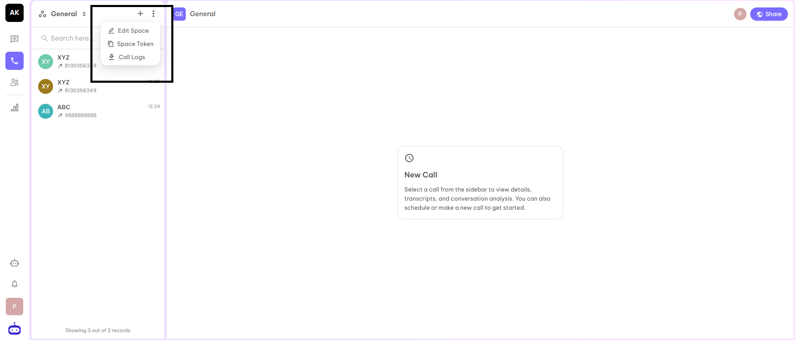
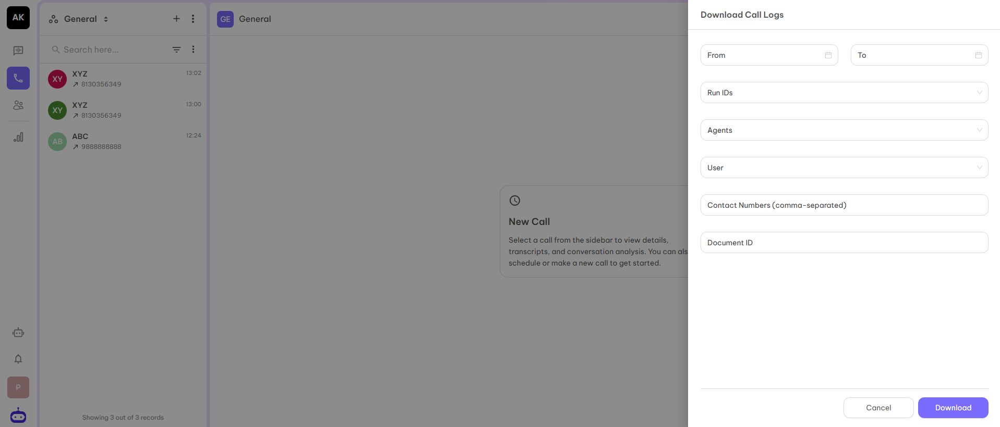
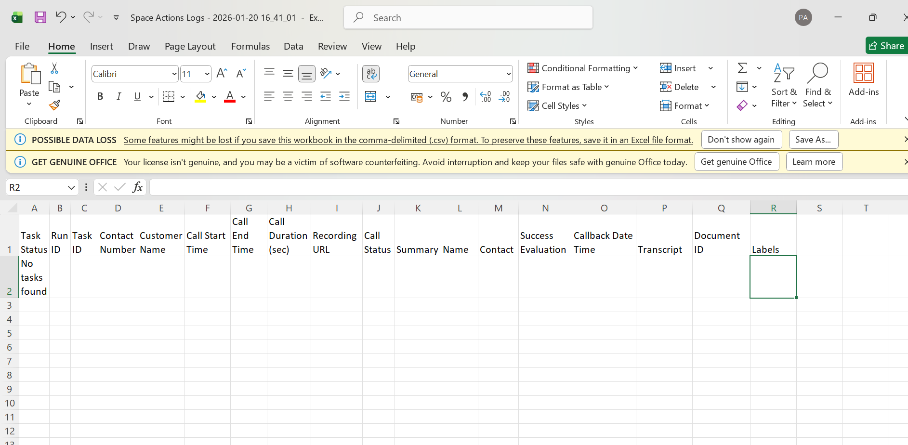
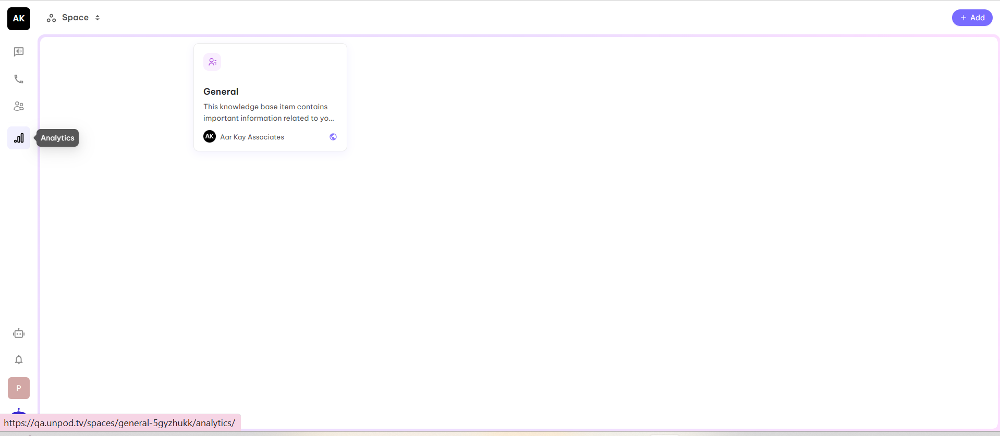
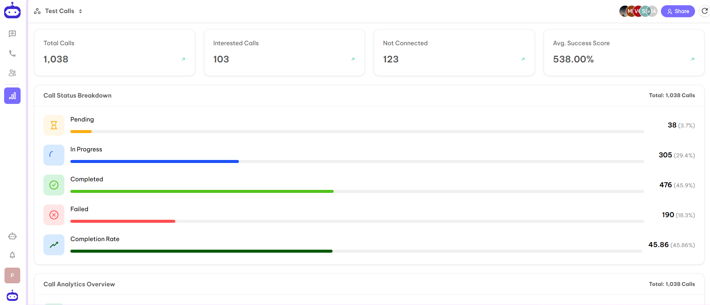
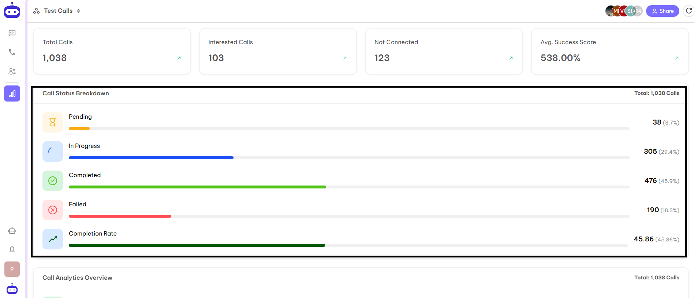
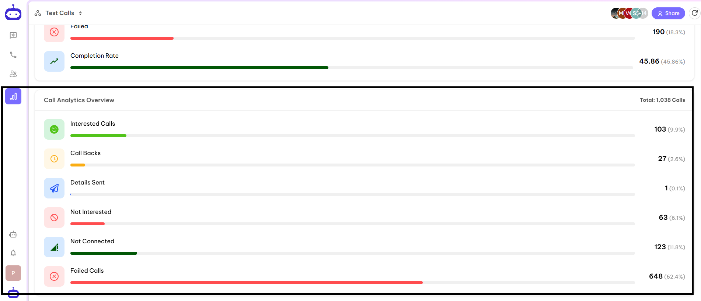

## Getting Started

Analytics and Reporting refers to the tools and dashboards that track, measure, and visualize the activity and performance of a Space or AI agent. This includes metrics like user interactions, engagement, call outcomes, document usage, and overall agent effectiveness, helping teams make data-driven decisions and optimize workflows.

Unpod dashboard provides you with two options to see the reports and analyze the performance of your business. Both the options are available in Space View.

---

## Call Logs

This option is available in the Space View. You can access it under the three dots at the top left corner. If you want to download all the details of the calls executed on the space in the form of CSV, you can download it from here.The screenshot is given below:

When you click on Call Logs, it will redirect you to the page where you have to fill in the following details:

- **Date range** - Starting and ending date within which you need the report.
- **Run id** - Wherever you initiate a call, the dashboard will consider this as a task and create a run id for the same. You can choose the run id for which you want the report.
- **Agent** - If you have multiple agents for your organization, then select the agent for which you want the report.
- **User** - If you want the report for a particular user, you can select the name of the user.

Once you enter all the details, click on Download to get the CSV file.

The CSV file will look like below attached screenshot:

The CSV file contains structured data which you have mentioned while setting up the Analysis settings of the Agent.

---

## Analytics

This option is available in Space View. You can access this option from the left side bar of the dashboard. The Analytics tab shows insights and performance metrics related to activity within the Space, including engagement, usage trends, and key statistics. It helps users track progress and measure impact across discussions, calls, and content.The screenshot is attached below:

Once you click on Analytics tab, you will be redirected to the analytics dashboard.

In the above dashboard, you will able to see below details:

- **Total Calls** - Number of total calls initiated on a particular space.
- **Interested Calls** - Number of people who are interested in the given information.
- **Not Connected** - Number of calls who are not connected due to some reasons.
- **Avg. Success Score** - The success rate according to the number of connected calls.

You will able to see the Call Status breakdown in graphical representation as shown below:

Calls Analytics Overview is also visible as graphical representation showing detailed metrics and trends.

