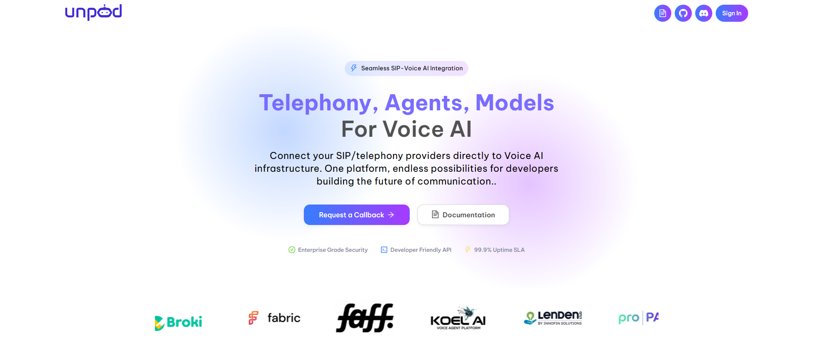
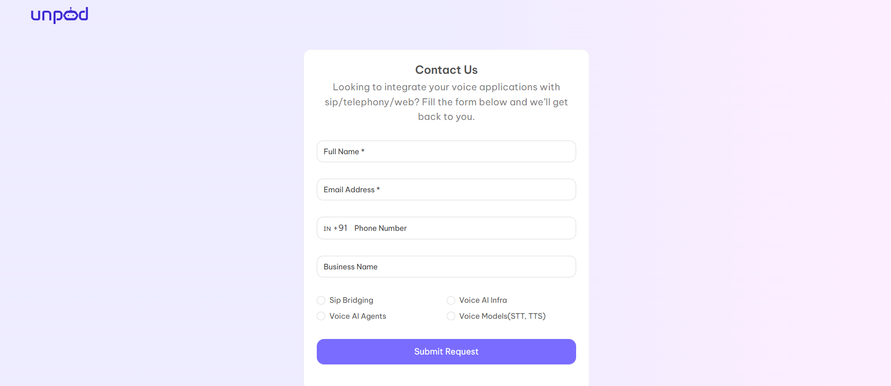
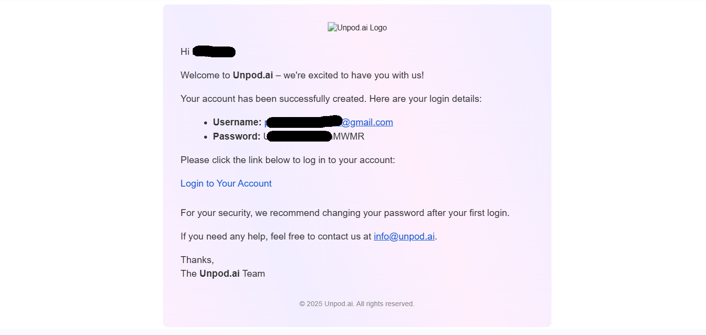
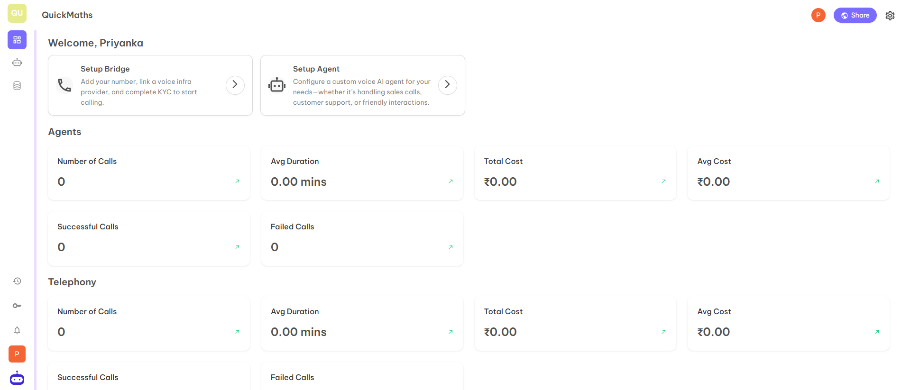

## How to Get Access to the Dev Dashboard?

### Step 1
Open https://unpod.dev/

### Step 2
Click on **Request a Call Back** option.

### Step 3
Fill in the required fields and click on **Submit**.

### Step 4
After you click on Submit Request, you will get a message **"Thank you, we will connect with you soon"**.

### Step 5
You will get the login credentials on your mail.

### Step 6
Now you can login on the dashboard and access the dashboard completely.

### Step 7
When you login for the first time, you will be redirected to the below page to create a hub for your organization.

There are four necessary fields which you have to fill:

- **Enter Hub Name** — Choose the name of your organization or choose any name that best suits your requirements and organization.
- **Domain Name** — Your personal domain name just like gmail.com, yahoo.co, etc. You can choose the domain name from the mail id you are using or make the organization's name as the domain name like maths.com, music.com, etc.
- **Privacy Type** — There are two options - **Public** and **Private**. If you choose public then your hub will be visible to everyone whereas if you choose private then your hub is only visible to people inside your domain.
- **Type of Account** — You can choose the type of account according to your requirement from the given five options:
  - Personal
  - Startups and Organisations
  - Teachers & Educators
  - Artists & Creators
  - Engineers and Researcher

After completion of all steps, you will be redirected to your organisation's hub. The hub will look like below:

---