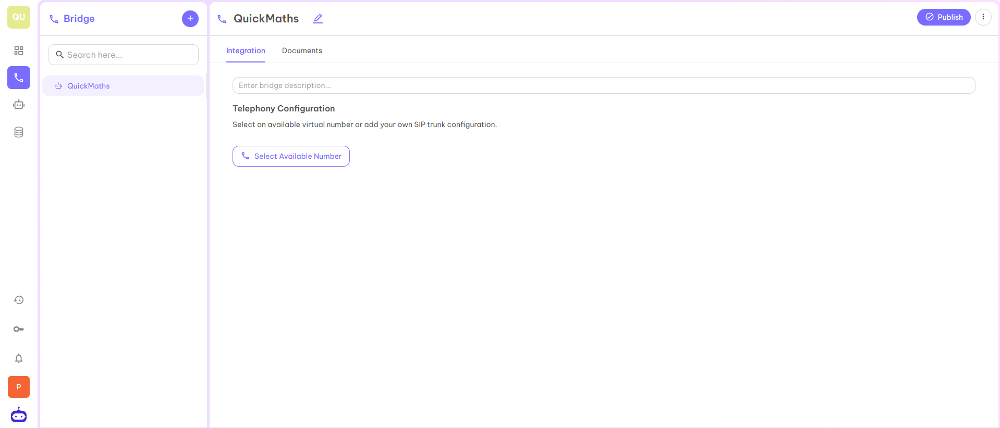
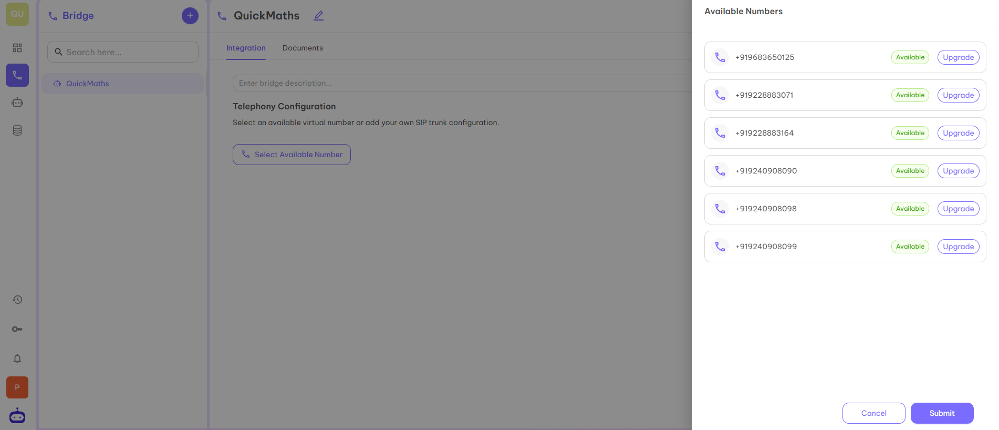
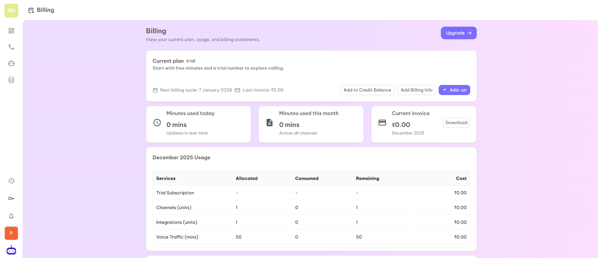
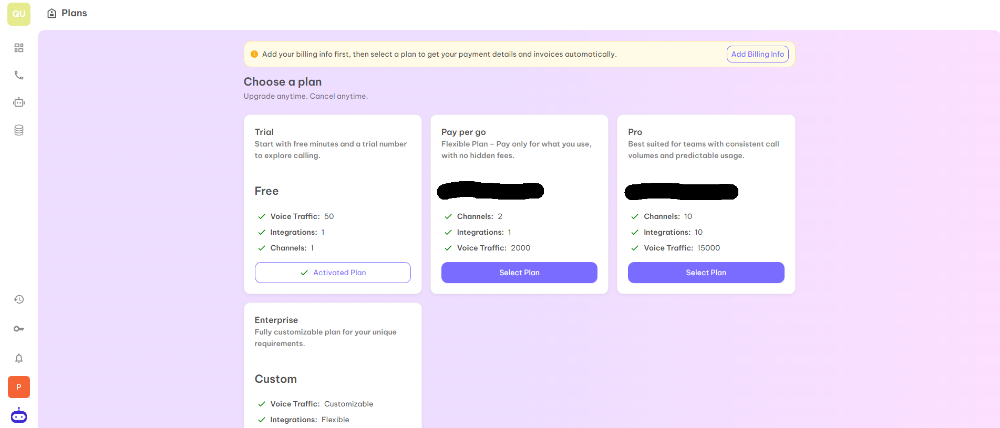
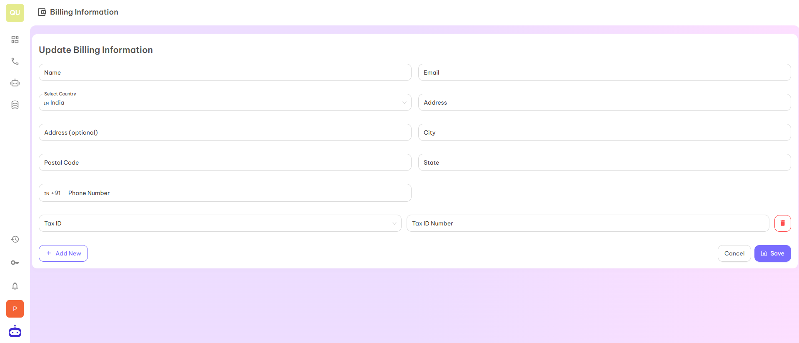
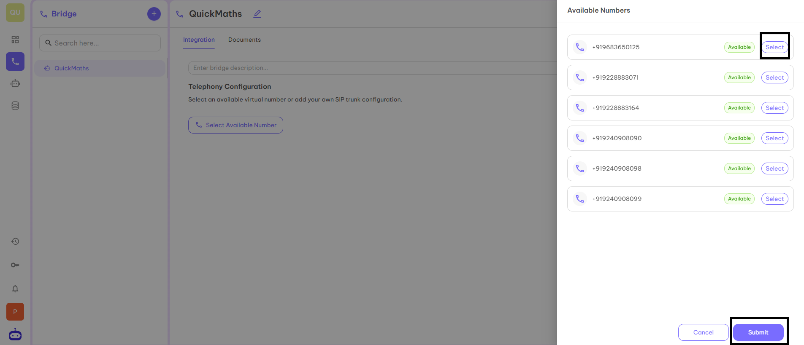
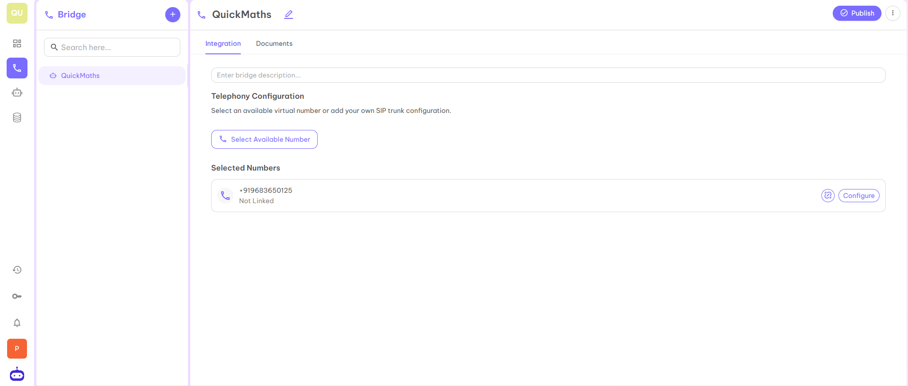

## Numbers: Your Voice, Your Number, Any Region

In Unpod, numbers are virtual phone lines that let your business make and receive calls or messages from anywhere in the world, without using traditional phone lines. Each number can connect to providers, bridges, and agents, which helps create flexible and smart communication.

### Assign Numbers to Bridges

#### Step 1
Select the Bridge to which you want to link the number. In the image below, QuickMaths is selected.

#### Step 2
Now click on **Select Available Number** to take the number. When you click on "Select Available Number", it will redirect you to the page below from where you can first upgrade the number and then select that number to integrate on your dashboard.

#### Step 3
Once you click on the **Upgrade** tab you will be redirected to the below page from where you can upgrade the plan or choose the plan to get access to the number.

#### Step 4
When you click on the **Upgrade or View Plans** tab, you will see different plans as well as an option of **Add Billing Info**. Before selecting the plan, you have to fill in your complete details.

#### Step 5
After filling the details and selecting the plan, return to the first page and again click on **Select Available Number**. Select the number for your business and click on the **Submit** button.

#### Step 6
After completing all the necessary steps, the number will get added to your Bridge.

---