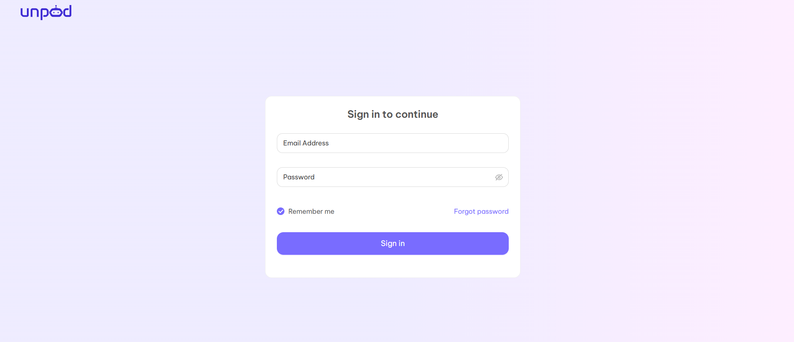
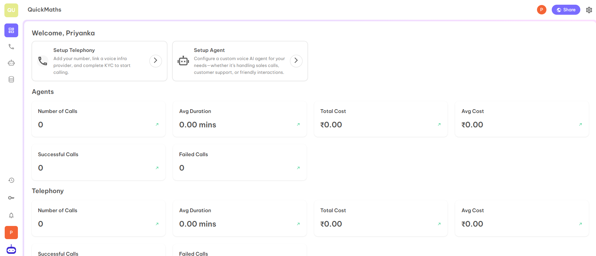
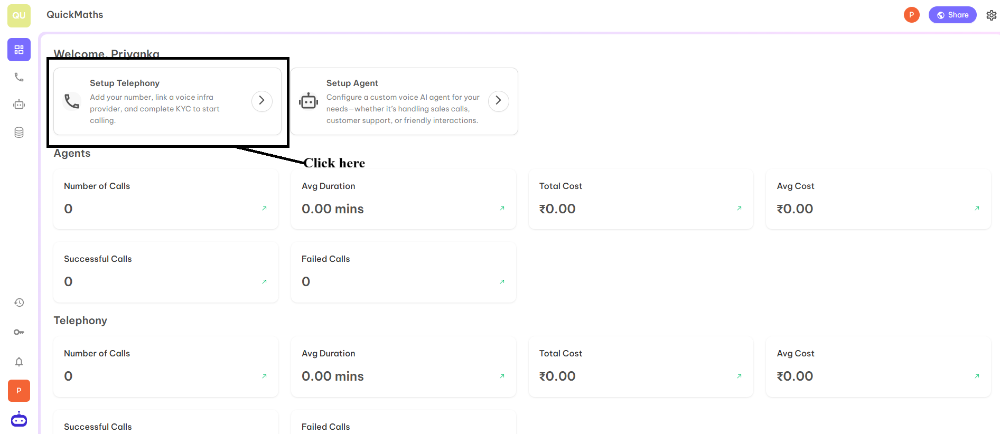
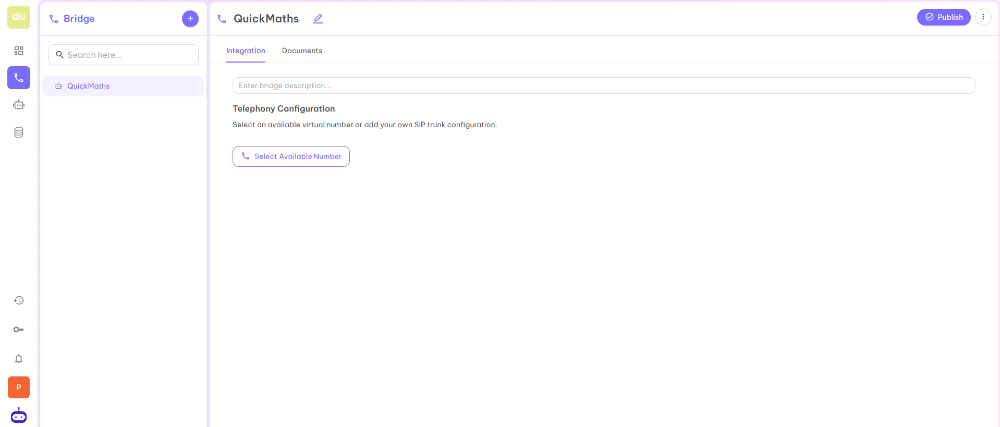
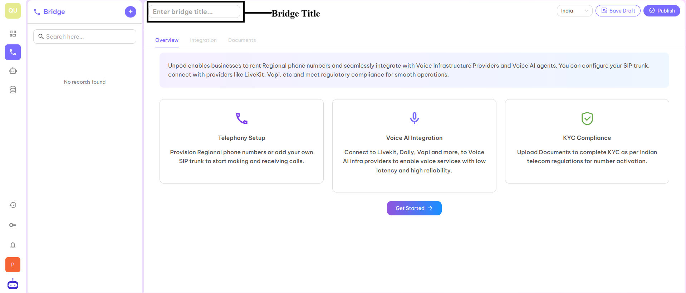
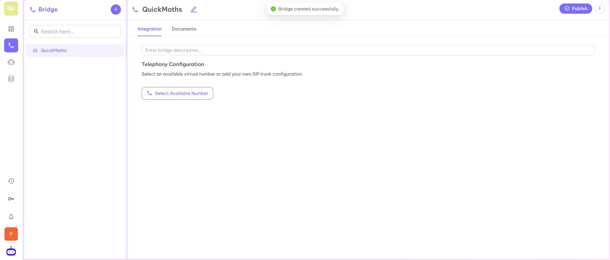
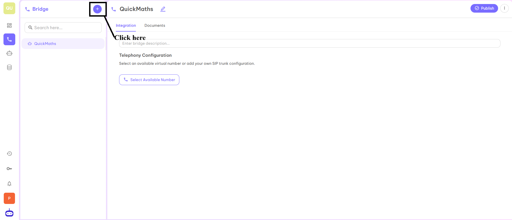

## Getting Started

Unpod enables businesses to rent Regional phone numbers and seamlessly integrate with Voice Infrastructure Providers and Voice AI agents. You can configure your SIP trunk, connect with providers like **LiveKit**, **Vapi**, etc and meet regulatory compliance for smooth operations.

---

## Bridges: Making Sure Every Call Finds Its Way Home

Bridges are known as central controllers that manage every call. They connect phone numbers, service providers, and AI agents to ensure each conversation is directed correctly and smoothly. Bridges help you set up how calls move, assign which service provider will handle each number, connect with AI or phone systems for smarter call handling, and keep all your important documents managed and organized for easy access and proper record-keeping. Think of them as the traffic police guiding all communication traffic efficiently.

### Steps to Create Bridges on Dashboard

### Step 1
Login to Dashboard with the credentials provided by the Unpod technical team.

### Step 2
Once you login, it will redirect you to the dashboard.

### Step 3
Now click on the **Setup Telephony** tab to access the Telephony Bridge.

### Step 4
When you click on Setup Telephony, it will redirect you to the below page from where you will be able to create your first Bridge.

### Step 5
Enter the Bridge title in the required tab.

### Step 6
After entering the suitable title for your first bridge, click on the **Publish** button. Your first Bridge is ready to use. You can use this Bridge to boost your business by integrating any virtual number or your own SIP trunk configuration.

### Step 7
In the same space, if you want to create another bridge then click on **➕** symbol. You will be able to add as many spaces you want to add by following the same process discussed above.

---

