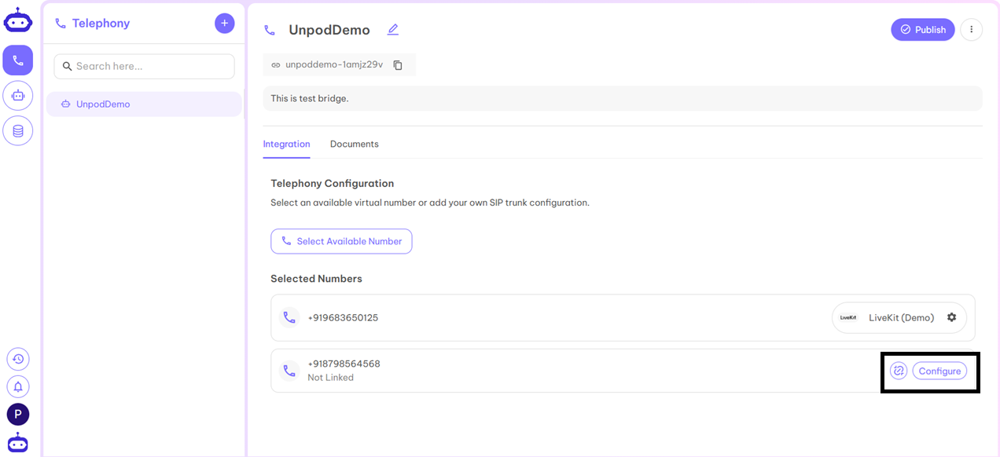
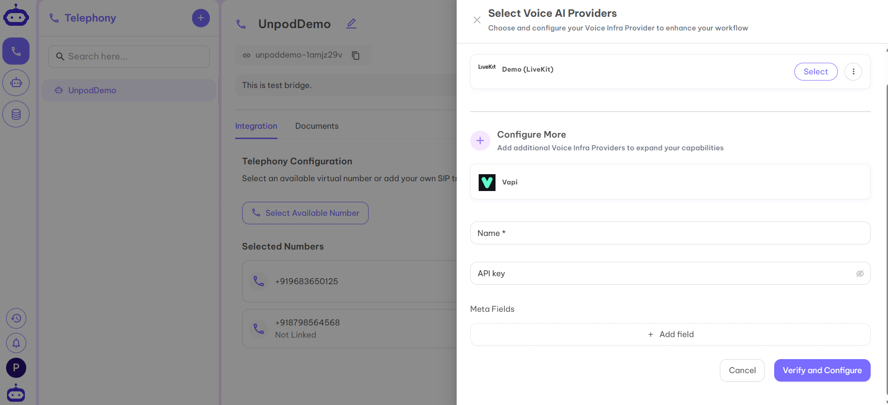
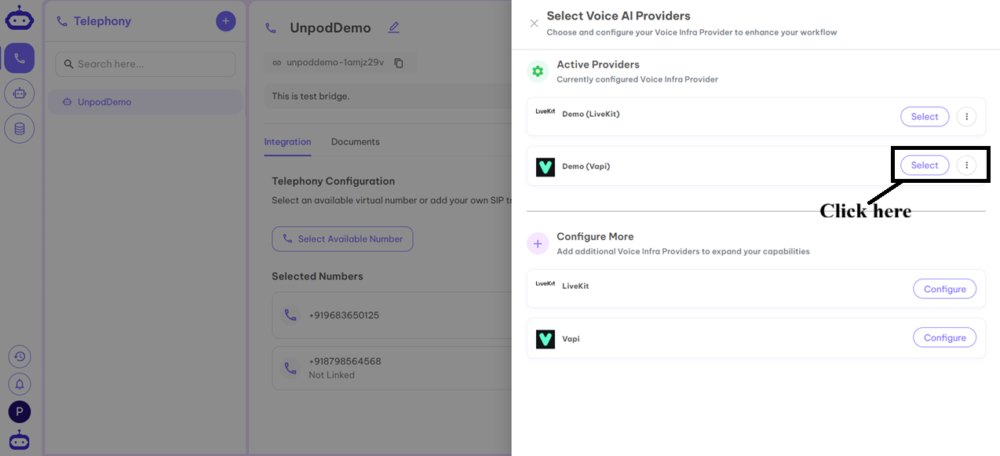
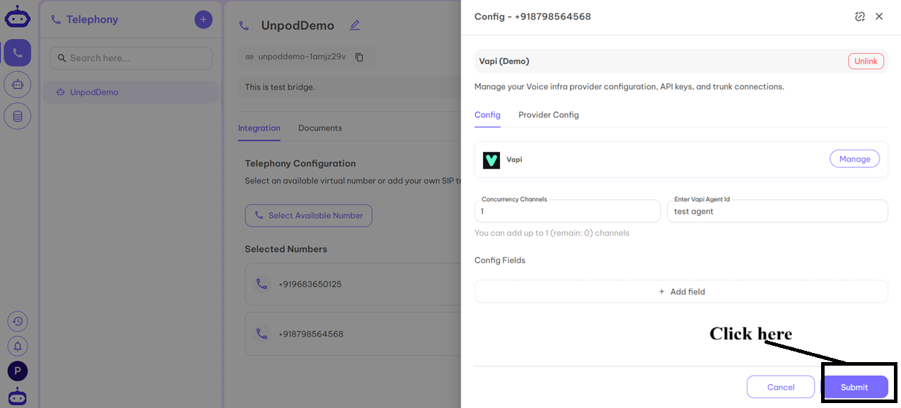

## Configure Number with Vapi

1. After adding a number to a Bridge, click **Configure**.  

2. Select **Vapi** from the provider list.  

3. Click **Configure** next to Vapi.  

4. Fill in the required details from your Vapi dashboard:  
   - **Name** – Any identifier (product/org name)  
   - **API Key** – Secure access key from Vapi  

5. Click **Verify and Configure**.  

6. Under Active Providers, select **Demo (Vapi)**.  

7. Your SIP trunk is now active.  

8. Go to **Settings** to configure the trunk.  

9. Fill in:  
   - **Concurrency Channels** – Number of parallel interactions  
   - **Enter Agent** – Name of your Vapi agent  

10. Your SIP trunk and number are ready for inbound/outbound calls. 🚀

---

✅ **Next Step:**  
Once your Vapi provider is configured, head to the **[Agents](../agents)** page to connect it with a voice agent.
