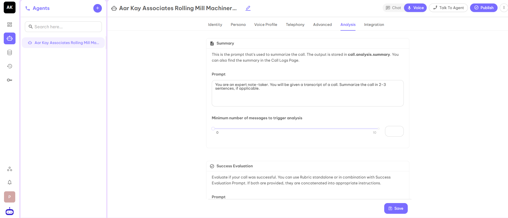
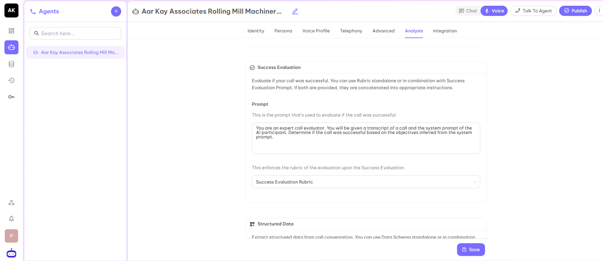
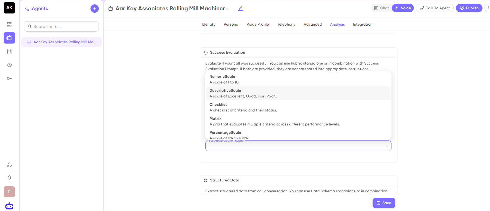
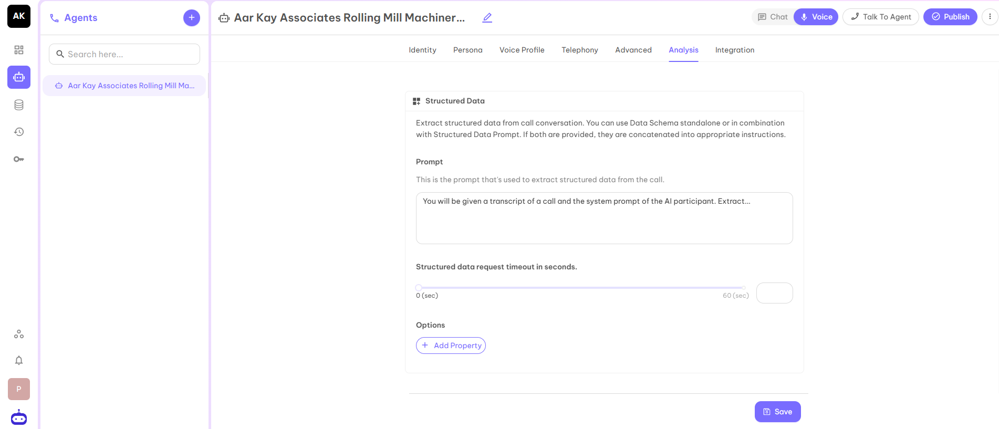
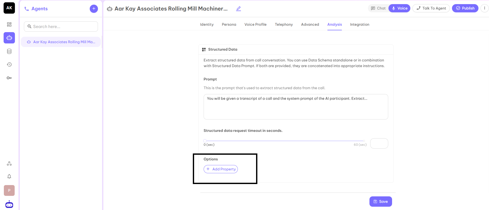
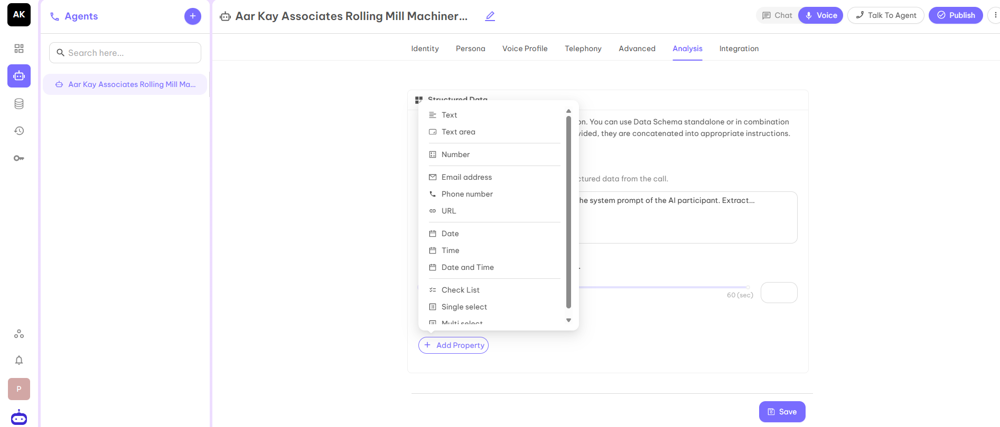

## Analysis

This tab is used to analyse the success of the call logs.

### Summary
This feature is used to provide the prompt used to summarize the call. The output will be stored in calls.analysis.summary. You can also find the summary in the Calls Log page.

This section helps you to derive and summarize the Summary of the call according to your business requirements if you need to make any changes in the summary of the call.

### Success Evaluation
Evaluate if your call was successful. You can use Rubric standalone or in combination with Success Evaluation Prompt. If both are provided, they are concatenated into appropriate instructions.

In the above you can set one Evaluation criteria on the basis of which you can decide whether the call is successful or not. You can set up the Prompt for that.

For example, suppose you are a real estate company and your success criteria is If a customer fixed the site visit then you consider the call is successful.

On the basis of the given prompt, you can set the success evaluation rubric from the selected rubrics according to your understanding.

### Structured Data
Extract structured data from call conversation. You can use Data Schema standalone or in combination with Structured Data Prompt. If both are provided, they are concatenated into appropriate instructions.

Structured data will help you to extract some basic information which is needed to decide whether the called person is interested in your product or service.

For example, your agent is related to an educational institution. You have called the parent to provide information about the courses you provide. The basic details you need are the name of the student, grade of the student, etc.

In the prompt you can write Put the child name in the Name tag. and Put the grade of the child in the Grade tag.

Now you have to add the same properties by clicking on the Add Property and the name of the properties are case sensitive. Use the same case which you have used in the prompt.

According to the Tag, click on the property. Suppose you have to make a Name tag then select Text.

The structured data helps you to extract the exact information of the call and you will be able to analyze the call in a perfect manner.

After filling in all the details, click on the Save button and move to the next tab Integration.
