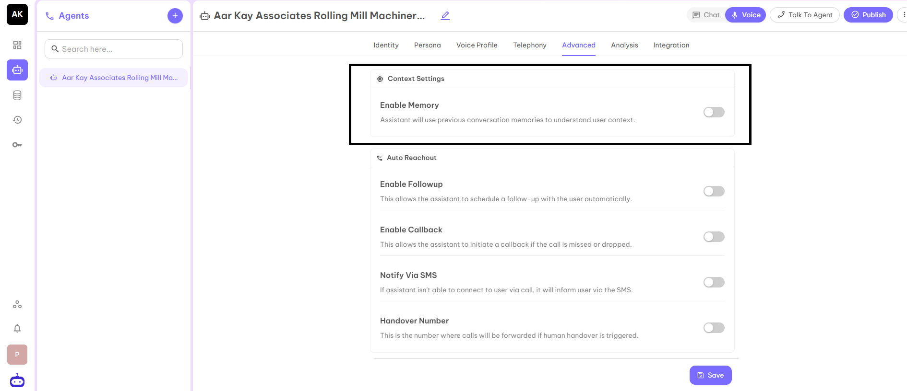
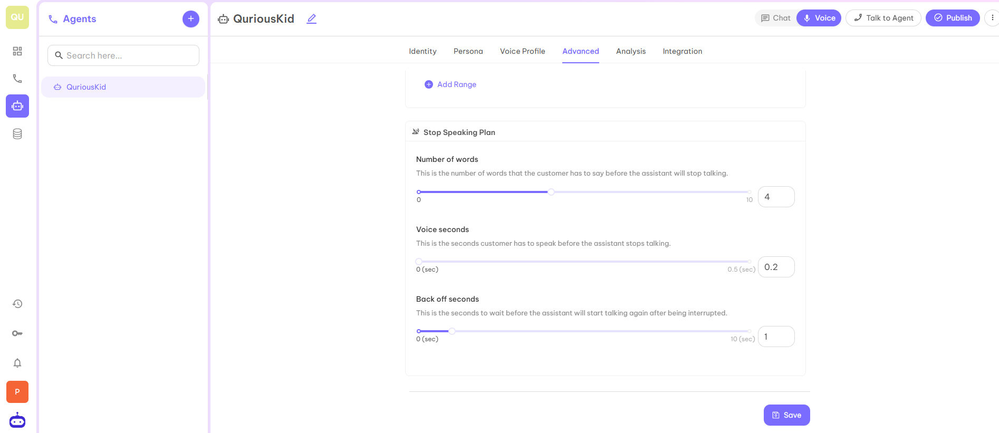
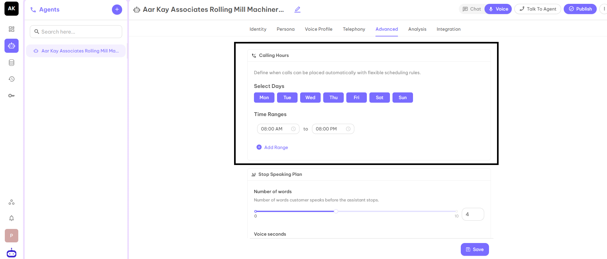
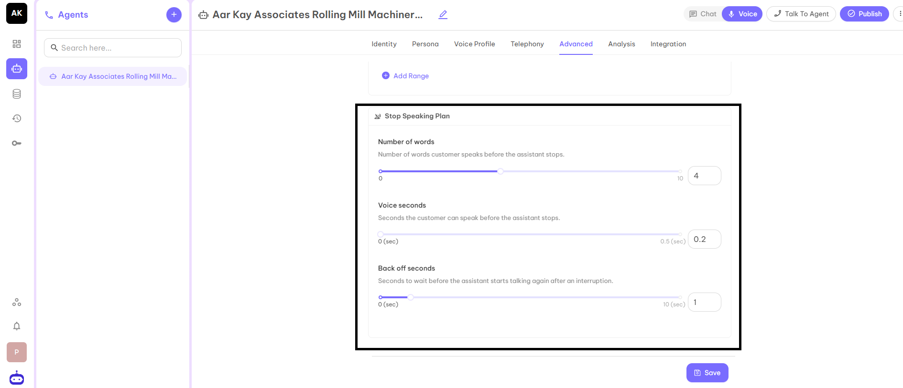

## Advanced

This is the advanced feature with the help of which you can set up automatic calls. When you set up this feature, your Voice AI agent will automatically call on the provided number at a given time.

### Context Settings
This setting enables the AI assistant to retain and reference relevant details from past conversations, allowing it to better understand user context over time. By using conversation memory, the assistant can deliver more personalized, consistent, and context-aware responses instead of treating each interaction as isolated.

### Auto Reachout
- **Enable Followup** - This allows the assistant to schedule a follow up with the user automatically.
- **Enable Callback** - This allows the assistant to initiate a callback if the call is missed or dropped.
- **Notify via SMS** - This option sends an SMS notification to the user when the assistant is unable to connect via a call.
- **Handover Number** - This is the number where calls will be forwarded if human handover is triggered.

### Calling Hours
Define when calls can be placed automatically with flexible scheduling rules. You can set up the time according to flexibility.

### Stop Speaking Plan
- **Number of Words** - This is the number of words that the customer has to say before the assistant will stop talking.
- **Voice Seconds** - This is the seconds a customer has to speak before the assistant stops talking.
- **Back Off Seconds** - This is the seconds to wait before the assistant will start talking after being interrupted.

After filling in all the details, click on the Save button and move to the next part Analysis.
