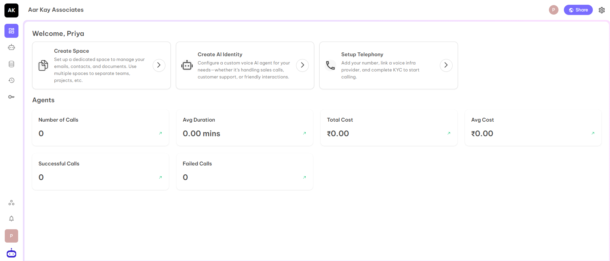
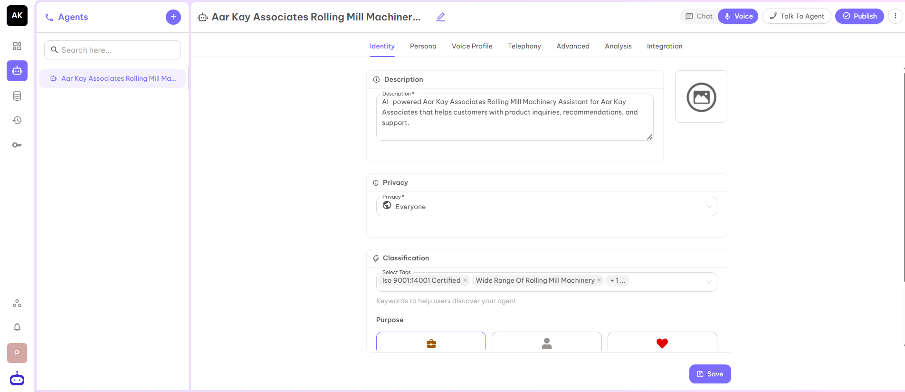
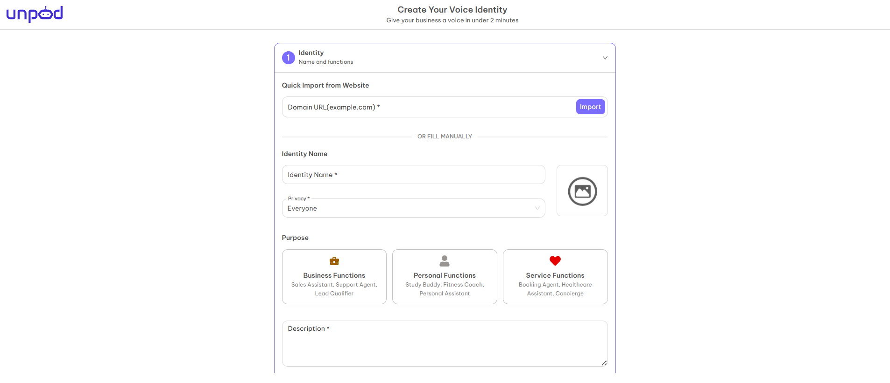

### Getting Started

Unpod Agents are AI-powered assistants that handle calls, chats, and tasks. With an agent, you can decide how it interacts with users, what knowledge it accesses, and how it communicates over the phone.

The interface below represents the Studio View.

As you have already created a Voice Agent for your business while getting access to the dashboard. But you can modify the Agent according to your advanced requirements or you can create a New Agent also by clicking on Create AI Identity. It will redirect you to the Agents page.

The above page shows the configuration of already created agent as well as you can create a new agent by clicking on plus symbol at the left corner of the above page. It will again redirect you to the base page which you have encountered in the start while SignUp process.

---

---

---

---

---

---

---

---

