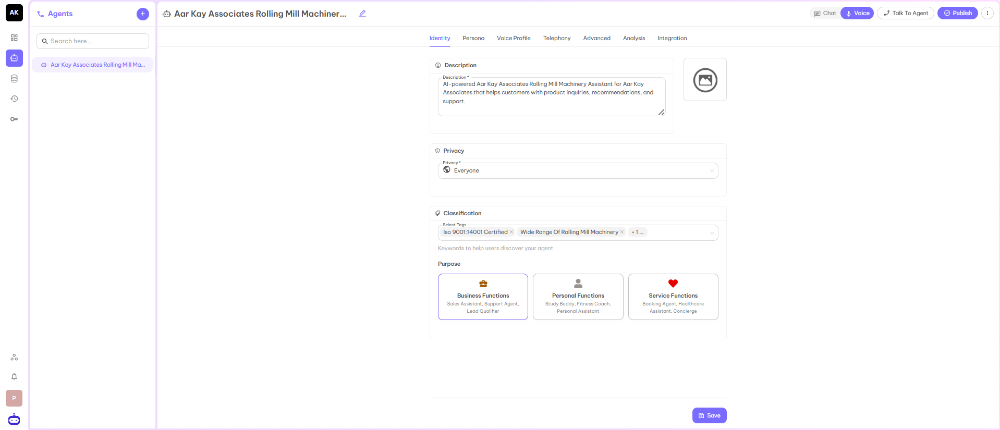

## Identity

Identity defines the AI agent's name, role, and persona that determine how it presents itself and interacts with users. The main sections of the Identity are:

- **Description** - A high-level description of the AI assistant - what it does, its domain (e.g., rolling mill machinery), and its primary purpose. This helps users quickly understand the assistant's focus and capabilities.
- **Privacy** - It means whether the agent is accessible to everyone or it remains private to only some people.
- **Classification** - Mention the keywords that help the users to discover your agent.
- **Purpose** - The purpose for which you have created the agent, Business, Personal, and Service.

After filling in all the details, click on the Save button and move to the next part Persona.
