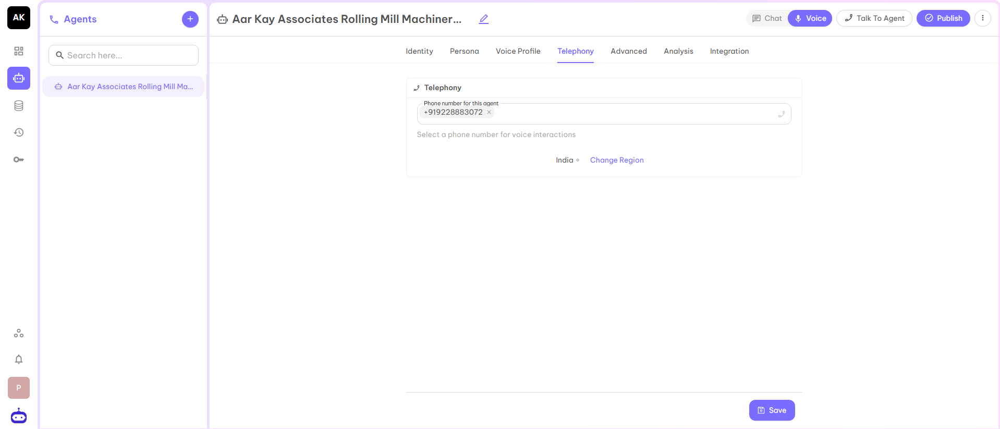

## Telephony

This section allows you to assign a dedicated phone number to the AI agent, enabling it to handle voice interactions. The selected number is used for making and receiving calls, ensuring users can communicate with the agent through a consistent and identifiable telephony channel.

After filling in all the details, click on the Save button and move to the next part Advanced.
