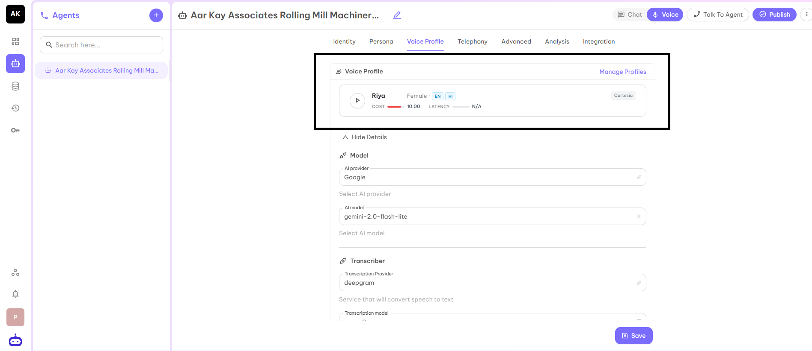
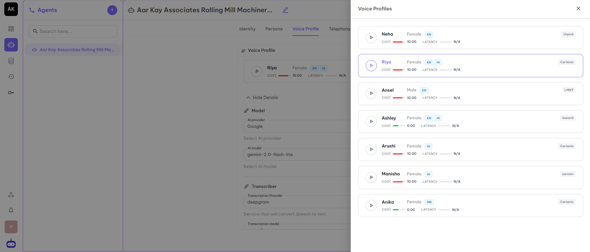
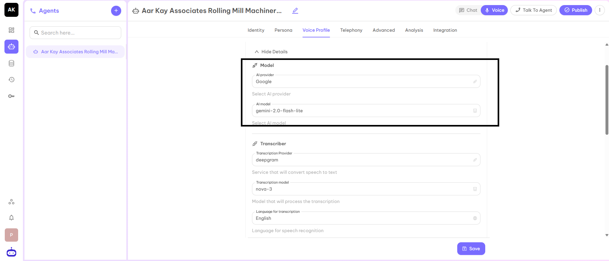
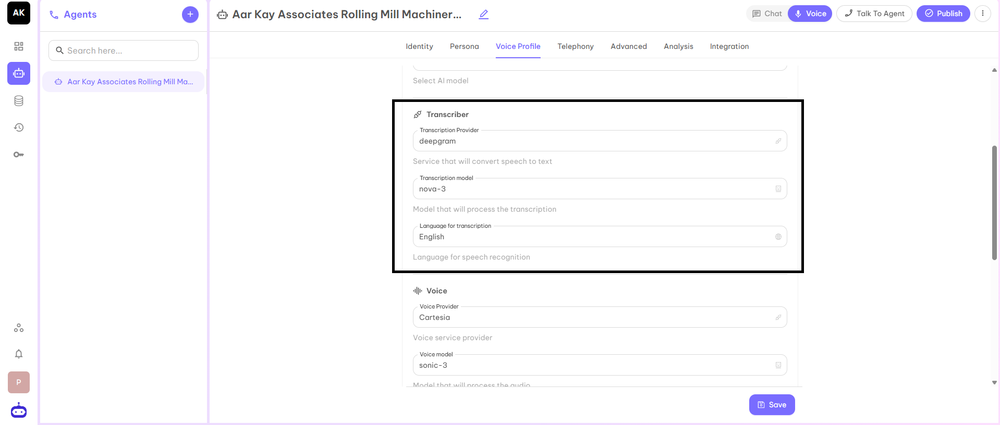
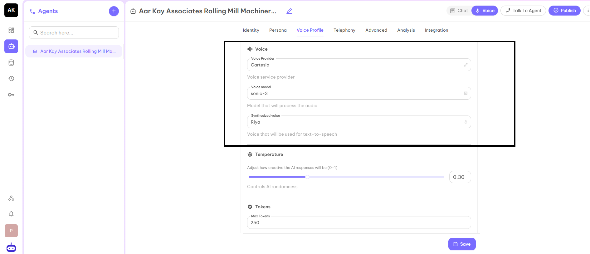
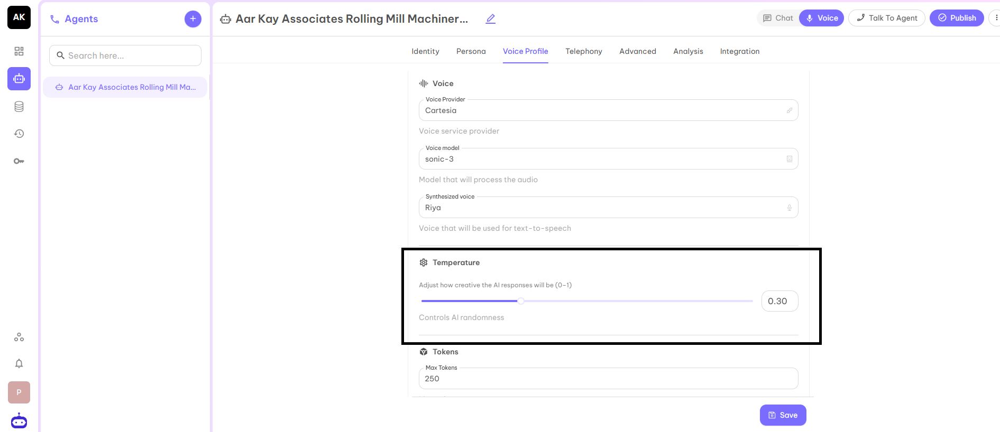
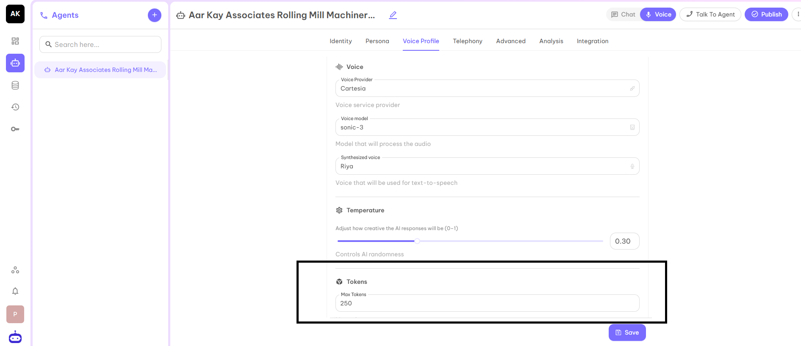
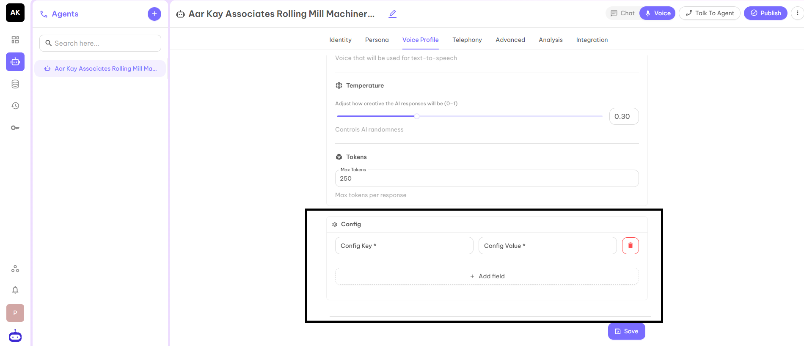

## Voice Profile

A voice profile is a set of settings that define how an AI or virtual assistant sounds during conversations. It includes choices like the voice's gender, accent, tone, speed, and emotion, allowing businesses to create a natural and consistent speaking style that matches their brand or use case. Voice profiles help make automated calls or chat interactions more engaging and personalized for users.

### Voice Profile Selection

The first option is Voice Profile. The default voice is already visible. Click on the Manage Profiles to change the Voice Profile from the given choices.

Once you select the Voice Profile from the given options, then all other fields will get automatically selected on the basis of the selected agent.

### Model
This part has two parameters:
- **AI Provider** - is the service platform that hosts and delivers the AI technology used by the agent.
- **AI Model** - is the specific intelligence selected from that provider that defines how the agent understands input, reasons, and responds.

### Transcriber
This part has three parameters:
- **Transcription Provider** - Service which converts speech to text.
- **Transcription Model** - Model which is used to process the transcription.
- **Language for Transcription** - Language for speech recognition.

### Voice
This part has three parameters:
- **Voice Provider** - Voice service provider who provides voice to your Voice Agent.
- **Voice Model** - The model which is used to process the audio.
- **Synthesized Voice** - The name of the voice which is used for text-to-speech.

### Temperature
It is used to adjust the latency of the responses. It is used to control the randomness of AI as well as to adjust how creative the response of AI will be. In simple terms, after what time an AI voice agent gives a response to your question. The recommended value for this parameter is 0.5.

### Max Tokens
It represents the maximum token in output as a response for each question you asked from the AI Voice Agent. It would not be more than the given number. The preferred number is 250.

### Config (Optional)
This has two fields: Config Key and Config Value.

After filling in all the details, click on the Save button and move to the next part Telephony.
