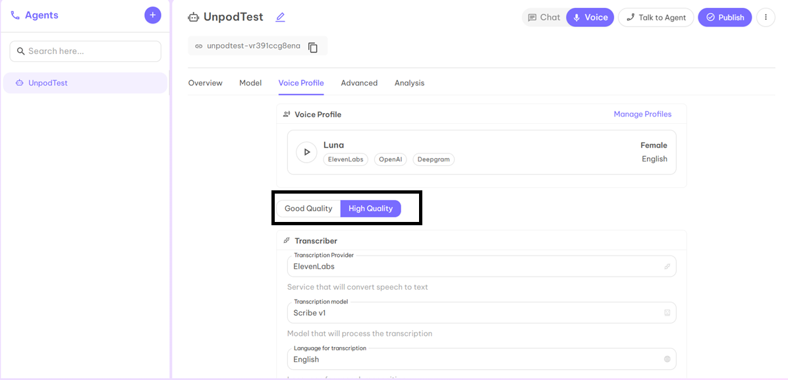
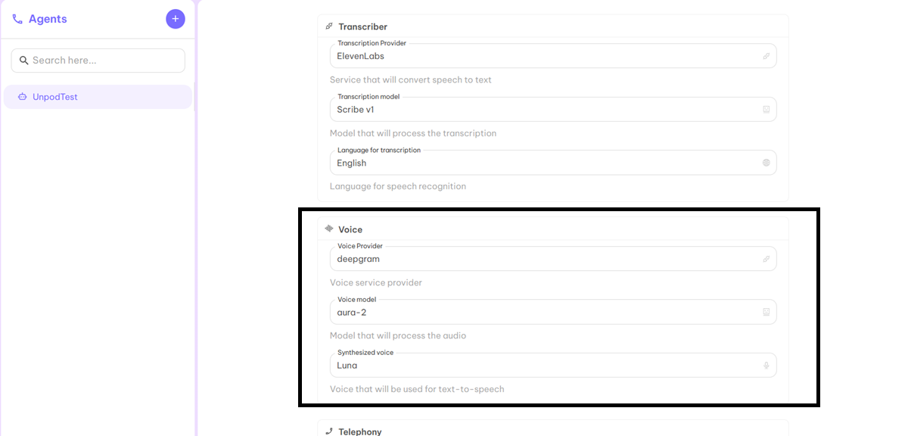
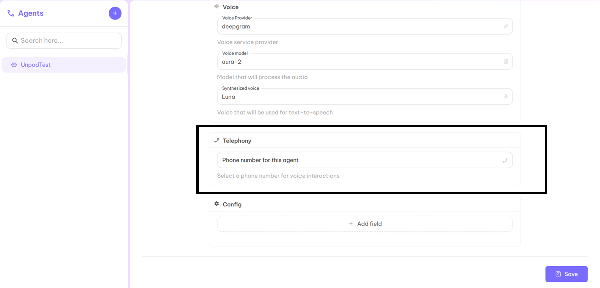
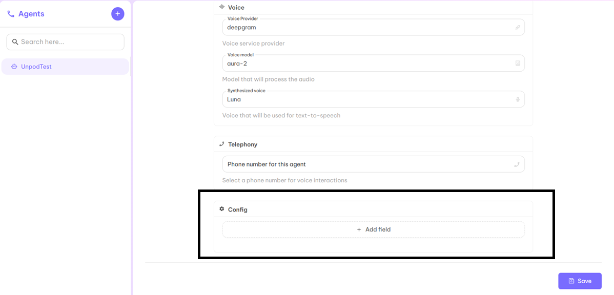
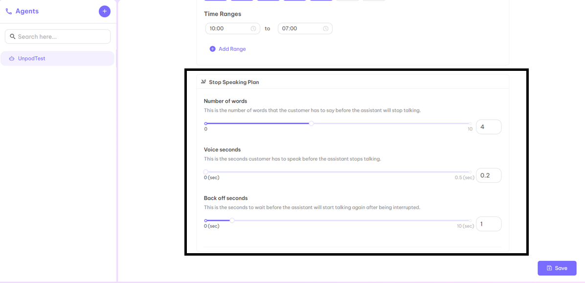
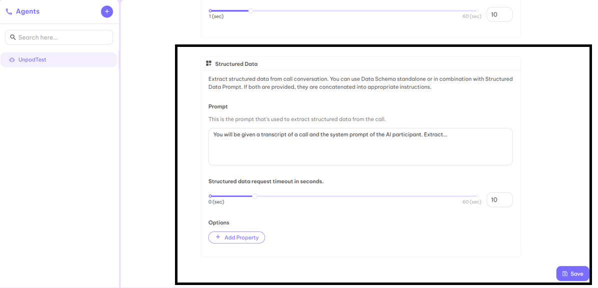

# AGENTS: The Heart of Unpod — Shaping Every Conversation

Unpod Agents are AI-powered assistants that handle calls, chats, and tasks. With an agent, you can decide how it interacts with users, what knowledge it accesses, and how it communicates over the phone.

---

## Overview

Create a voice agent with a simple prompt, attach it with your phone number, and make your first call.  

### Step 1  
Login to the Unpod dashboard using your credentials.  
Click on **AI Studio** from the left sidebar of the dashboard as shown below.

### Step 2  
The page will be blank initially since you don’t have any agent yet.  
To create your first agent, click on the **➕** symbol as shown below.

### Step 3  
After clicking **➕**, you’ll be redirected to the creation page to start setting up your first agent.

### Step 4  
Give your agent a name according to your product or organization.

### Step 5  
Fill in all the highlighted details.  
Mandatory fields: **Description**, **Classification**, and **Access Type** (Public or Shared).  
For Classification, choose the relevant tag from the dropdown menu based on your product or organization.

### Step 6  
After completing the form, click **Save** to create your agent.

### Step 7  
Your created agent will now appear on the left side of the dashboard.

### Step 8  
Now decide the type of your agent — **Chat Agent** or **Voice Agent**.  
After selecting the type, fill in the remaining details in the next steps.

---

## Model

A **model** refers to a customizable AI system designed for tasks like conversations, support automation, or workflow handling.  
Here, you define how your AI starts and manages conversations using the system prompt.

### Step 1 — Persona  
Enter the **Greeting Message** (how the agent starts a conversation) and **System Prompt** (defines agent behavior throughout the chat).

### Step 2 — Objectives (Optional)  
If you want your AI to focus on specific questions or topics, define them here. You can add multiple objectives.

### Step 3 — Knowledge Base (Optional)

If FAQs are too large to include in the System Prompt, create a Knowledge Base and link it to your Voice Agent.

#### How to Create a Knowledge Base

1. On the dashboard, click on **Knowledge Base** from the left corner.  
2. Click **Add** to create a new Knowledge Base.  
3. Fill in the required fields: **Name**, **Type**, **Description**, and **Visibility**.

**Visibility Options:**
- **Everyone:** Accessible to everyone  
- **Shared:** Accessible only to shared email IDs  
- **Private:** Accessible only to you  

4. Click **Next** to open the **Add Schema Fields** page.  
5. Fill in the required schema details and click **Next** again.  
6. On the **Create Knowledge Base** page, upload your reference file (organization or product info) and click **Save**.

Once saved, your Knowledge Base is ready and can be used by your AI Voice Agent.

### Step 4 — Select Model

You’ll have two dropdowns:

- **AI Provider:** Choose from options like OpenAI, Groq, Google, Azure, etc.  
- **AI Model:** Choose from available models like `gpt-3.5-turbo`, `gpt-4o`, etc.

### Step 5 — Temperature  
Adjusts the randomness and creativity of the AI’s responses.  
Recommended value: **0.5**

### Step 6 — Max Tokens  
Sets the maximum token count for output per response.  
Preferred value: **250**

### Step 7  
After completing all details, click **Save** and move to **Voice Profile**.

---

## Voice Profile

A voice profile is a set of settings that define how an AI or virtual assistant sounds during conversations. It includes choices like the voice’s gender, accent, tone, speed, and emotion, allowing businesses to create a natural and consistent speaking style that matches their brand or use case. Voice profiles help make automated calls or chat interactions more engaging and personalized for users.

### Step 1  
Click **Select** to choose a Voice Profile from the given options. 

Once selected, related fields auto-fill based on your choice.

### Step 2 — Quality  
Choose between:
- **Good Quality Agent** — Slight AI tone, cost-effective  
- **High Quality Agent** — Natural, human-like voice

### Step 3 — Transcriber  
Set up:
- **Transcription Provider:** Converts speech to text  
- **Transcription Model:** Processes transcription  
- **Language for Transcription:** Sets speech recognition language

### Step 4 — Voice  
Configure:
- **Voice Provider:** Voice service provider  
- **Voice Model:** Audio processing model  
- **Synthesized Voice:** Name of the voice used for text-to-speech

### Step 5 — Telephony  
Add the phone number you want your Voice AI Agent to connect with.

### Step 6 — Config (Optional)  
Add:
- **Config Key**  
- **Config Value**

Click **Save** and move to the **Advanced** tab.

---

## Advanced

Advanced settings allow you to automate calls — enabling your Voice AI Agent to call at a scheduled time.

### Step 1 — Auto Reachout  
Set the following parameters:
- **Enable Follow-up:** Automatically schedules a follow-up call  
- **Enable Callback:** Initiates a callback if a call is missed  
- **Handover Number:** Number where calls are forwarded if human handover is triggered  
- **Calling Hours:** Define the time range for automatic calling

### Step 2 — Stop Speaking Plan  
Configure:
- **Number of Words:** Words spoken by customer before the AI pauses  
- **Voice Seconds:** Time the customer speaks before AI pauses  
- **Back Off Seconds:** Wait time before the AI resumes after interruption

Click **Save** and move to **Analysis**.

---

## Analysis

Used to analyze the success and performance of call logs.

### Step 1 — Summary  
Define the **Summary Prompt** for calls.  
Output is stored in `calls.analysis.summary` and visible in the Calls Log page.

### Step 2 — Success Evaluation  
Evaluate call success using **Rubric** and **Success Evaluation Prompt**.  
If both are used, they combine into unified evaluation instructions.

### Step 3 — Structured Data  
Extract structured data from call conversations using **Data Schema** or **Structured Data Prompt**.

After filling all details, click **Save**.

Finally, click the **Publish** button at the top-right corner to make your agent live.

---

✅ **Your AI Agent is now ready to use!**
