## Getting Started

Unpod Agents are AI-powered assistants that handle calls, chats, and tasks. With an agent, you can decide how it interacts with users, what knowledge it accesses, and how it communicates over the phone.

---

## Identity

Create a voice agent with a simple prompt, attach it with your phone number, and make your first call.

### Step 1
Login to the dashboard of Unpod with your login credentials. Click on **AI Studio** from the left side of the dashboard as shown below.

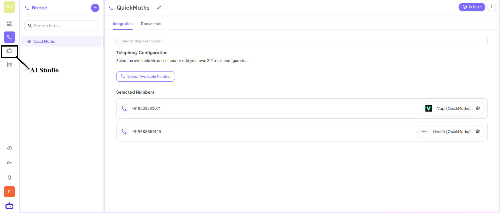

### Step 2
Once you click on **AI Studio**, you will be redirected to the page from where you can start creating your first agent.

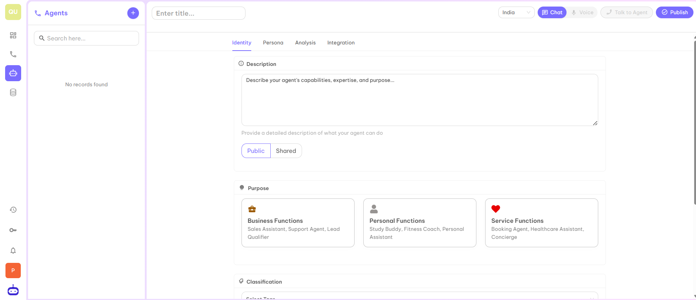

### Step 3
Now give the name to your agent according to your product or organization for which you are creating this agent.

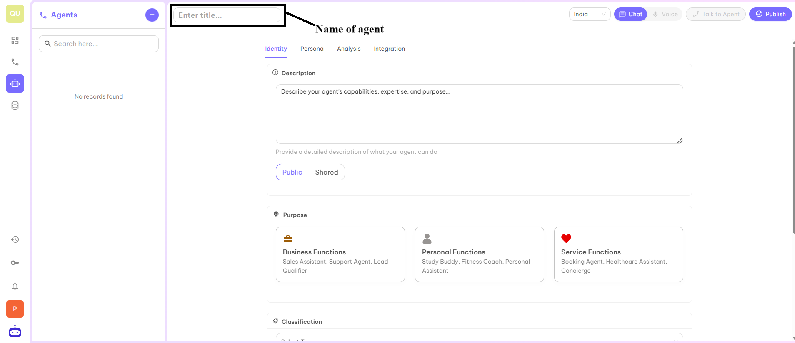

### Step 4
Now fill the complete details of the agent in the highlighted fields. The fields which are mandatory to fill are **Description**, **Purpose**, **Classification**, also select whether the agent should be accessed by anyone (public) or accessed by only those whom you give the access (shared). For classification, there is a drop down menu from where you can select the tag according to your organization or product. You can also add the logo of your organization.

In description, you can give the identity of the business. For example, I have created an agent for QuriousKid which is an educational institute. In Identity, I have mentioned:
> "You are Ahaana, a friendly and understanding educational consultant from CuriousKid."

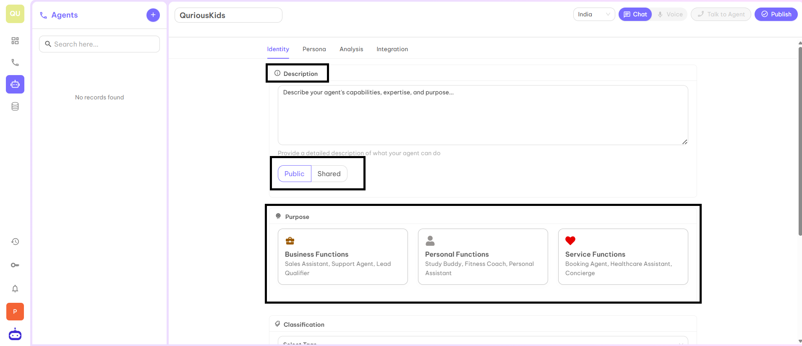
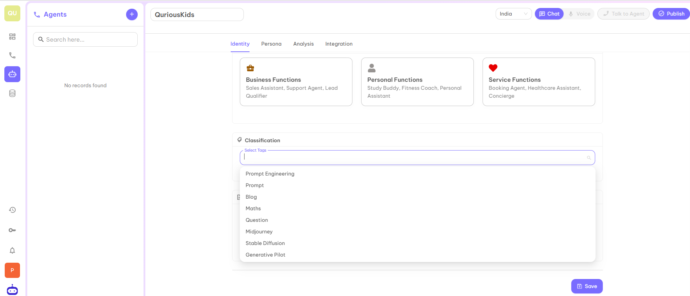

### Step 5
After filling all the details, click on **Save** button to create an agent.

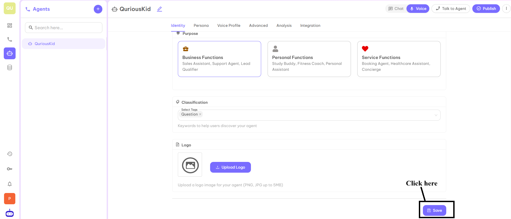

### Step 6
Once you click on Save, your created agent will be visible on the left side of the dashboard as shown below.

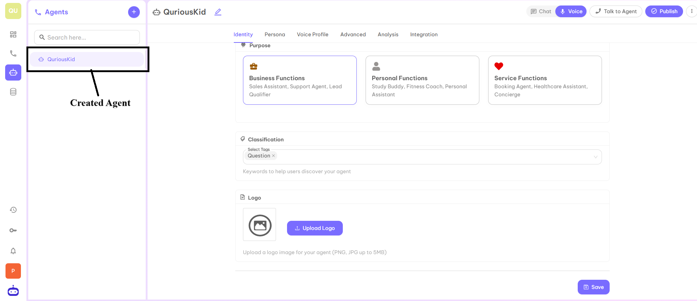

### Step 7
Now your agent is ready. Now you have to decide whether the agent is a **Chat Agent** or **Voice Agent**. After selecting the type of agent, you have to fill in other details in next steps.

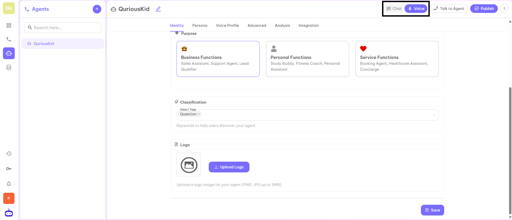

Now the step of Identity is completed, now you have to move to next parts **Persona**, **Voice Profile**, **Advanced**, **Analysis**, and **Integration**. Let's go through each part step by step.

---

## Persona

A "Persona" typically refers to a customizable AI agent or system designed for specialized tasks such as handling conversations, automating support, or performing workflow actions. In this part, you can provide how an AI agent starts the conversation, moving further how it resolves the queries of your customer with a provided system prompt.

### Step 1 — Greeting Message
Enter **Greeting Message**. This is the first message which your AI identity says to your client. For example:
> "Hello! How can I assist you today?"

### Step 2 — System Prompt
Provide **System Prompt** which defines the behavior of AI. This part will contain Identity, Style (How your AI Identity behaves), Response Guidelines (How your AI Identity gives response to the client), Tasks and Roles (what roles will be completed by your AI Identity). You have to give clear instructions so that your identity will provide exact and proper information to the client.

### Step 3 — Tone and Personality
Select the Tone and Personality of your AI Identity. You have four options: **Professional**, **Friendly**, **Casual**, and **Empathetic**. Select according to your business requirements.

### Step 4 — Knowledge Base (Optional)
Sometimes FAQs are more and not possible to give all information in System Prompt. You can create your own Knowledge Base and connect it with Voice Agent from the dashboard only.

#### How to Create a Knowledge Base?

1. On the Dashboard, you find the **Knowledge Base** option at the left corner shown below.

2. Once you click on the symbol shown above, you will be redirected to the below page. On this page, click on the **Add** button to create a new Knowledge Base.

3. Once you click on the **Add** button, you will be redirected to the below page where you can fill the required information to create a new Knowledge Base.

You have to fill in the **Name**, **Type of content**, **Description**, and **Visibility** of the knowledge base.

**Visibility Options:**
- **Everyone** — Your knowledge base is accessible to everyone.
- **Shared** — Your knowledge base is only accessible to shared mail ids.
- **Private** — Your knowledge base is accessible to you only.

4. Once you fill in all the details, click on the **Next** button and you will be redirected to the page shown below **Add Schema Fields**.

Here you can select the necessary fields which are required for your knowledge base. For others you can deselect them. You can also add new fields if needed with the help of **Add Field** option.

5. When you click on **Next**, you will be redirected to the below page.

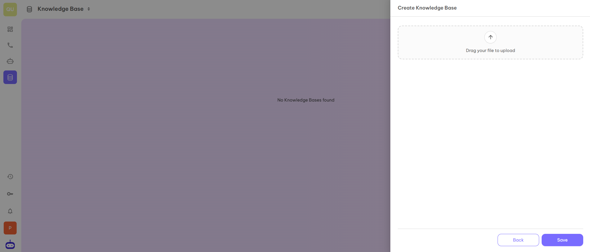

In the above page, you have to add the file that contains required information about your organization or product so that it must be accessible by your AI Voice Agent. After uploading the file, click on the **Save** button.

6. Once you click on the **Save** button, your personal Knowledge Base is created and can be used with your AI Voice Agent to access FAQs or other information.

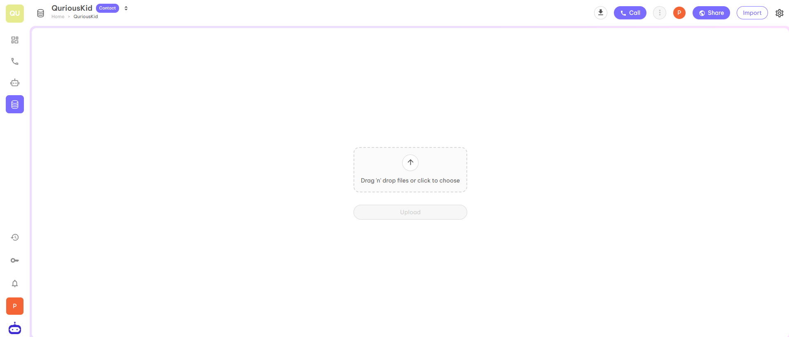

### Step 5 — Select Model
In the next step, you have to select the Model for your Voice AI agent. There are two options to select:

- **AI Provider** — You have to select the provider from the given options in the drop down list (OpenAI, Groq, Google, Azure, etc.).

- **AI Model** — You have to select the model from the given options in the drop down list (gpt-3.5-turbo, gpt-4o, etc.).

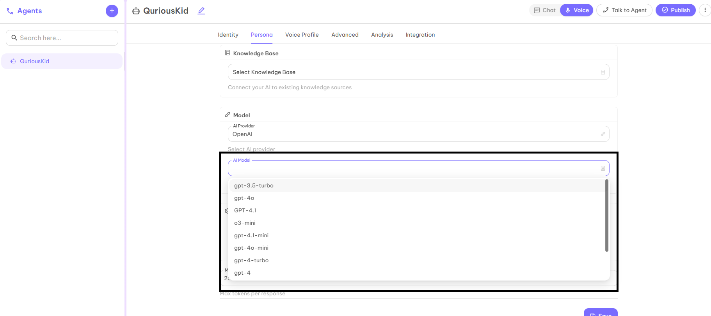

### Step 6 — Temperature
It is used to adjust the latency of the responses. It is used to control the randomness of AI as well as to adjust how creative the response of AI will be. In simple terms, after what time an AI voice agent gives a response to your question. The recommended value for this parameter is **0.5**.

### Step 7 — Max Tokens
It represents the maximum token in output as a response for each question you asked from the AI Voice Agent. It would not be more than the given number. The preferred number is **250**.

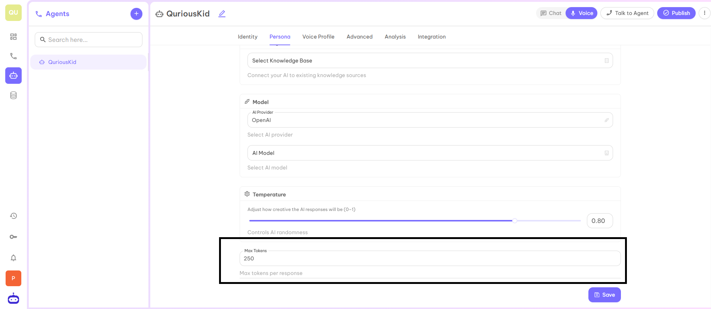

### Step 8
After filling in all the required details, click on **Save** button and move to next part which is **Voice Profile**.

---

## Voice Profile

A voice profile is a set of settings that define how an AI or virtual assistant sounds during conversations. It includes choices like the voice's gender, accent, tone, speed, and emotion, allowing businesses to create a natural and consistent speaking style that matches their brand or use case. Voice profiles help make automated calls or chat interactions more engaging and personalized for users.

### Step 1 — Voice Profile Selection
First option is Voice Profile. Click on the **Select** button to add the Voice Profile from the given choices.

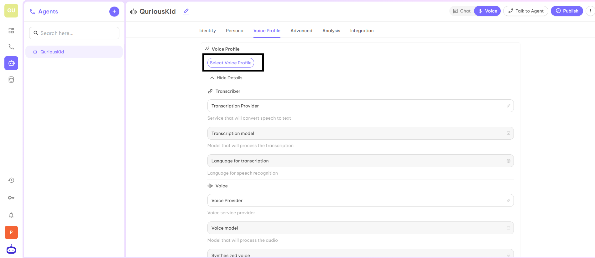

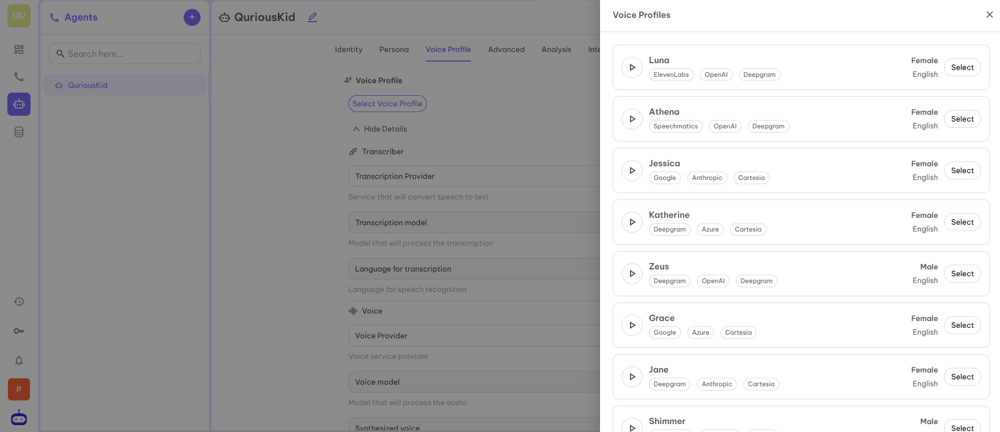

Once you select the Voice Profile from the given options, then all other fields will get automatically selected on the basis of the selected agent.

### Step 2 — Transcriber
This part has three parameters:
- **Transcription Provider** — Service which converts speech to text.
- **Transcription Model** — Model which is used to process the transcription.
- **Language for Transcription** — Language for speech recognition.

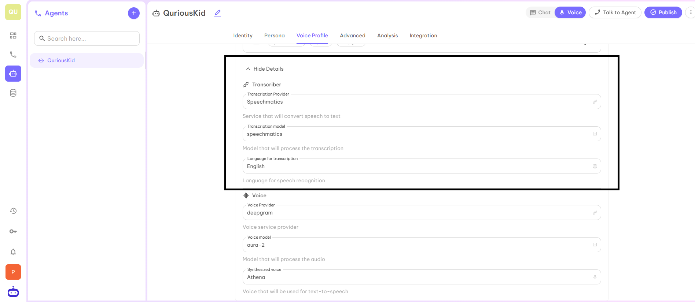

### Step 3 — Voice
This part has three parameters:
- **Voice Provider** — Voice service provider who provides voice to your Voice Agent.
- **Voice Model** — The model which is used to process the audio.
- **Synthesized Voice** — The name of the voice which is used for text-to-speech.

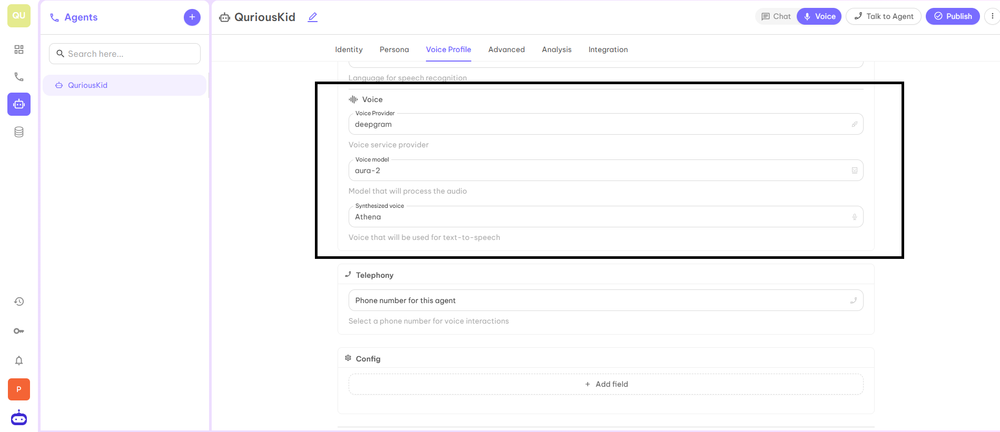

### Step 4 — Telephony
This is where you can add the number to which you want to attach your Voice AI Agent.

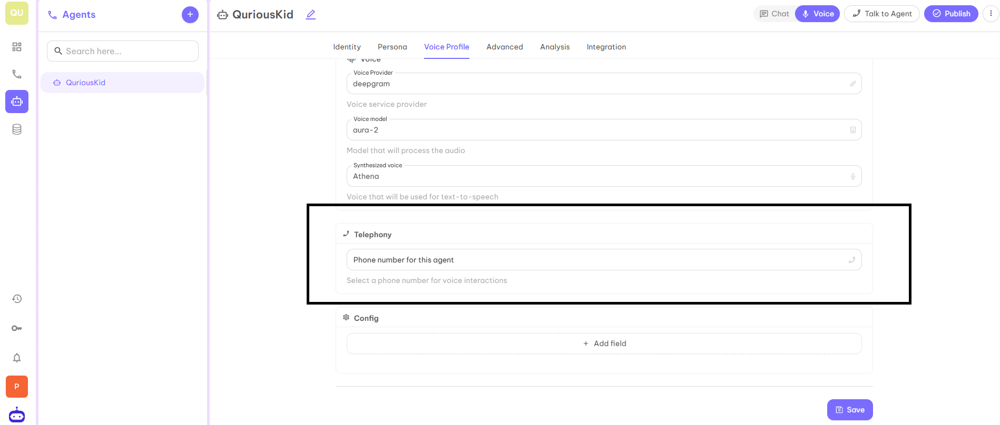

### Step 5 — Config (Optional)
This has two fields: **Config Key** and **Config Value**.

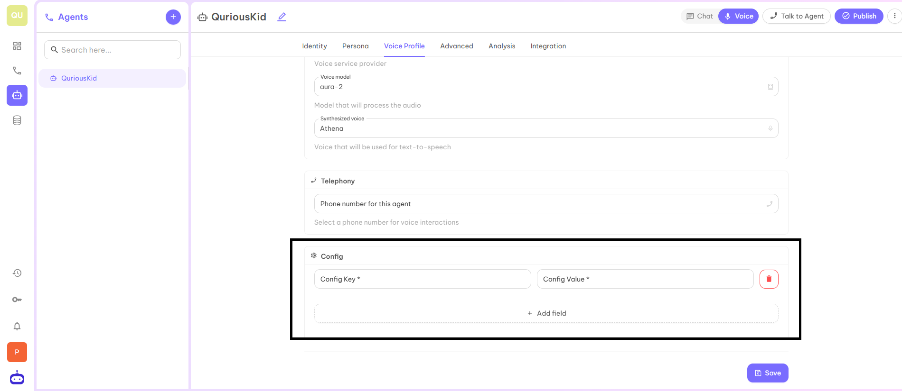
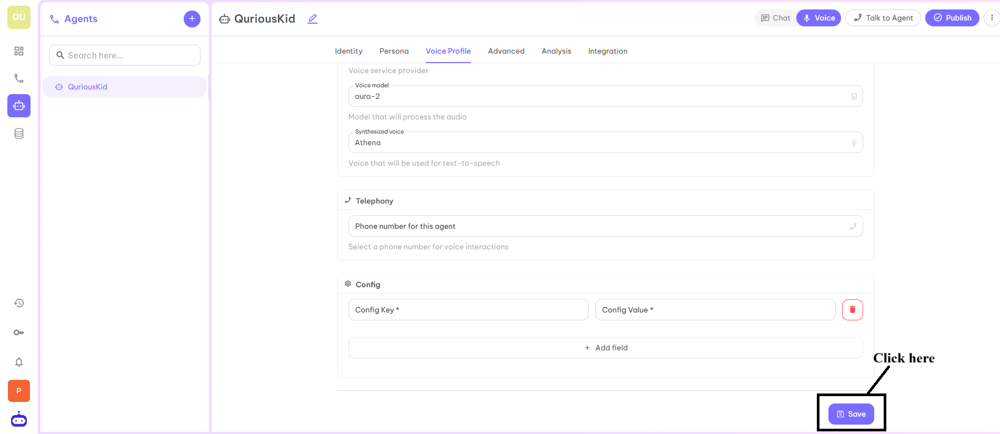

After filling in all the details, click on the **Save** button and move to the next part **Advanced**.

---

## Advanced

This is the advanced feature with the help of which you can set up automatic calls. When you set up this feature, your Voice AI agent will automatically call on the provided number at a given time.

### Step 1 — Auto Reachout
The first tab is **Auto Reachout**. This tab has following parameters to set up:

- **Enable Followup** — This allows the assistant to schedule a follow up with the user automatically.
- **Enable Callback** — This allows the assistant to initiate a callback if the call is missed or dropped.
- **Handover Number** — This is the number where calls will be forwarded if human handover is triggered.
- **Calling Hours** — Define when calls can be placed automatically with flexible scheduling rules. You can set up the time according to flexibility.

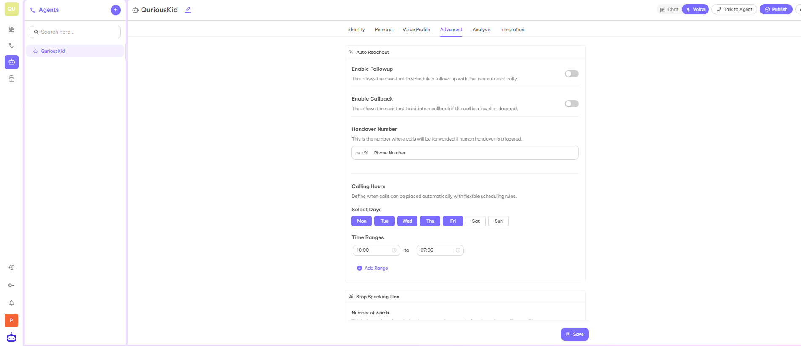
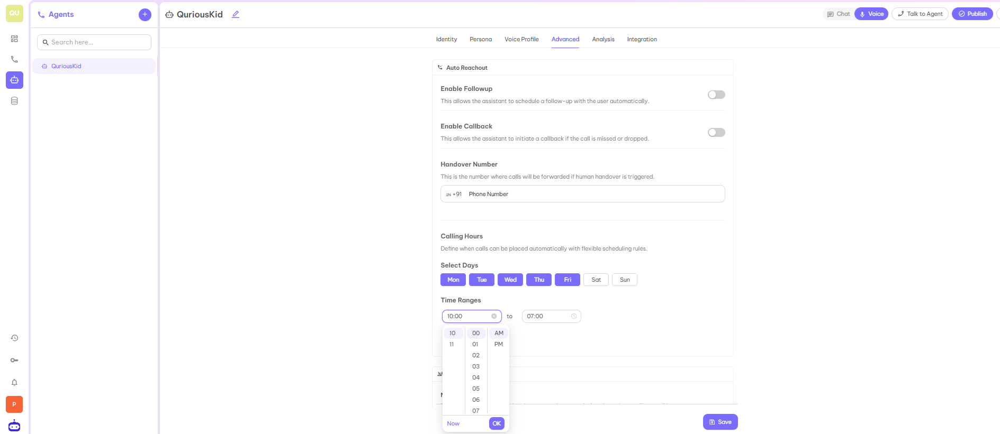

### Step 2 — Stop Speaking Plan
The next tab is **Stop Speaking Plan**. This tab has below parameters:

- **Number of Words** — This is the number of words that the customer has to say before the assistant will stop talking.
- **Voice Seconds** — This is the seconds a customer has to speak before the assistant stops talking.
- **Back Off Seconds** — This is the seconds to wait before the assistant will start talking after being interrupted.

After filling in all the details, click on the **Save** button and move to the next tab **Analysis**.

---

## Analysis

This tab is used to analyse the success of the call logs. This tab has the following parameters:

### Step 1 — Summary
This feature is used to provide the prompt used to summarize the call. The output will be stored in `calls.analysis.summary`. You can also find the summary in the **Calls Log** page.

This section helps you to derive and summarize the "Summary" of the call according to your business requirements if you need to make any changes in the summary of the call.

### Step 2 — Success Evaluation
Evaluate if your call was successful. You can use **Rubric** standalone or in combination with **Success Evaluation Prompt**. If both are provided, they are concatenated into appropriate instructions.

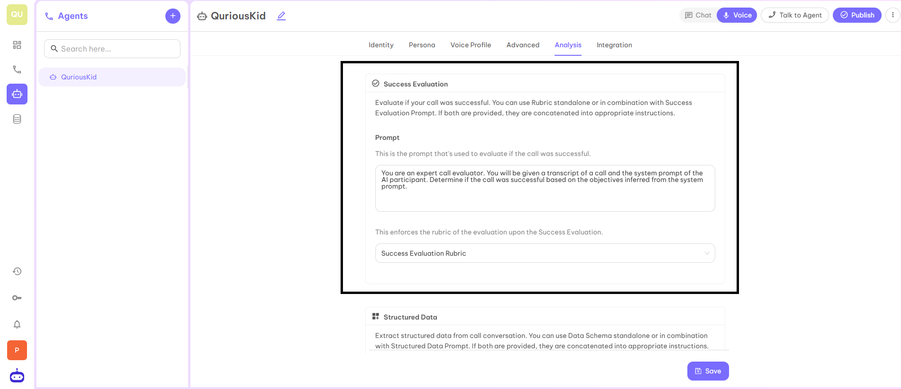

In the above you can set one Evaluation criteria on the basis of which you can decide whether the call is successful or not. You can set up the Prompt for that.

For example, suppose you are a real estate company and your success criteria is "If a customer fixed the site visit" then you consider the call is successful.

On the basis of the given prompt, you can set the success evaluation rubric from the selected rubrics according to your understanding.

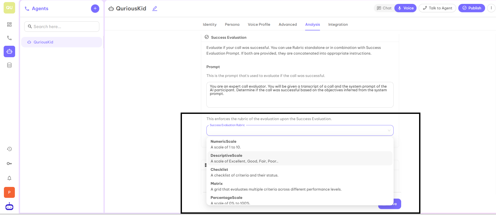

### Step 3 — Structured Data
Extract structured data from call conversation. You can use **Data Schema** standalone or in combination with **Structured Data Prompt**. If both are provided, they are concatenated into appropriate instructions.

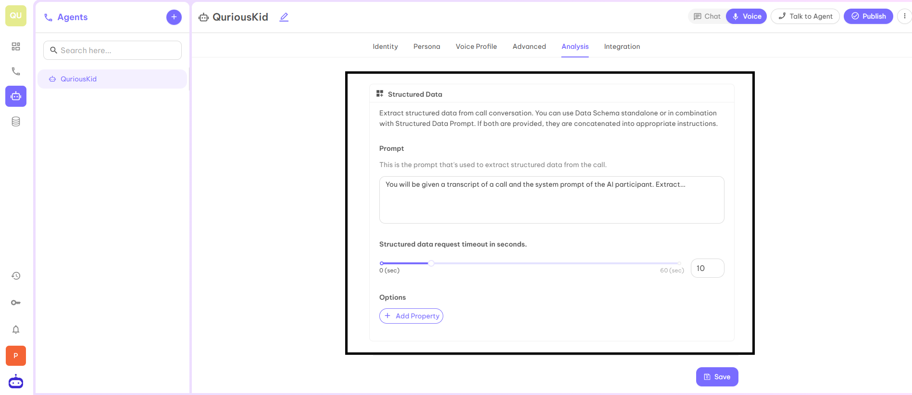

Structured data will help you to extract some basic information which is needed to decide whether the called person is interested in your product or service.

For example, your agent is related to an educational institution. You have called the parent to provide information about the courses you provide. The basic details you need are the name of the student, grade of the student, etc.

In the prompt you can write "Put the child name in the Name tag." and "Put the grade of the child in the Grade tag".

Now you have to add the same properties by clicking on the **Add Property** and the name of the properties are case sensitive. Use the same case which you have used in the prompt.

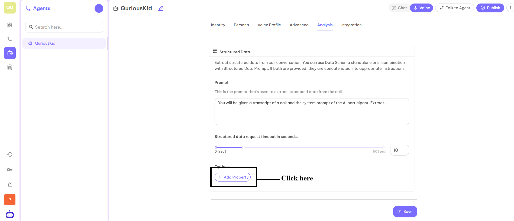

According to the Tag, click on the property. Suppose you have to make a "Name" tag then select "Text".

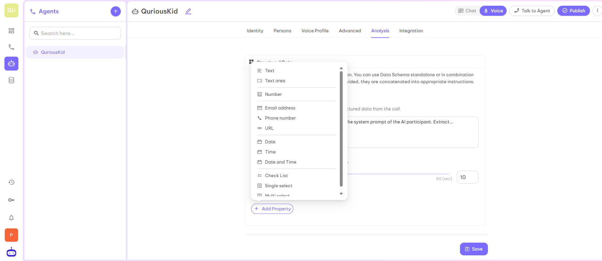

The structured data helps you to extract the exact information of the call and you will be able to analyze the call in a perfect manner.

After filling in all the details, click on the **Save** button and move to the next tab **Integration**.

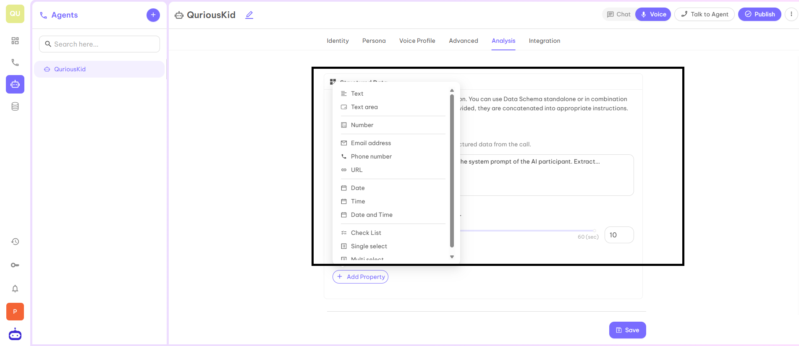

---

## Integration

Webhook integration is the process of using webhooks to enable real-time communication between web applications, where one application sends data to another as an event occurs.

To enable the webhook integration, you have to click on **Enable Webhook** as **Yes**.

**Webhook URL** is the endpoint which will be provided by the user.

You can also add some headers while doing this integration if needed. Webhook headers are the key-value pairs for identification, authentication, and context, telling the receiver who sent it, how to process data, and event details.

### Common Webhook Headers

**Common and Standard Headers:**
- **Content-Type** — Describes the format of the data (e.g., `application/json`, `application/x-www-form-urlencoded`).
- **User-Agent** — Identifies the client sending the request (e.g., `GitLab/15.5.0`).
- **Content-Length** — Size of the request body in bytes.

**Security and Authentication Headers:**
- **Authorization** — For bearer tokens or basic auth (e.g., `Bearer <token>`).
- **X-Hub-Signature / X-Hub-Signature-256** — HMAC signature to verify the request authenticity (GitHub, etc.).
- **X-Shopify-Hmac-Sha256** — The signature of Shopify to verify the delivery.
- **Idempotency-Key** — Ensures a request is processed only once, even with retries.

**Platform-Specific Headers (Examples):**
- **X-GitHub-Event** — Type of event (e.g., `push`, `pull_request`).
- **X-Shopify-Topic** — The event topic (e.g., `products/create`).
- **X-Gitlab-Event** — GitLab event type (e.g., `Push Hook`).
- **X-Contentful-Topic** — Event topic in Contentful.

After entering all the required information, click on **Save**. At last click on the **Publish** button at the right top corner and the agent is ready to use.

---

**Your AI Agent is now ready to use!**
