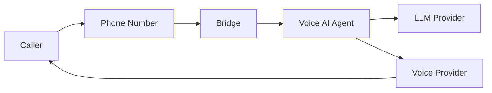

## Monorepo Structure

Unpod is organized as an NX monorepo with five core applications and shared libraries.

```
unpod/
├── apps/
│   ├── web/                 # Next.js frontend
│   ├── backend-core/        # Django REST API
│   ├── api-services/        # FastAPI microservices
│   ├── super/               # Voice AI framework
│   └── unpod-tauri/         # Desktop application
├── libs/nextjs/             # Shared frontend libraries
├── infrastructure/docker/   # Service configurations
├── scripts/                 # Utility scripts
└── docker-compose*.yml      # Orchestration
```

---

## Core Services

### Web Frontend (`apps/web/`)

The user-facing application built with **Next.js 16** and **React 19** using the App Router pattern.

- **UI:** Styled-components + Ant Design
- **Key features:** Auth, dashboard, AI Studio, spaces, knowledge bases, settings
- **Testing:** Playwright for E2E tests

### Backend Core (`apps/backend-core/`)

The main REST API built with **Django 5.2** and **Django REST Framework**.

- **Architecture:** Multi-tenant organization/workspace model
- **Auth:** JWT authentication + Google OAuth
- **Storage:** PostgreSQL (relational), MongoDB (documents), Redis (cache)
- **Management commands:** Seeding, migrations, scheduling

### API Services (`apps/api-services/`)

Specialized **FastAPI** microservices for specific workloads:

| Service | Purpose |
|---------|---------|
| **Messaging** | Real-time conversations and WebSocket support |
| **Document Store** | File parsing and connectors |
| **Search** | AI-powered semantic search |
| **Task Management** | Background task execution |

### Voice AI Platform (`apps/super/`)

The voice agent framework built with **Python 3.10+**.

- **Integrations:** LiveKit, Pipecat, LangChain
- **Features:** Voice processing, memory management, plugin system
- **Orchestration:** Prefect workflow engine

### Desktop Application (`apps/unpod-tauri/`)

Cross-platform desktop client built with **Tauri 2.x** and Rust.

---

## Tech Stack

| Layer | Technology | Version |
|-------|-----------|---------|
| Frontend | Next.js / React | 16 / 19 |
| Monorepo | NX | 22 |
| Backend | Django + DRF | 5.2 / 3.16 |
| Microservices | FastAPI | 0.129 |
| Database | PostgreSQL | 16 |
| NoSQL | MongoDB | 7 |
| Cache / Queue | Redis | 7 |
| Message Bus | Kafka (KRaft) | Confluent 7.5 |
| Real-time | Centrifugo | v5 |
| Voice | LiveKit + Pipecat | Latest |
| Desktop | Tauri | 2.x |

---

## Data Flow

How calls flow through the system:



The **Bridge** routes incoming calls to the appropriate **Agent**, which processes speech through the AI pipeline (STT → LLM → TTS) and streams audio back to the caller via the configured **Voice Provider**.

---

## Next Steps

<CardGroup cols={2}>
  <Card title="Quickstart" icon="rocket" href="/quickstart">
    Get Unpod running on your machine.
  </Card>
  <Card title="Core Components" icon="cube" href="/core-components">
    Numbers, Providers, Bridges, and Agents explained.
  </Card>
  <Card title="Dev Platform" icon="sliders-horizontal" href="/Dev Platform/introduction">
    Configure telephony and agents via the dashboard.
  </Card>
  <Card title="API Reference" icon="code" href="/api/get-started/quickstart">
    Full API documentation.
  </Card>
</CardGroup>
