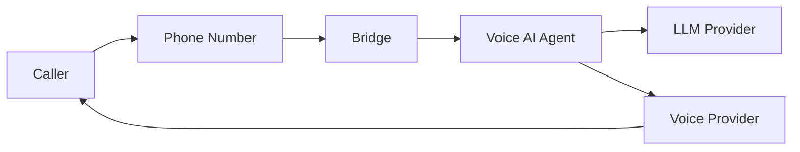

## Monorepo Structure

Unpod is an NX monorepo with four main applications and a shared library layer.

```
unpod/
├── apps/
│   ├── web/              # Next.js 16 frontend (React 19)
│   ├── backend-core/     # Django 5 REST API
│   ├── api-services/     # FastAPI microservices
│   ├── super/            # Voice AI engine (LiveKit + Pipecat)
│   └── unpod-tauri/      # Desktop app (Tauri 2)
├── libs/
│   └── nextjs/           # Shared React libraries (@unpod/*)
├── infrastructure/
│   └── docker/           # Dockerfiles & service configs
└── scripts/              # Setup, migration, and utility scripts
```

---

## Core Services

### Web Frontend (`apps/web/`)

Next.js 16 frontend with App Router, group-based layouts, styled-components, and Ant Design.

- **Key features:** Auth, dashboard, AI Studio, spaces, knowledge bases, settings
- **Testing:** Playwright for E2E tests

```bash
npx nx dev web              # Dev server at port 3000
npx nx build web            # Production build
npx nx e2e web              # Playwright E2E tests
```

Environment: copy `apps/web/.env.local.example` to `apps/web/.env.local`.

Desktop app (Tauri): `npm run desktop:dev` / `npm run desktop:build`

### Backend Core (`apps/backend-core/`)

Django 5 REST API with JWT auth, multi-tenant organizations, RBAC, and background tasks.

- **Auth:** JWT authentication + Google OAuth
- **Storage:** PostgreSQL (relational), MongoDB (documents), Redis (cache)
- **Endpoints:** All under `/api/v1/`

```bash
cd apps/backend-core
source .venv/bin/activate
python manage.py runserver        # API at port 8000
pytest                            # Run tests
```

### API Services (`apps/api-services/`)

FastAPI microservices for messaging, document store, AI search, and task management. MongoDB primary storage.

```bash
cd apps/api-services
pip install -r requirements.txt
uvicorn main:app --host 0.0.0.0 --port 9116 --reload
```

Interactive docs at http://localhost:9116/docs.

| Route | Service | Description |
|-------|---------|-------------|
| `/api/v1/store` | store_service | Document store & indexing |
| `/api/v1/connector` | store_service | Data connectors |
| `/api/v1/voice` | store_service | LiveKit voice/video |
| `/api/v1/search` | search_service | AI-powered search |
| `/api/v1/conversation` | messaging_service | Chat conversations |
| `/api/v1/agent` | messaging_service | Agent management |
| `/api/v1/task` | task_service | Task management |

WebSocket: `ws://localhost:9116/ws/v1/conversation/{thread_id}/`

### Voice AI Engine (`apps/super/`)

Voice AI engine built on LiveKit and Pipecat. Orchestrates real-time voice agents with LLM providers, TTS/STT engines, and workflow automation via Prefect.

```bash
cd apps/super

# Install (uv recommended)
uv pip install -r requirements/super.txt -r requirements/super_services.txt

# Run voice executor
uv run super_services/orchestration/executors/voice_executor_v3.py start

# Run Prefect worker
uv run -m prefect worker start --pool call-work-pool
```

```bash
# Testing
pytest                      # All tests
pytest -m unit              # Unit tests only
pytest -m integration       # Integration tests
```

### Desktop Application (`apps/unpod-tauri/`)

Native cross-platform desktop client built with **Tauri 2** and Rust.

---

## Tech Stack

| Layer | Technology |
|-------|-----------|
| Frontend | Next.js 16 / React 19 / styled-components / Ant Design |
| Monorepo | NX 22 |
| Desktop | Tauri 2 |
| Backend | Django 5 + DRF / FastAPI |
| Voice AI | LiveKit + Pipecat + LangChain |
| Databases | PostgreSQL 16, MongoDB 7, Redis 7 |
| Messaging | Kafka (KRaft), Centrifugo v5 |

---

## Data Flow

How calls flow through the system:



The **Bridge** routes incoming calls to the appropriate **Agent**, which processes speech through the AI pipeline (STT → LLM → TTS) and streams audio back to the caller via the configured **Voice Provider**.

---

## Next Steps

<CardGroup cols={2}>
  <Card title="Quickstart" icon="rocket" href="/quickstart">
    Get Unpod running on your machine.
  </Card>
  <Card title="Core Components" icon="cube" href="/core-components">
    Numbers, Providers, Bridges, and Agents explained.
  </Card>
  <Card title="Dev Platform" icon="sliders-horizontal" href="/Dev Platform/introduction">
    Configure telephony and agents via the dashboard.
  </Card>
  <Card title="API Reference" icon="code" href="/api/get-started/quickstart">
    Full API documentation.
  </Card>
</CardGroup>
