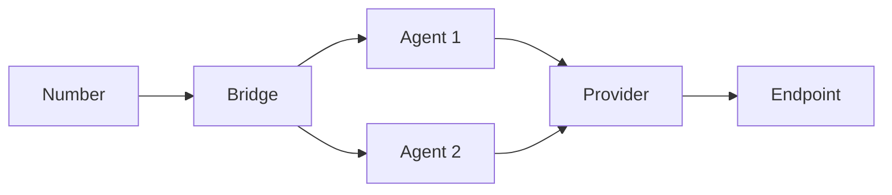

# Core Concepts

This section covers the fundamental concepts that form the foundation of the Unpod platform.

## Number

Numbers are the virtual entry points in your Unpod system. With them, you can instantly give your business a local or global identity while managing all inbound and outbound calls in one place.

### Key Features
- **Global Uniqueness**: Each number is globally unique
- **Multi-protocol Support**: Works across different communication protocols
- **Metadata Support**: Attach custom metadata for advanced routing

Numbers are what make your AI voice agents reachable from anywhere in the world.


```javascript
// Example: Number object
{
  "id": "num_1234567890",
  "number": "+14155552671",
  "type": "toll-free",
  "provider": "twilio",
  "capabilities": ["sms", "voice"],
  "created_at": "2023-01-01T00:00:00Z"
}
```

## Provider

Providers act as the carriers and gateways that move calls outside Unpod. You can use Unpod’s own SIP trunking for simplicity or connect third-party carriers for more control.

### Common Providers
- **Twilio**: For SMS and voice communications
- **Plivo**: Alternative communication platform
- **Custom**: Build your own provider integration

Providers ensure that when your voice agent speaks, the world can hear it.


## Bridge

Bridges are the control hubs that decide what happens to every call. They connect your numbers, providers, and agents — making sure conversations reach the right place at the right time.

### Bridge Types
1. **Direct Bridge**: Point-to-point connection
2. **Multi-point Bridge**: Connects multiple endpoints
3. **Transform Bridge**: Modifies data in transit

## Agents

Agents are where intelligence meets telephony. They are programmable AI units that handle conversations, learn from data, and connect with your systems.

### Agent Types
- **Routing Agent**: Directs messages based on rules
- **Processing Agent**: Transforms or enriches messages
- **Monitoring Agent**: Tracks system health and metrics

Agents transform your communication lines into smart, conversational experiences.

## Data Flow

Understanding how data moves through the system is crucial for effective implementation.



## Best Practices

1. **Naming Conventions**: Use clear, descriptive names for all components
2. **Error Handling**: Implement comprehensive error handling
3. **Monitoring**: Set up alerts for critical operations
4. **Documentation**: Keep documentation up-to-date
