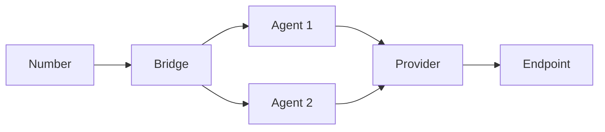

# Core Concepts

This section covers the fundamental concepts that form the foundation of the Unpod platform.

## Number

Numbers in Unpod are unique identifiers that represent communication endpoints. They serve as the primary way to route messages and calls within the system.

### Key Features
- **Global Uniqueness**: Each number is globally unique
- **Multi-protocol Support**: Works across different communication protocols
- **Metadata Support**: Attach custom metadata for advanced routing

```javascript
// Example: Number object
{
  "id": "num_1234567890",
  "number": "+14155552671",
  "type": "toll-free",
  "provider": "twilio",
  "capabilities": ["sms", "voice"],
  "created_at": "2023-01-01T00:00:00Z"
}
```

## Provider

Providers are external services that offer communication capabilities like SMS, voice, or other messaging protocols.

### Common Providers
- **Twilio**: For SMS and voice communications
- **Plivo**: Alternative communication platform
- **Custom**: Build your own provider integration

## Bridge

Bridges connect different systems and services, enabling seamless data flow between them.

### Bridge Types
1. **Direct Bridge**: Point-to-point connection
2. **Multi-point Bridge**: Connects multiple endpoints
3. **Transform Bridge**: Modifies data in transit

## Agents

Agents are specialized components that handle specific tasks within the Unpod ecosystem.

### Agent Types
- **Routing Agent**: Directs messages based on rules
- **Processing Agent**: Transforms or enriches messages
- **Monitoring Agent**: Tracks system health and metrics

## Data Flow

Understanding how data moves through the system is crucial for effective implementation.



## Best Practices

1. **Naming Conventions**: Use clear, descriptive names for all components
2. **Error Handling**: Implement comprehensive error handling
3. **Monitoring**: Set up alerts for critical operations
4. **Documentation**: Keep documentation up-to-date
