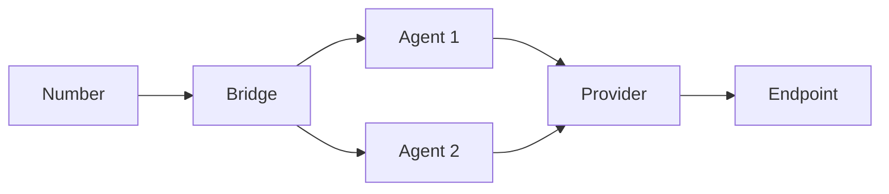

Unpod is built around four essential building blocks — **Numbers, Providers, Bridges, and Agents**.
Each plays a distinct role, and together they form a complete communication and AI automation framework.

## Numbers

**Numbers** are the virtual entry points into your Unpod ecosystem. They give your business a local or global identity and allow you to manage all inbound and outbound calls from a single dashboard.

With Numbers, you can:

- Acquire local or international numbers to expand your reach
- Route customer calls directly into AI or workflow-based systems
- Stay compliant with regional KYC and telecom regulations

Numbers make your AI voice agents reachable from anywhere in the world.

## Providers

**Providers** are the carriers and gateways that move calls and messages beyond Unpod. You can use **Unpod's built-in SIP trunking** or connect **third-party SIP or telecom providers** for added flexibility and control.

Providers let you:

- Configure SIP URIs, routing, and authentication details
- Connect multiple providers for redundancy or cost optimization
- Adjust codecs, regions, and routing policies per use case

Providers ensure that when your AI agents speak — your customers can hear them, anywhere.

## Bridges

**Bridges** are the control hubs that decide what happens to every call or message. They connect **Numbers, Providers, and Agents**, making sure conversations reach the right place at the right time.

Bridges help you:

- Define call flows and routing logic
- Attach one or more numbers and select which provider handles them
- Integrate with AI platforms or PBX systems for intelligent call handling
- Maintain compliance through centralized document management

Think of Bridges as the **traffic controllers** of your communication system.

## Agents

**Agents** are where intelligence meets telephony. They are programmable AI units that handle conversations, learn from data, and connect with your systems.

Agents allow you to:

- Define their tone, behavior, and goals using prompts
- Connect to CRMs, knowledge bases, or APIs for smarter responses
- Choose speech recognition and synthesis providers
- Assign phone numbers so customers can call agents directly
- Manage retries, callbacks, and scheduling for real-world reliability

Agents transform your communication lines into smart, conversational experiences.

## Data Flow

Understanding how data moves through the system is crucial for effective implementation.

