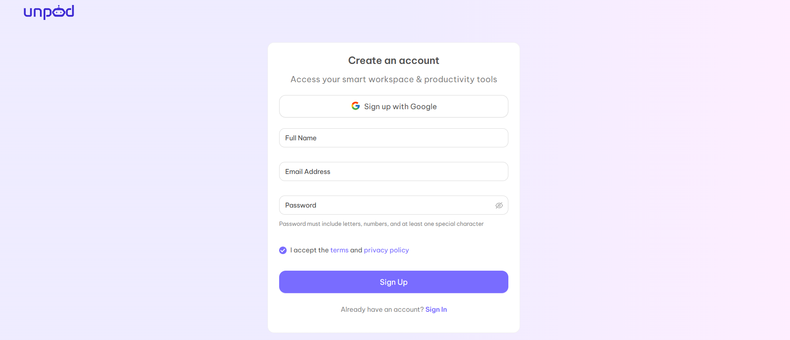
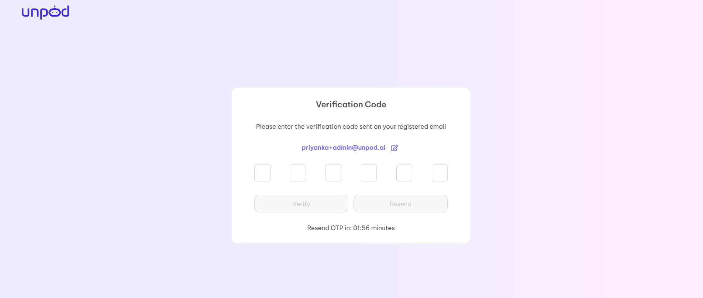
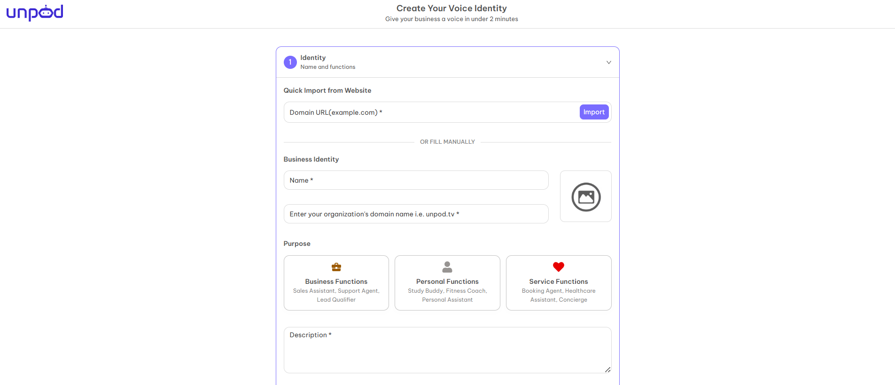
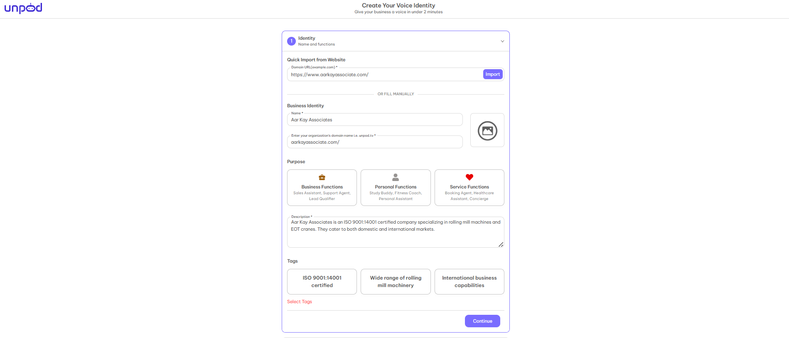
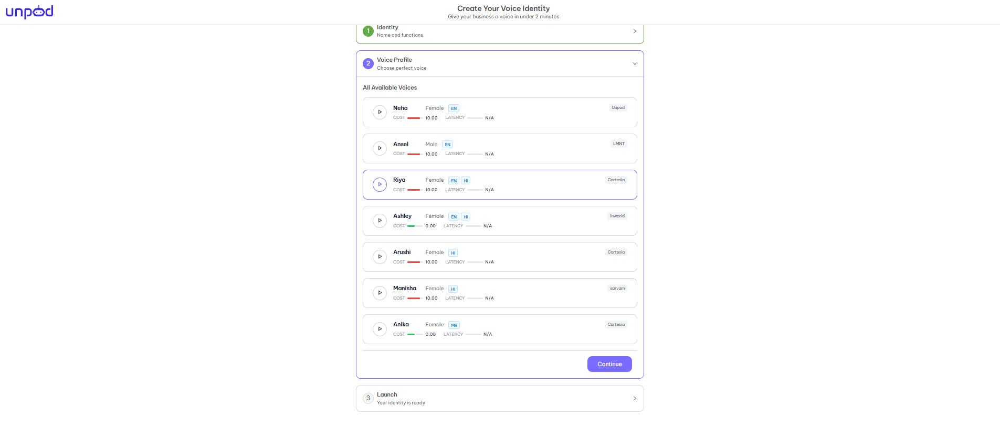
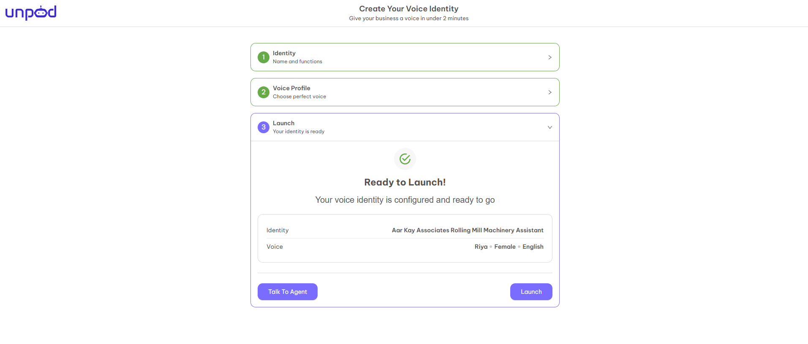
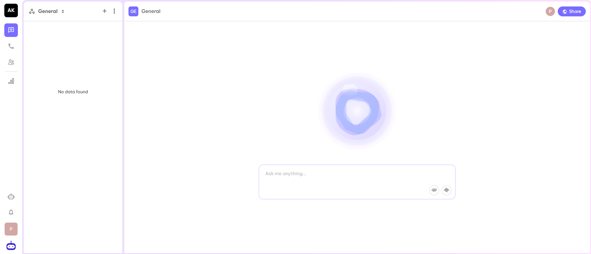

## Getting Started

**Unpod AI: The AI voice your business can trust**

Unpod is a platform which acts as a building block for communication that has four core components, that is, **Numbers**, **Providers**, **Bridges** and **Agents**. Start with a number, select a provider or channel, route traffic through a bridge, and optionally add a voice agent to automate or assist conversations.

---

## Platform Base URLs

Unpod provides two different portals depending on your requirements - the main application interface and the developer environment. Below are the base URLs and what each one is used for:

### Unpod AI Platform (User Dashboard)

**URL:** https://unpod.ai/

**Purpose:**
- Main user-facing platform where organizations, teams log in.
- Used for managing workspaces, telephony setup, user dashboards, analytics, and day to day operations.

### Unpod Developer Platform

**URL:** https://unpod.dev/

**Purpose:**
- This portal is meant for developers, integrators, and technical teams.
- Contains developer tools, API access, integrations, telephony configuration, and testing utilities.

---

## How Unpod Works?

With Unpod, you can setup three basic components:

<CardGroup cols={3}>
  <Card title="Setup Space" icon="building">
    A dedicated space that helps to manage your emails, contacts, and documents.
  </Card>
  <Card title="Setup Agent" icon="robot">
    A custom AI agent for all your needs like customer support and sales support.
  </Card>
  <Card title="Setup Telephony" icon="phone">
    Add number, link a voice infra provider, complete KYC, and start calling.
  </Card>
</CardGroup>

---

## How to Get Access to the Dev Dashboard?

### Step 1
Open https://unpod.dev/

### Step 2
Click on **Request a Call Back** option.

### Step 3
Fill in the required fields and click on **Submit**.

### Step 4
After you click on Submit Request, you will get a message **"Thank you, we will connect with you soon"**.

### Step 5
You will get the login credentials on your mail.

### Step 6
Now you can login on the dashboard and access the dashboard completely.

### Step 7
When you login for the first time, you will be redirected to the below page to create a hub for your organization.

There are four necessary fields which you have to fill:

- **Enter Hub Name** — Choose the name of your organization or choose any name that best suits your requirements and organization.
- **Domain Name** — Your personal domain name just like gmail.com, yahoo.co, etc. You can choose the domain name from the mail id you are using or make the organization's name as the domain name like maths.com, music.com, etc.
- **Privacy Type** — There are two options - **Public** and **Private**. If you choose public then your hub will be visible to everyone whereas if you choose private then your hub is only visible to people inside your domain.
- **Type of Account** — You can choose the type of account according to your requirement from the given five options:
  - Personal
  - Startups and Organisations
  - Teachers & Educators
  - Artists & Creators
  - Engineers and Researcher

After completion of all steps, you will be redirected to your organisation's hub. The hub will look like below:

---

## How to Get Access to the Unpod.ai Dashboard?

### Step 1
Open https://unpod.ai/auth/signup/

### Step 2
Fill in all the details of your organization manually or you can also login with the help of "Sign in with Google" with your existing gmail. After entering all the details, Click on the "Sign Up" button. You will be redirected to the OTP page and get OTP on your registered mail.

### Step 3
Enter OTP and click on "Verify". You will be redirected to the page "Create your Voice Identity".

### Step 4
First section is "Identity" which is the identity of your business. You can import the details from your business website by using "Quick Import from Website" or you can fill the details manually. When you import it from a website, all your details will be automatically taken by the CRM. The details required are:
- **Name** - Your business name.
- **Domain Name** - Enter the domain name of your business, like gmail.com, yahoo.co, etc.
- **Purpose** - The purpose of your identity. You can choose from business, personal, or service according to the requirements of the business.
- **Description** - This sub-section will describe your business, what it does, what services or products it will provide to your business.
- **Tags** - Which type of identity you are creating for your business, for example, you want to create an identity who provides sales and leads to your business.

After importing the business information from the website, the details will look like:

Here you have to select the tags which are more relevant to your business, and click on "Continue".

### Step 5
The second section is "Voice Profile". With the help of this section, you can give voice to your business. You can listen to the available voices and choose the best that suits your business and click on "Continue".

### Step 6
The last section is "Launch", it shows the summary of the identity of your business.

### Step 7
Click on "Launch" and you will be redirected to the page of your organization which is the "Space View" of the organization.

Now you have complete access to the dashboard.

## Demo

[Watch a Demo](https://drive.google.com/file/d/1SFkcnSLwcDqQG8Q4VwjABVDYpNQVMSPO/view?usp=drive_link)

---

## Key Capabilities

- **Real time communication** — Natural voice conversations.
- **Omni Channel Support** — Voice, WhatsApp, and Email
- **AI Driven Automation** — Context aware responses and workflow automation
- **Integration ready** — Connect to CRMs, ERPs, and other business tools
- **Flexible routing** — Use numbers, providers, and bridges to control traffic

---

## Use Cases

<CardGroup cols={2}>
  <Card title="Customer Support" icon="headset">
    Automate inbound calls with AI agents and escalate to humans when needed.
  </Card>
  <Card title="Sales & Lead Qualification" icon="phone-volume">
    Make outbound sales calls and schedule appointments with prospects.
  </Card>
  <Card title="Appointment Scheduling" icon="calendar-check">
    Handle booking details and schedule appointments after confirming availability.
  </Card>
  <Card title="E-commerce" icon="cart-shopping">
    Customer support and personalized product recommendations.
  </Card>
</CardGroup>

---

## Why Choose Unpod?

- **Flexible** — Run simple flows (number + provider) or advanced omni-channel workflows
- **Reliable** — 99.99% uptime with automatic failover
- **Secure** — Enterprise-grade security and compliance
- **Global Reach** — Communicate with users worldwide
