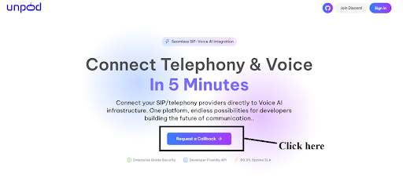
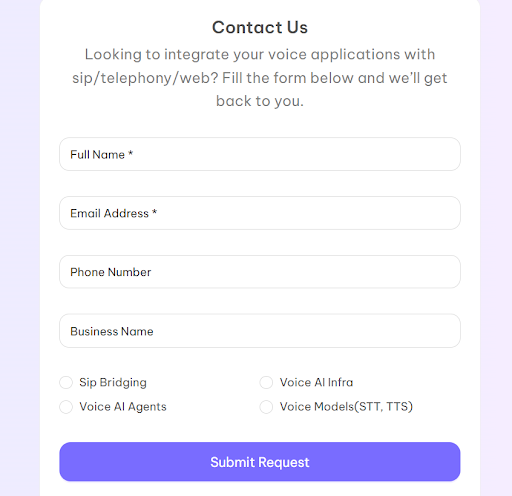
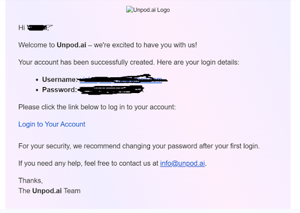
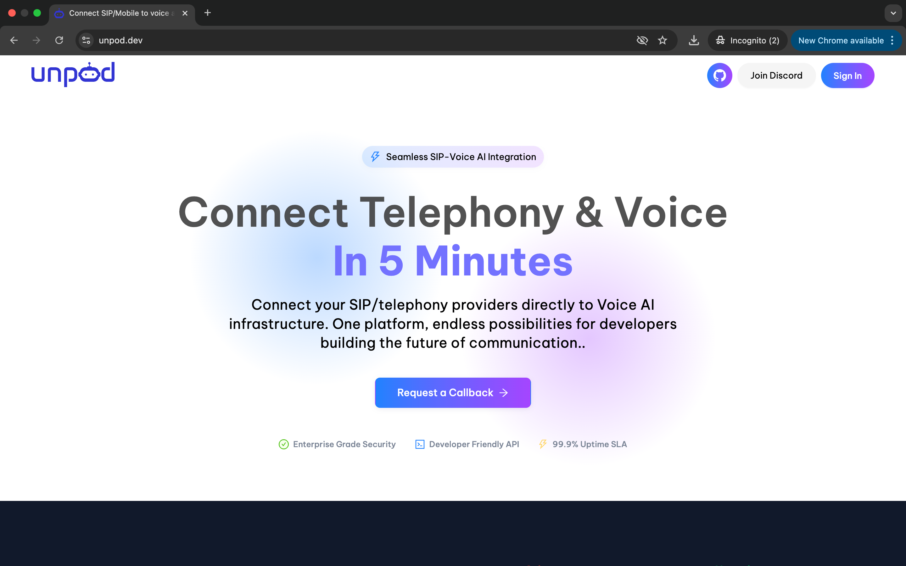

## Unpod AI: The AI Voice Your Business Can Trust

Unpod is a platform that acts as a building block for communication with four core components:

1. **Numbers**
2. **Providers**
3. **Bridges**
4. **Agents**

Start with a number, select a provider or channel, route traffic through a bridge, and optionally add a voice agent to automate or assist conversations.

---

## How Unpod Works

With Unpod, you can set up three basic components:

| **SETUP SPACE** | **SETUP AGENT** | **SETUP TELEPHONY** |
|-----------------|-----------------|----------------------|
| A dedicated space that helps to manage your emails, contacts, and documents. | A custom AI agent for all your needs like customer support and sales support. | Add number, link a voice infra provider, complete KYC, and start calling. |

---

## How to Get Access to the Unpod Dashboard

1. Open [https://unpod.dev/](https://unpod.dev/).

2. Click on **Request a Call Back**.

3. Fill in the required fields and click **Submit**.  

4. After submitting, you will see a message:  
   > “Thank you, we will connect with you soon.”  
5. You will receive login credentials via email.  

6. Use those credentials to log in and access the dashboard.  

---

## Demo

[Watch Demo](https://drive.google.com/file/d/1SFkcnSLwcDqQG8Q4VwjABVDYpNQVMSPO/view?usp=drive_link)

---

## Key Capabilities

- **Real-time communication** — Natural voice conversations  
- **Omni-channel support** — Voice, WhatsApp, and Email  
- **AI-driven automation** — Context-aware responses and workflow automation  
- **Integration ready** — Connect to CRMs, ERPs, and other business tools  
- **Flexible routing** — Use numbers, providers, and bridges to control traffic  

---

## Use Cases

- **Customer Support** — Automate inbound calls with agents and escalate to humans when needed.  
- **Sales and Lead Qualification** — Make outbound sales calls and schedule appointments with concerned person.  
- **Appointment Scheduling** — Handle booking details and schedule appointments after confirming availability.  
- **E-commerce Management** — Customer support and personalized product recommendations.  

---

## Why Choose Unpod

- **Flexible** — Run simple flows (number + provider) or advanced omni-channel workflows  
- **Reliable** — 99.99% uptime with automatic failover  
- **Secure** — Enterprise-grade security and compliance  
- **Global Reach** — Communicate with users worldwide  

