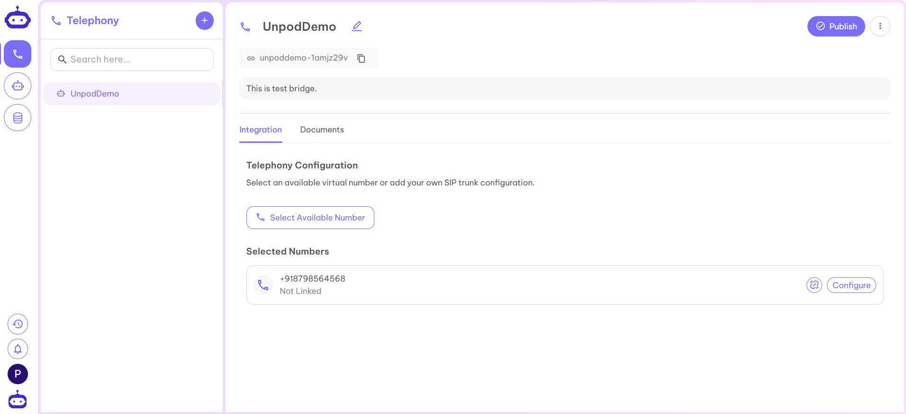

Numbers in Unpod are **virtual phone lines** that allow your business to make and receive calls or messages globally, without traditional phone lines. Each number can connect to **providers, bridges, and agents** for flexible communication.

### Assign Numbers to Bridges

1. Select the Bridge where you want to link the number (e.g., *UnpodDemo*).  

2. Click on **Select Available Number**.  

3. You’ll be redirected to a page with available numbers.  

4. Click **Upgrade** to choose a plan for your number.  

5. Select a suitable plan by clicking **View Plans**.  

6. Return to the first page and again click **Select Available Number**.  

7. Choose a number for your business and click **Submit**.  

8. Your number is now added to the Bridge.  

---

**Next Steps:**  
Continue to [Provider Setup](./provider) to configure your SIP trunk with LiveKit or Vapi.
