## SIP Trunking: Powering Seamless Global Connections

**SIP trunking** replaces traditional phone lines with a **virtual connection over the internet**, enabling calls through broadband. It connects your internal phone system (PBX/VoIP) to a SIP provider, which routes calls to the regular network—making it **simpler and more cost-effective**.

---

## Supported SIP Providers

Unpod supports multiple providers for inbound and outbound calls:

- **LiveKit** – Real-time audio/video calls using virtual members.  
- **Vapi** – Cloud telephony API for programmatic calls.  
- **Daily** – Multi-party voice/video with web integrations.  
- **Twilio** – Global programmable voice for any device.  

---

## Setup Process

After selecting your number, configure it with a provider. Currently, Unpod supports **LiveKit** and **Vapi**.

---

### Configure Number with LiveKit

1. After adding a number to a Bridge, click **Configure** to activate SIP trunking.  

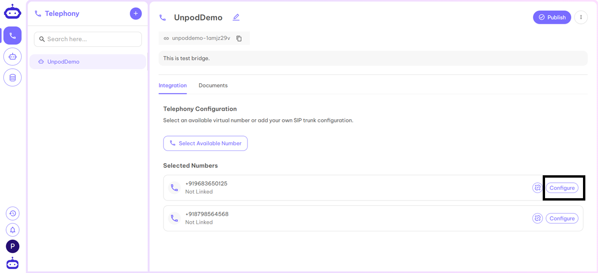

2. Select **LiveKit** from the provider list.  

3. Click **Configure** next to LiveKit.  

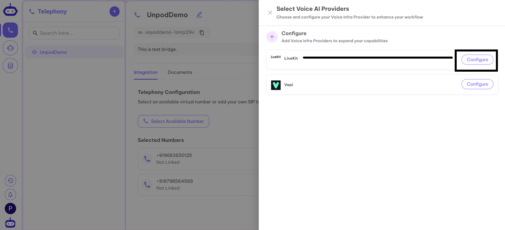

4. Fill in the required details from your LiveKit dashboard:  
   - **Name** – Any identifier (product/org name).  
   - **API Key** – Secure access key from LiveKit.  
   - **API Secret** – Password-like credential for API access.  
   - **Base URL** – Main API web address.  
   - **SIP URL** – VoIP identifier (e.g., `sip:username@domain.com`).  

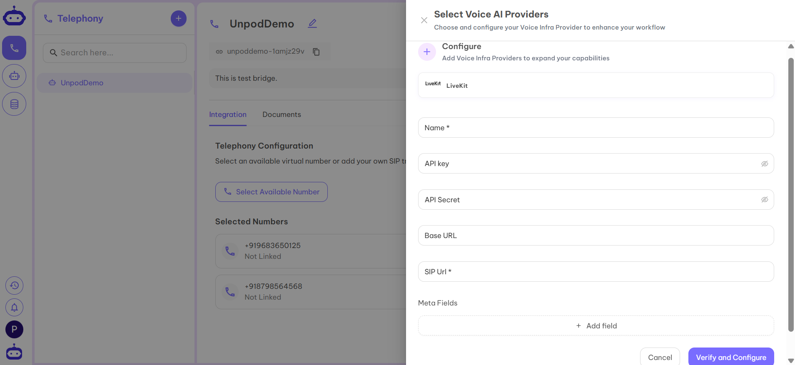

5. Click **Verify and Configure**.  

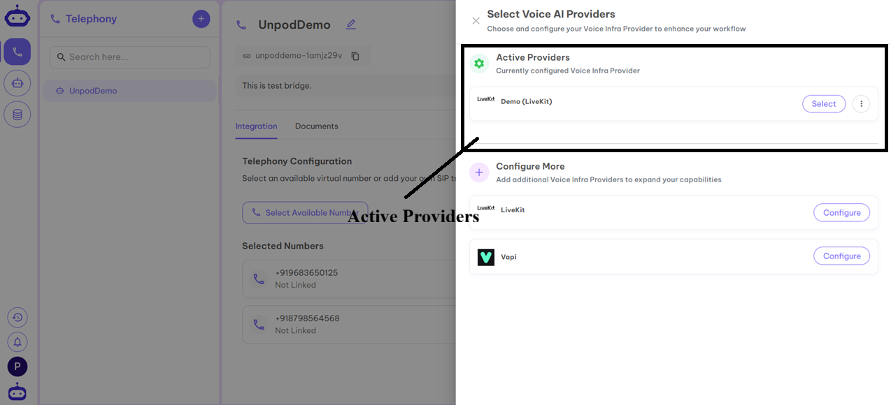

6. Under Active Providers, select **Demo (LiveKit)** to link it to your number.  

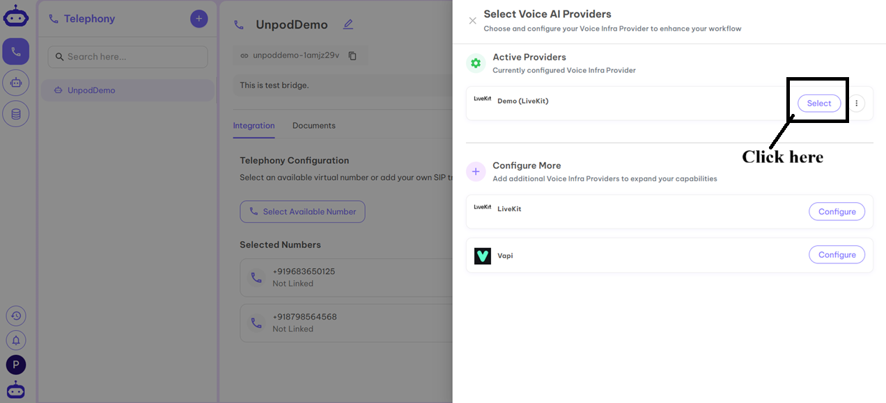

7. Your SIP trunk is now active.  

8. Go to **Settings** to configure the trunk.  

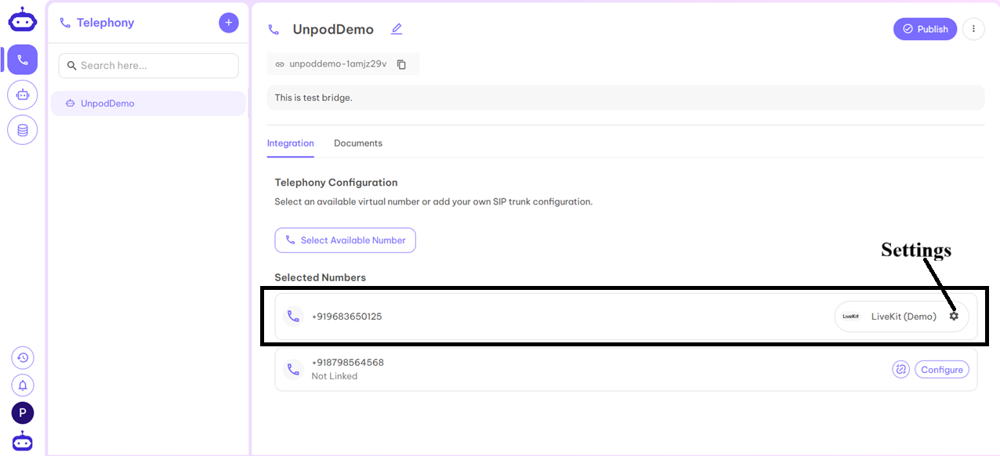

9. Fill in:  
   - **Concurrency Channels** – Number of parallel interactions.  
   - **Enter Agent** – Name of your LiveKit agent.  

10. Your SIP trunk and number are ready for inbound/outbound calls.

---

### Configure Number with Vapi

1. After adding a number to a Bridge, click **Configure**.  

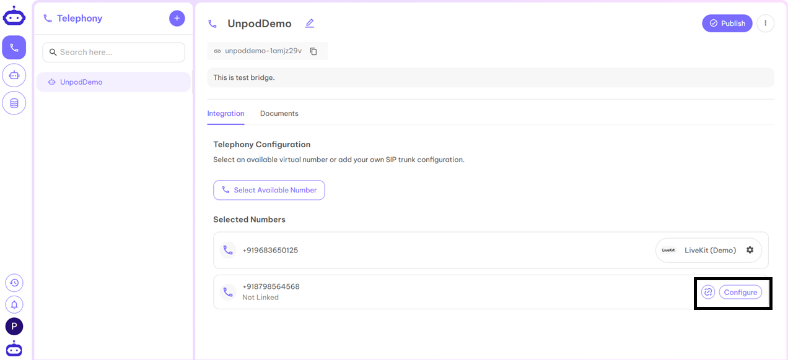

2. Select **Vapi** from the provider list.  

3. Click **Configure** next to Vapi.  

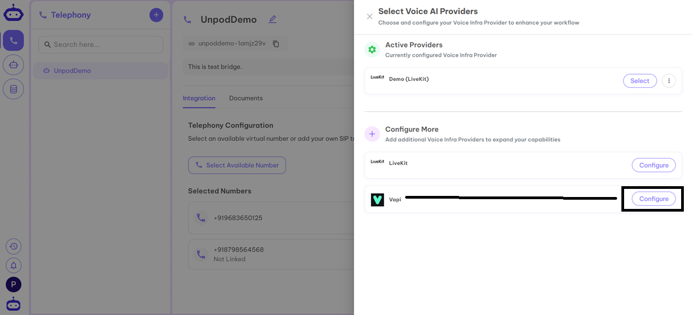

4. Fill in the required details from your Vapi dashboard:  
   - **Name** – Any identifier (product/org name).  
   - **API Key** – Secure access key from Vapi.  

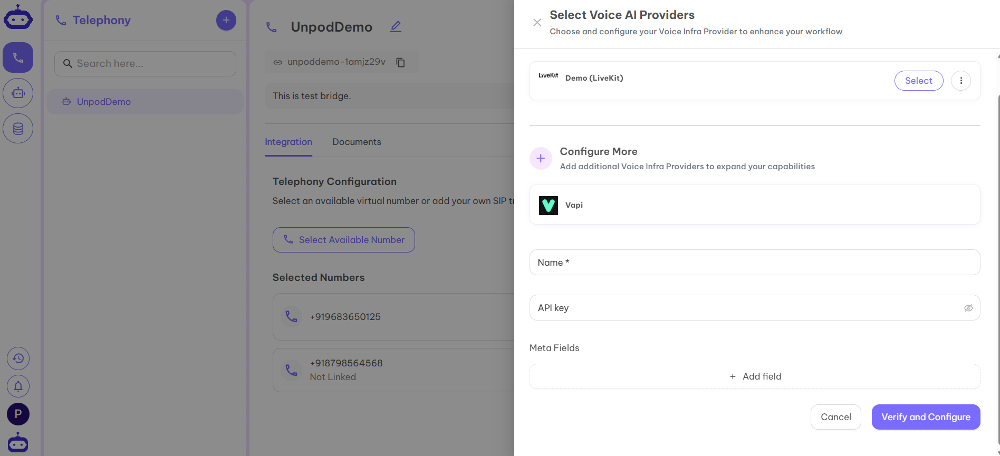

5. Click **Verify and Configure**.  

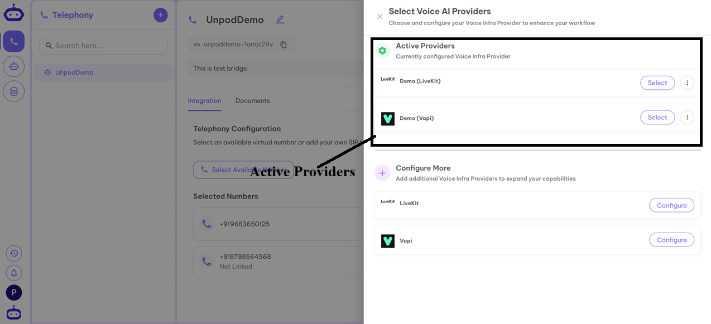

6. Under Active Providers, select **Demo (Vapi)**.  

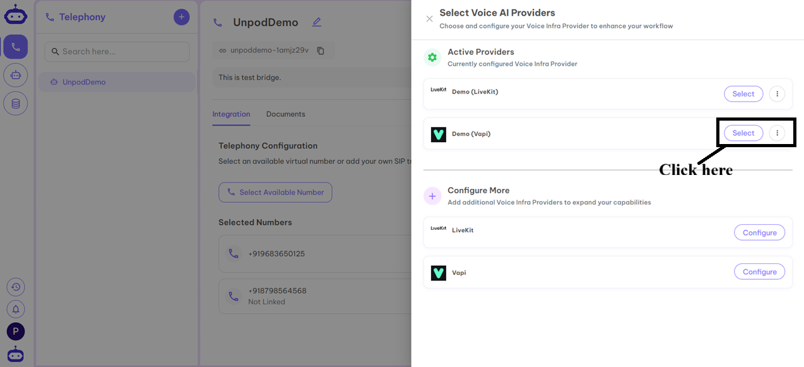

7. Your SIP trunk is now active.  

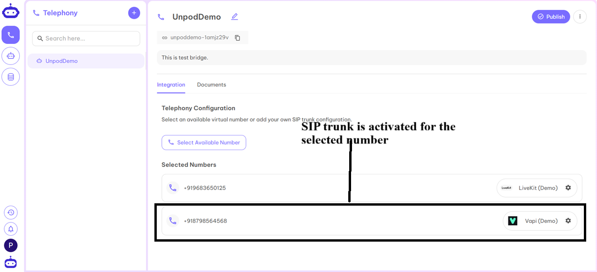

8. Go to **Settings** to configure the trunk.  

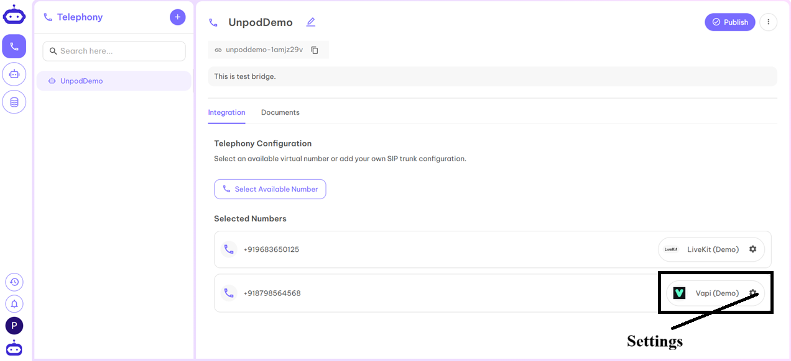

9. Fill in:  
   - **Concurrency Channels** – Number of parallel interactions.  
   - **Enter Agent** – Name of your Vapi agent.  

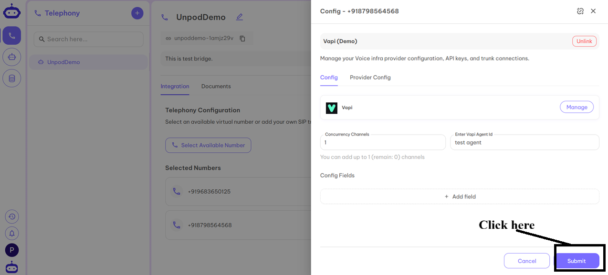

10. Your SIP trunk and number are ready for inbound/outbound calls.
 

---

## Final Step: Publish

After configuring all required numbers, click the **Publish** button at the top of the dashboard.  
Your setup is now live and ready to use! 🚀
