## SIP Trunking: Powering Seamless Global Connections

SIP trunking replaces traditional phone lines with a virtual connection over the internet, enabling your business to make and receive calls through a broadband connection. It links your internal phone system (PBX or VoIP) to a SIP provider, which then routes calls to the regular phone network. This setup makes your communication system simpler and usually more affordable.

---

## Supported SIP Providers: Bridging You to the World Beyond

We have the following providers available for initiating both inbound and outbound calls:

- **LiveKit** — Enables real time audio and video calls over the internet using virtual members.
- **Vapi** — Provides cloud telephony API for initiating and receiving phone calls programmatically.
- **Daily** — Powers multi-party voice and video communication with web-based integrations.
- **Twilio** — Offers global programmable voice to connect calls across any device.

---

## Setup Process

As you have already selected the number, now you have to configure the number with the available provider. Currently Unpod is providing two options. Let's configure the number with both the providers step by step.

---

### Configure the Number with LiveKit

#### Step 1
You already have added the number in your Bridge. Now click on **Configure** to activate the SIP trunking.

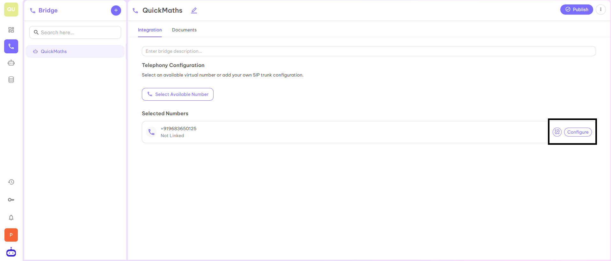

#### Step 2
When you click on the **Configure** button, you will be redirected to the below page from where you can choose any SIP provider to enhance the workflow of your organization.

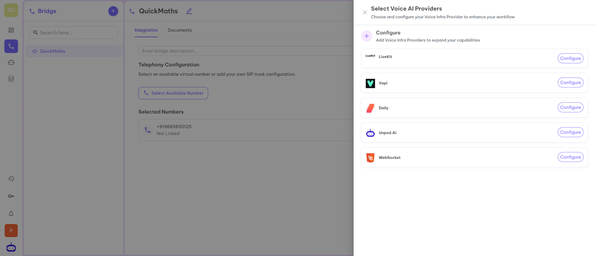

#### Step 3
Now you have various SIP providers with the help of which you can configure the numbers. Let's choose LiveKit for the first selected number. To do this, click on the **Configure** button in front of LiveKit.

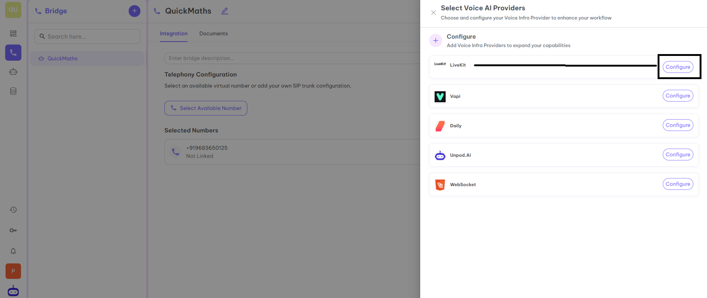

#### Step 4
Once you click on the **Configure** button, it will redirect you to the page below where you have to fill in the different details from your LiveKit ID. The details which are mandatory to fill are:

- **Name** — You can give any name as per your product or name of the organization.
- **API Key** — An API key for LiveKit is a unique code provided by LiveKit that allows your application to securely access and use LiveKit's communication services.
- **API Secret** — It acts like a password that ensures only authorized users and applications can access and use the API. You will get this from your LiveKit dashboard.
- **Base URL** — A Base URL is the main web address or starting point for accessing an API.
- **SIP URL** — It looks similar to an email address (e.g., `sip:username@domain.com`) and is used to identify users or devices for making and receiving VoIP calls over the internet.

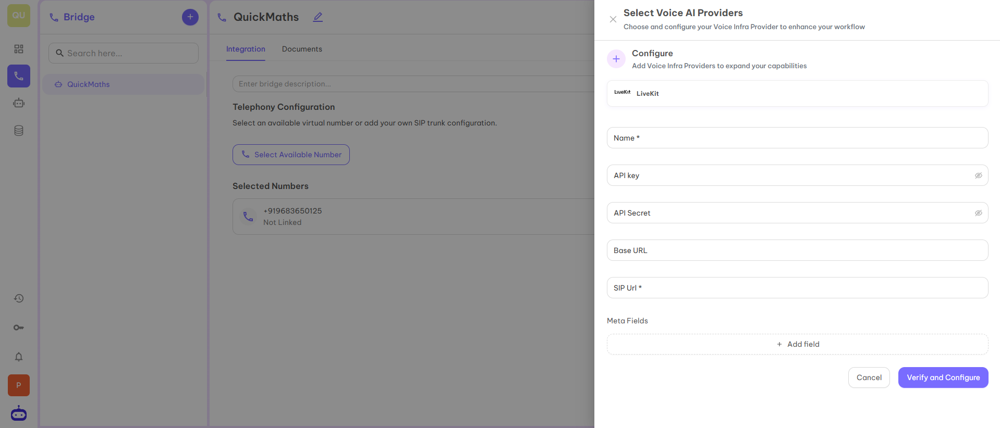

#### Step 5
You can access all the above mentioned fields from your LiveKit dashboard except Name.

1. **Access API Key and API Secret:**
Go to https://cloud.livekit.io/ and then go to **Settings > API Keys** under your project.

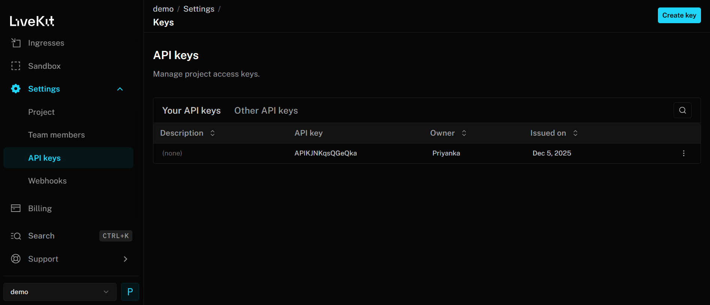

Here click on Description section to get all the details which are required related with the API keys.

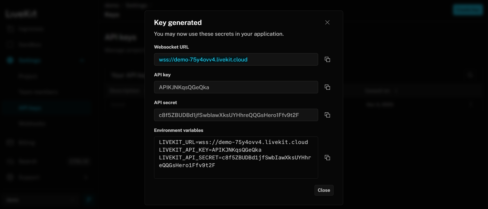

2. **Access Base URL and SIP URL:** Go to https://cloud.livekit.io/ and then go to **Settings > Project**.

Here Project URL is base URL and SIP URL is mentioned. You can copy it from here and paste on the portal.

#### Step 6
After filling all the mentioned fields, click on the **Verify and Configure** button. You can now see Active Providers also on the first page.

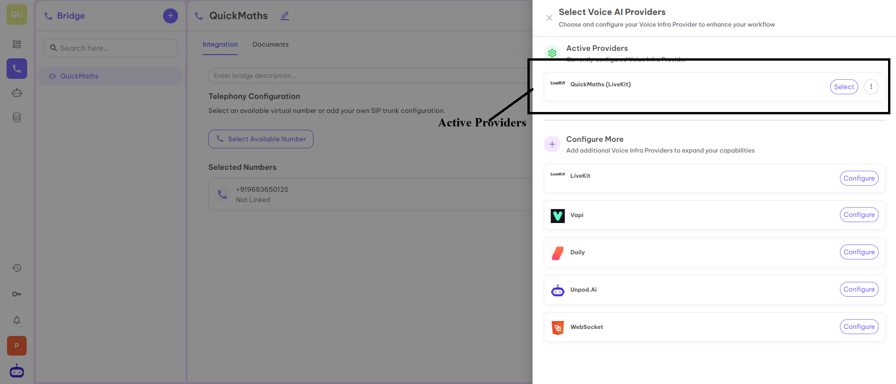

#### Step 7
Now click on **Select** in front of QuickMaths(LiveKit) under Active Providers to connect it with your selected number.

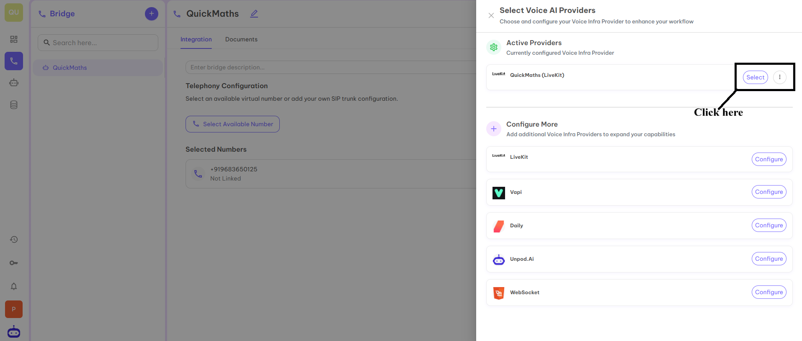

#### Step 8
Once you click on the above button, your SIP trunk is activated for use.

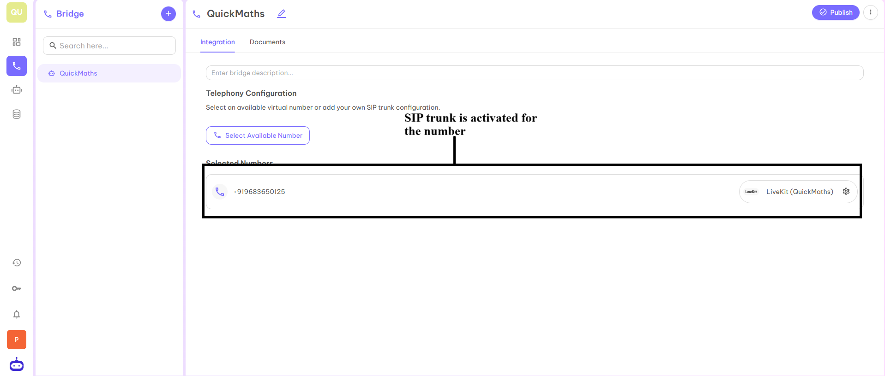

#### Step 9
Now as you have activated the SIP trunk, you can configure your trunk for use. To configure, click on **Settings**.

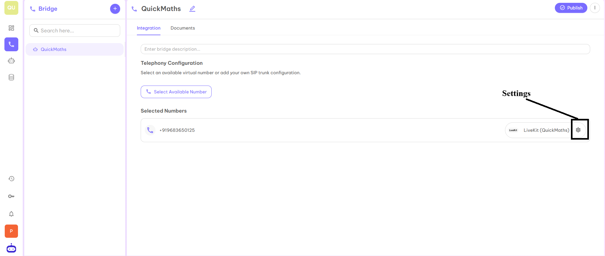

#### Step 10
When you click on settings, you will be redirected to the below page where you have to fill in the below fields and click on submit.

- **Concurrency Channels** — Concurrency channel usually refers to a communication channel that supports multiple interactions or processes happening at the same time without interference. Here you can select any number of channels as per your requirement.
- **Enter Agent** — Enter the name of your LiveKit agent to start the Voice calling process.

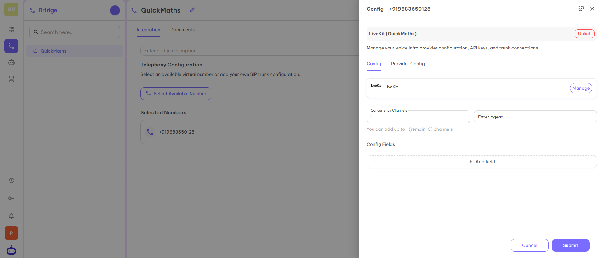

#### Step 11
SIP trunk and number is ready to use. You can start calling with the help of this number. You can use the number for inbound as well as outbound calls as per your requirement. You can see the activated SIP Trunk in LiveKit also.

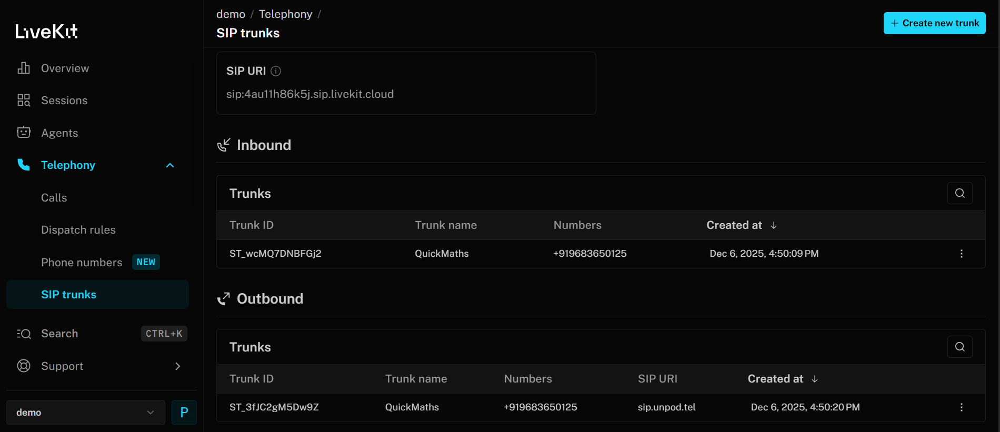

---

### Configure the Number with cloud.livekit.io

#### Step 1
On platform cloud.livekit.io, go to **Telephony > SIP Trunks**.

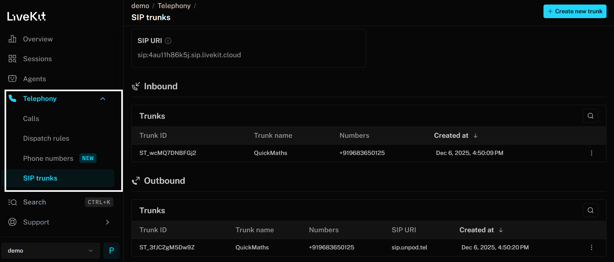

#### Step 2
Click on **Create SIP trunk** at the top right corner.

#### Step 3
Once you click on **Create new trunk**, you will get the option to create **Inbound** or **Outbound** trunk according to organization's requirement. You can select one, fill the required details and create the trunk.

#### Step 4
For **Inbound**, you just need to provide the Name of the Trunk and Phone number. IP address is optional; if you want to allow it for particular IP addresses then mention that else leave the field blank or `0.0.0.0/0` and the trunk is valid for all IP addresses. After filling all the details, click on **Create** and another Inbound Trunk gets created.

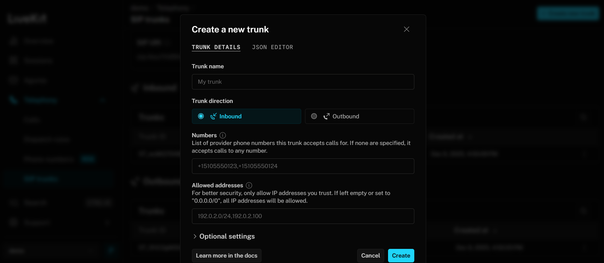
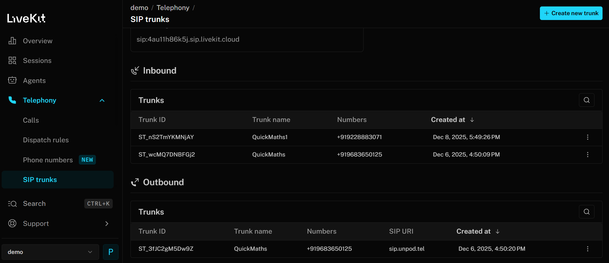

#### Step 5
For **Outbound**, you have to fill:
- **Trunk Name**
- **IP Address** (SIP address of the provider from where you have taken the number)
- Keep the **Transport Type** as Auto
- **Numbers** provided by the provider
- **Username** and **Password** provided by the provider

You can ask your SPOC to provide the IP address, Username, and Password from the provider's end. Once you fill in the complete details, your Outbound trunk will be created.

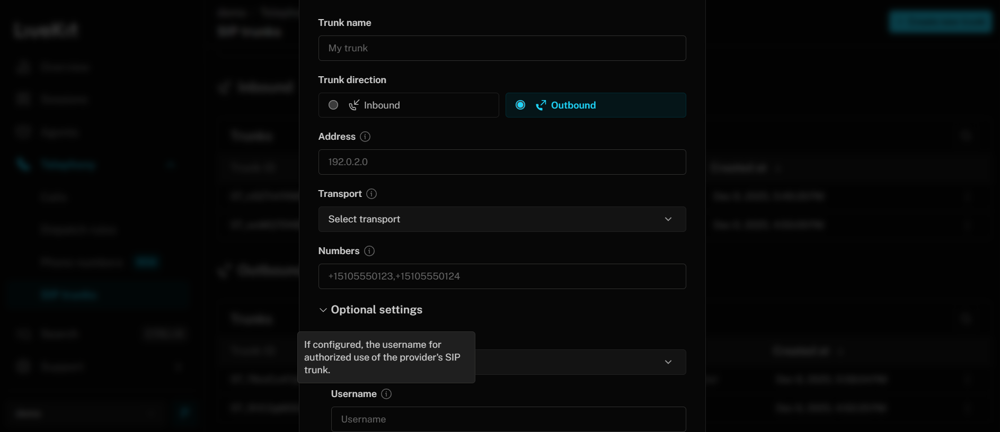
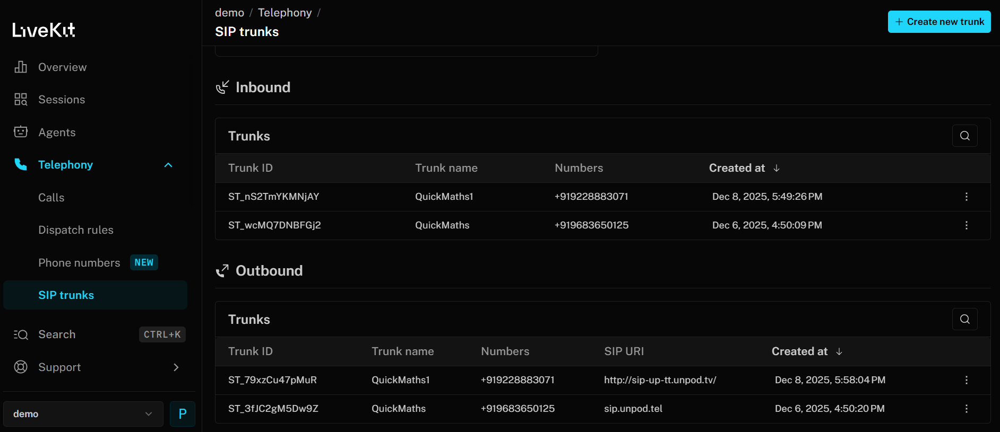

Now as your SIP trunks are created, you can use the number to boost your business by making Inbound/Outbound calls.

---

### Configure the Number with Vapi

#### Step 1
You already have added the number in your Bridge. Now click on **Configure** to activate the SIP trunking.

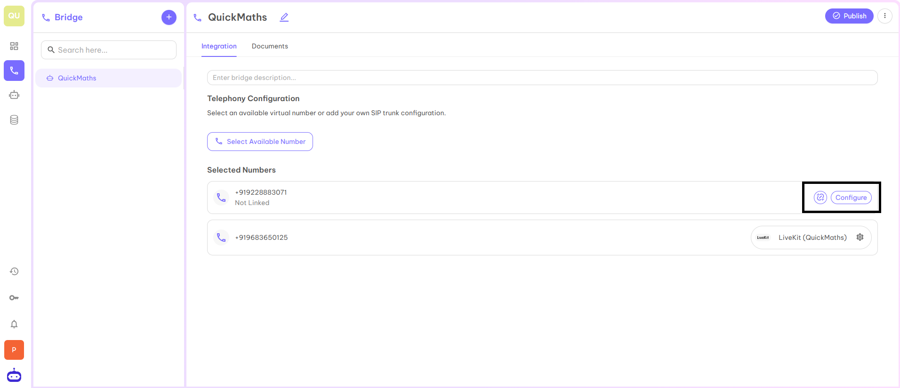

#### Step 2
When you click on the **Configure** button, you will be redirected to the below page from where you can choose any SIP provider to enhance the workflow of your organization.

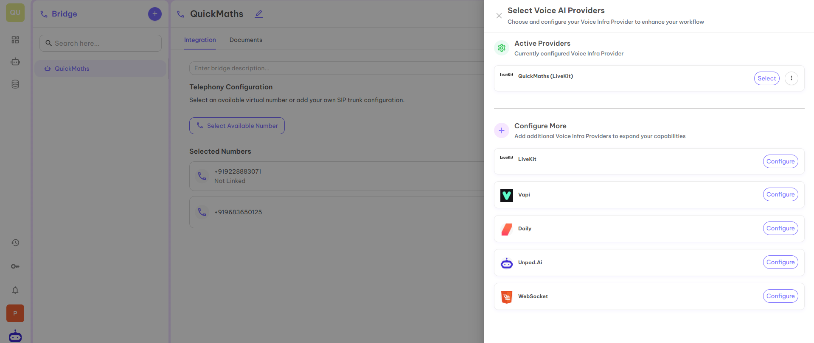

#### Step 3
Now you have various SIP providers with the help of which you can configure the numbers. Let's choose Vapi for the next selected number. To do this, click on the **Configure** button in front of Vapi.

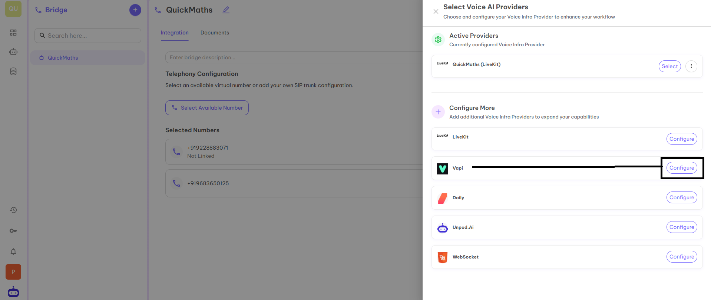

#### Step 4
Once you click on the **Configure** button, it will redirect you to the page below where you have to fill in the different details from your Vapi ID. The details which are mandatory to fill are:

- **Name** — You can give any name as per your product or name of the organization.
- **API Key** — An API key for Vapi is a unique code provided by Vapi that allows your application to securely access and use Vapi's communication services.

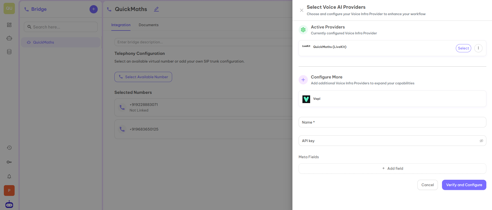

#### Step 5
You can access the API key from the Vapi dashboard. Go to **dashboard.vapi.ai**, click on **API Keys** and copy **TEST API key** and paste on the portal.

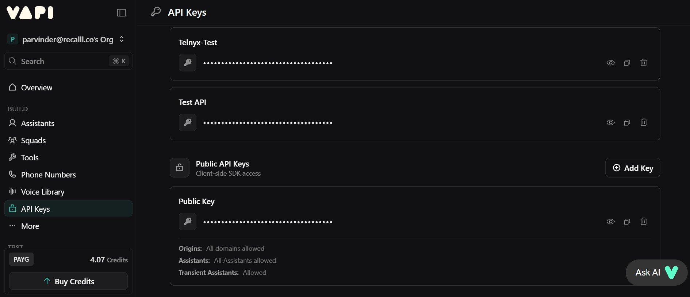

#### Step 6
After filling all the mentioned fields, click on the **Verify and Configure** button. You can now see Active Providers also on the first page.

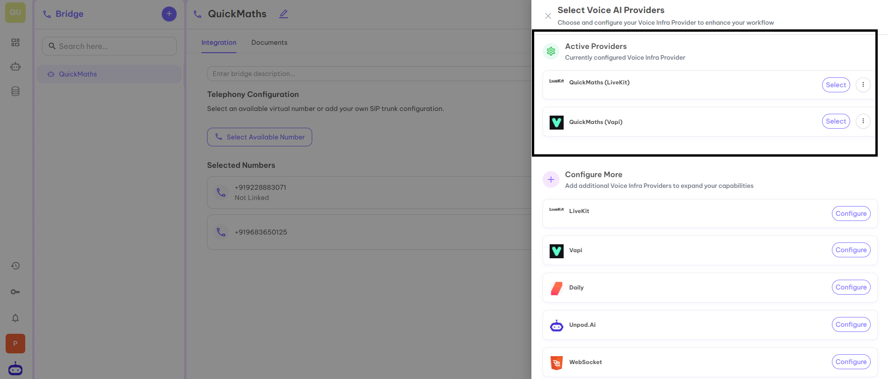

#### Step 7
Now click on **Select** in front of QuickMaths (Vapi) under Active Providers to connect it with your selected number.

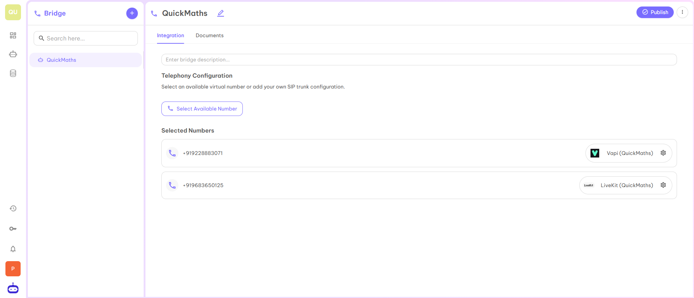

#### Step 8
Once you click on the above button, your SIP trunk is activated for use.

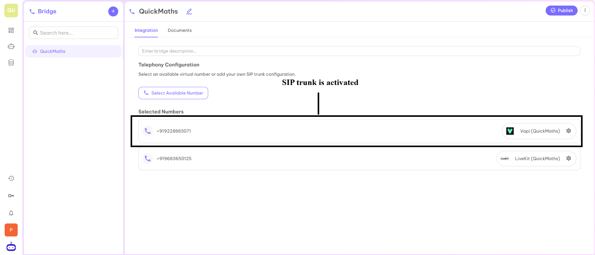

#### Step 9
Now as you have activated the SIP trunk, you can configure your trunk for use. To configure, click on **Settings**.

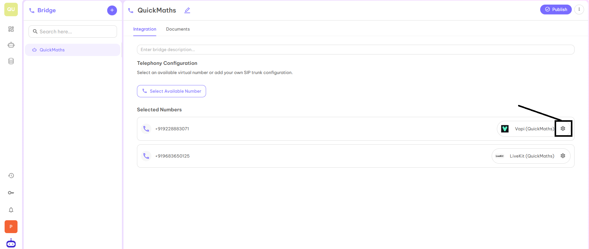

#### Step 10
When you click on settings, you will be redirected to the below page where you have to fill in the below fields and click on submit.

- **Concurrency Channels** — Concurrency channel usually refers to a communication channel that supports multiple interactions or processes happening at the same time without interference. Here you can select any number of channels as per your requirement.
- **Enter Agent** — Enter the name of your Vapi agent to start the Voice calling process.

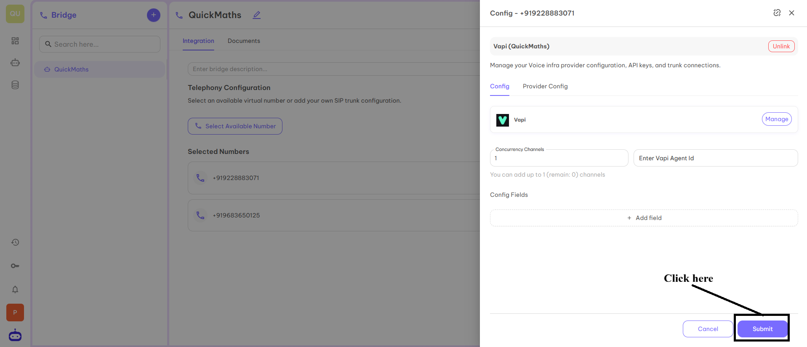

#### Step 11
SIP trunk and number is ready to use. You can start calling with the help of this number. You can use the number for inbound as well as outbound calls as per your requirement.

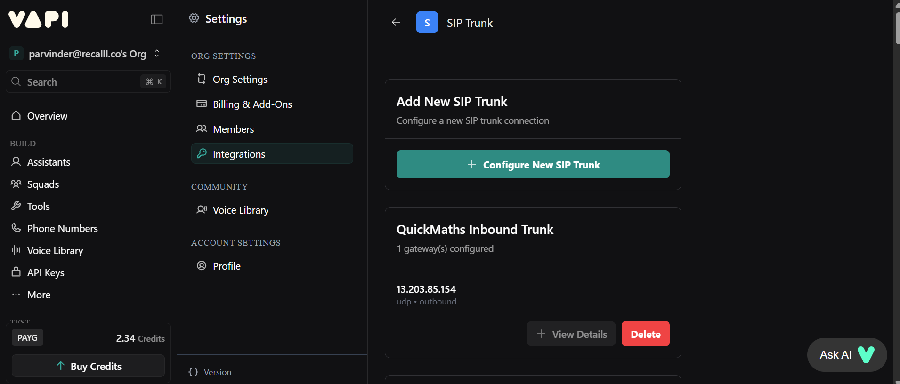

---

## Publish

As you have configured all the required numbers, the last step is to **Publish** them. Click on the **Publish** button at the top of the dashboard.

You can check on your Vapi Dashboard that your SIP Trunk is created.

---

**Your Telephony setup is now complete and ready to use!**
