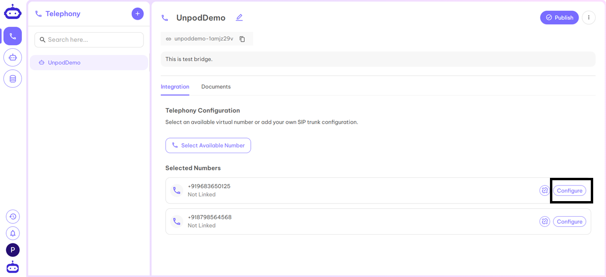
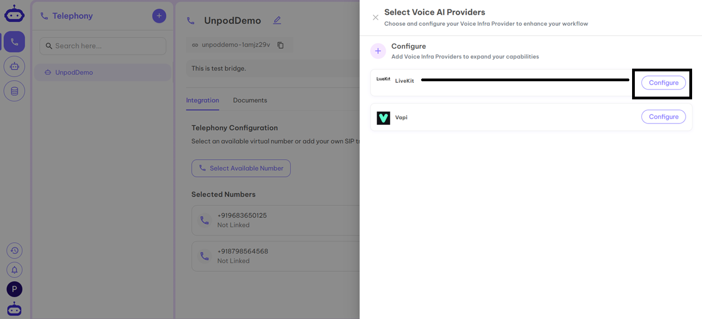
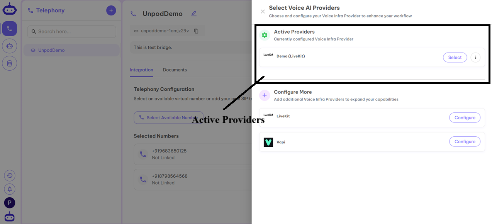
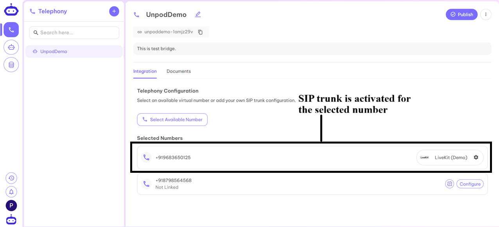
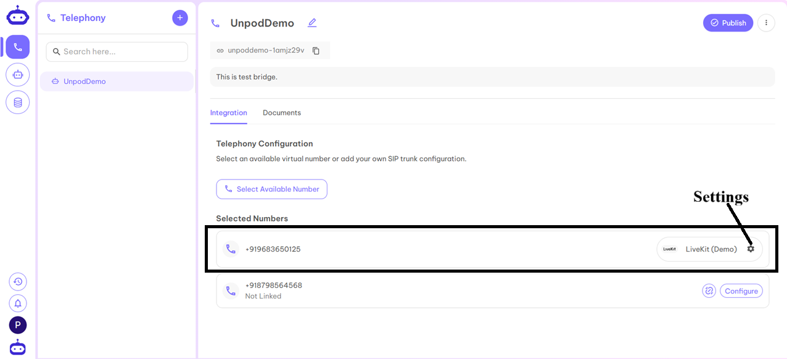
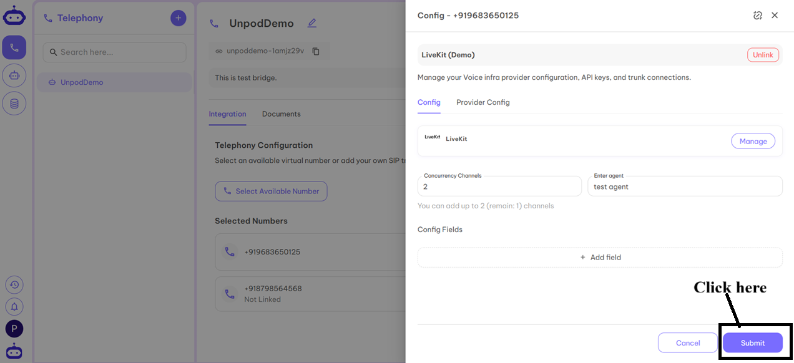

## Configure Number with LiveKit

1. After adding a number to a Bridge, click **Configure** to activate SIP trunking.  

2. Select **LiveKit** from the provider list.  

3. Click **Configure** next to LiveKit.  

4. Fill in the required details from your LiveKit dashboard:  
   - **Name** – Any identifier (product/org name)  
   - **API Key** – Secure access key from LiveKit  
   - **API Secret** – Credential for API access  
   - **Base URL** – Main API web address  
   - **SIP URL** – VoIP identifier (e.g., `sip:username@domain.com`)  

5. Click **Verify and Configure**.  

6. Under Active Providers, select **Demo (LiveKit)** to link it to your number.  

7. Your SIP trunk is now active.  

8. Go to **Settings** to configure the trunk.  

9. Fill in:  
   - **Concurrency Channels** – Number of parallel interactions  
   - **Enter Agent** – Name of your LiveKit agent  

10. Your SIP trunk and number are ready for inbound/outbound calls. 🚀

---

✅ **Next Step:**  
Once your LiveKit provider is configured, head to the **[Agents](../agents)** page to link a voice agent to your SIP number.
