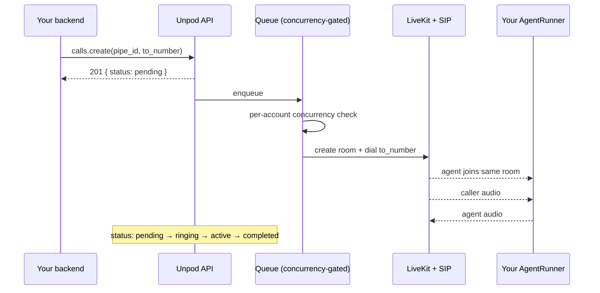
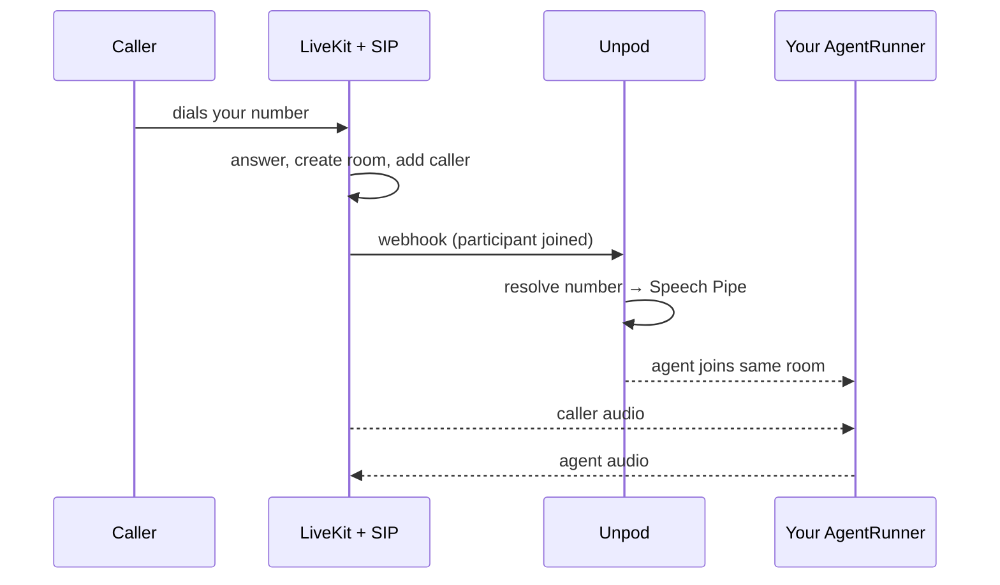
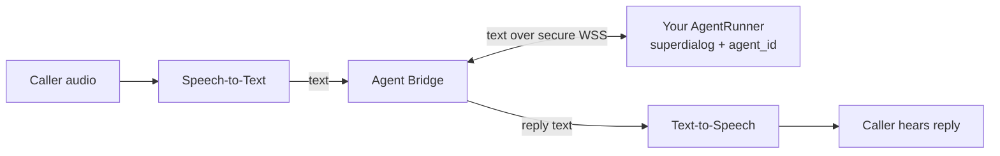

## Overview

Every call - whether you start it or a caller rings in - ends up the same way: your
agent and the caller are two participants in a LiveKit room, and Unpod bridges the
audio between them while streaming transcripts to your `AgentRunner`.

This page traces both directions so you know exactly what happens after you call
`calls.create()` or after someone dials your number.

---

## Outbound: what happens after `calls.create()`

`calls.create()` is **asynchronous**. It does not wait for the phone to ring - it
puts your call on a queue and returns immediately with `status: "pending"`. The
actual dialing happens in the background, gated by your plan's per-account
concurrency limit.

<Steps>
  <Step title="You enqueue the call">
    `calls.create(pipe_id, to_number, ...)` records the call and returns `201` with
    `status: "pending"`. Your request is never blocked on the network.
  </Step>
  <Step title="Unpod gates on concurrency">
    A background worker picks up the call. If your account is at its concurrent-call
    cap, the call is automatically rescheduled and retried shortly - no error, no
    dropped call.
  </Step>
  <Step title="Unpod dials the number">
    Unpod creates a room and originates the SIP call to `to_number`. The call row
    moves to `ringing`, and you get a `session_id`.
  </Step>
  <Step title="Your agent joins and talks">
    Your `AgentRunner` is connected to the same room. Audio flows; transcripts stream
    to your dialog logic. The call row moves to `active`, then `completed` on hangup.
  </Step>
</Steps>

<Tip>
Because `create()` returns `pending`, poll `GET /calls/{call_id}` (or
`client.calls.get(...)`) to watch the status advance to `ringing` → `active` →
`completed`. Don't assume the call is connected the moment `create()` returns.
</Tip>

---

## Inbound: what happens when someone calls your number

Inbound is simpler - there is no queue, because there is nothing to rate-limit. The
moment a caller dials a number attached to your Speech Pipe, the call is already live
and Unpod just connects your agent to it.

<Steps>
  <Step title="Caller dials your number">
    The carrier delivers the call over SIP. LiveKit answers, creates a room, and adds
    the caller as a participant.
  </Step>
  <Step title="Unpod resolves your pipe">
    Unpod matches the dialed number to your Speech Pipe and its voice profile.
  </Step>
  <Step title="Your agent joins the live room">
    Unpod connects your `AgentRunner` to the room the caller is already in. Audio and
    transcripts start immediately.
  </Step>
</Steps>

---

## The audio + transcript path

Once both legs are in the room, every call works the same way. Unpod's speech stack
transcribes the caller and streams plain **text** to your `AgentRunner`; your dialog
logic replies with text; Unpod synthesizes it back to speech.

<Note>
Your `agent_id` selects **which dialog brain** runs for the call. It is carried to
your `AgentRunner` - it is not how Unpod routes the phone number. Number routing is
handled by the Speech Pipe the number is attached to.
</Note>

---

## Call status reference

| Status | Meaning |
|--------|---------|
| `pending` | Enqueued; waiting for a concurrency slot (outbound only). |
| `ringing` | Room created; the call is being placed / connecting. |
| `active` | Both legs connected; your agent is talking to the caller. |
| `completed` | Call ended normally. |
| `failed` | Could not connect or an error occurred. |

---

## Related

- [Outbound Calls](/speech/outbound-calls) - the `calls.create()` API in detail
- [Speech Pipe](/speech/pipes) - what ties a number, voice profile, and agent together
- [Numbers](/speech/numbers) - attaching phone numbers to a pipe
- [Bring Your Agent](/sdk/bring-your-agent) - running an `AgentRunner`
