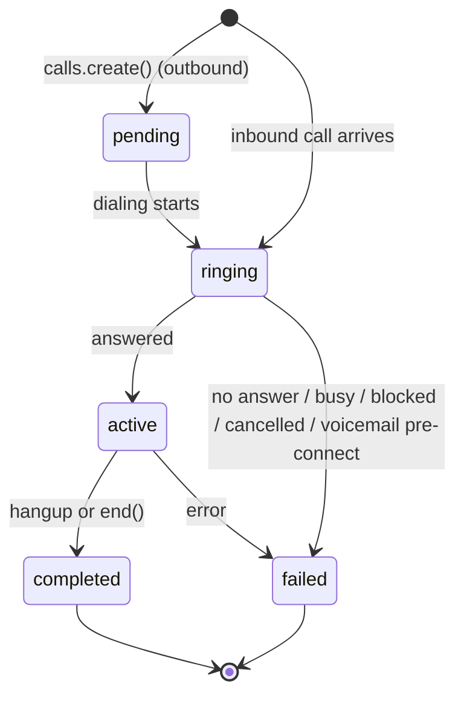

Every call - whether you start it or a caller rings in - ends up the same way:
a Unpod media worker and the caller are the two participants in a LiveKit room,
and the worker bridges the audio while streaming transcripts to your
`AgentRunner` over a separate text-only bridge. Your dialog brain never joins the
room or touches audio. This page traces both directions, the states a call moves
through, and how it can end.

<Frame>
  
</Frame>

## The state machine



| Visible `status` | Internal state | What is happening |
|---|---|---|
| `pending` | queued | Enqueued; waiting for a concurrency slot (outbound only). |
| `ringing` | `dialing` / `ringing` | The SIP leg is originating, or the far end is ringing. |
| `active` | `active` | Both legs connected; your agent is talking to the caller. |
| `completed` | `ended` | The conversation finished after being active. |
| `failed` | `not_connected` / `cancelled` | Never reached a live conversation, or cancelled pre-connect. |

<Note>
Inbound calls skip `pending` and dialing - the caller is already on the line,
so the call starts at `ringing`/`active`. Only outbound calls pass through the
full sequence. You never drive these states yourself; you observe them via the
call `status`, the `call_end` hook, and the final `end_reason`.
</Note>

## Outbound: what happens after `calls.create()`

`calls.create()` is **asynchronous**. It does not wait for the phone to ring -
it puts your call on a queue and returns immediately with `status: "pending"`.
The actual dialing happens in the background, gated by your plan's per-account
concurrency limit.

<Steps>
  <Step title="You enqueue the call">
    `calls.create(pipe_id, to_number, ...)` records the call and returns `201`
    with `status: "pending"`. Your request is never blocked on the network.
  </Step>
  <Step title="Unpod gates on concurrency">
    A background worker picks up the call. If your account is at its
    concurrent-call cap, the call is automatically rescheduled and retried
    shortly - no error, no dropped call.
  </Step>
  <Step title="Unpod dials the number">
    Unpod creates a room and originates the SIP call to `to_number`. The call
    row moves to `ringing`, and you get a `session_id`.
  </Step>
  <Step title="Your agent joins and talks">
    A Unpod media worker joins the room and bridges the caller's audio;
    transcripts stream to your `AgentRunner` over its text bridge and reply text
    comes back for TTS. The call row moves to `active`, then `completed` on
    hangup.
  </Step>
</Steps>

```mermaid
sequenceDiagram
    participant You as Your backend
    participant API as Unpod API
    participant Q as Queue (concurrency-gated)
    participant LK as LiveKit + SIP
    participant Agent as Your AgentRunner

    You->>API: calls.create(pipe_id, to_number)
    API-->>You: 201 { status: pending }
    API->>Q: enqueue
    Q->>Q: per-account concurrency check
    Q->>LK: create room + dial to_number
    LK-->>Agent: media worker bridges call; runner connects (text)
    LK-->>Agent: caller transcript (text)
    Agent-->>LK: reply text (synthesised to speech on Unpod's side)
    Note over API: status: pending → ringing → active → completed
```

<Tip>
Because `create()` returns `pending`, poll `client.calls.get(call_id)` to watch
the status advance. Don't assume the call is connected the moment `create()`
returns.
</Tip>

## Inbound: what happens when someone calls your number

Inbound is simpler - there is no queue, because there is nothing to rate-limit.
The moment a caller dials a number attached to your Speech Pipe, the call is
already live and Unpod connects your agent to it.

<Steps>
  <Step title="Caller dials your number">
    The carrier delivers the call over SIP. LiveKit answers, creates a room,
    and adds the caller as a participant.
  </Step>
  <Step title="Unpod resolves your pipe">
    Unpod matches the dialed number to your Speech Pipe and its voice profile.
  </Step>
  <Step title="Your agent is bridged to the live call">
    A Unpod media worker joins the room the caller is already in and bridges the
    audio; transcripts start streaming to your `AgentRunner` over its text
    bridge immediately.
  </Step>
</Steps>

## The audio + transcript path

Once both legs are in the room, every call works the same way. Unpod's speech
stack transcribes the caller and streams plain **text** to your `AgentRunner`;
your dialog logic replies with text; Unpod synthesizes it back to speech.

The animated lifecycle above is the same loop in motion: call audio stays on
Unpod's side, text crosses into your runner, and reply text comes back for TTS.

<Note>
Your `agent_id` selects **which dialog brain** runs for the call - it is not
how Unpod routes the phone number. Number routing is handled by the
[Speech Pipe](/get-started/core-concepts#pipe) the number is attached to.
</Note>

## Voicemail detection

Unpod automatically detects when an outbound call has reached a voicemail
system so your agent does not waste a turn talking to a machine. There are two
detection points:

<Steps>
  <Step title="Pre-connect (during ringing)">
    Many carriers route "forwarded to voicemail" to a SIP *user-unavailable*
    signal after a brief ring. When Unpod sees this pattern, it classifies the
    call as voicemail **before** it ever connects, ends the call, and reports
    `end_reason: "VOICEMAIL_DETECTED_PRECONNECT"`.
  </Step>
  <Step title="Post-connect (just after answer)">
    Some voicemail systems answer, play a greeting, then go silent. If a call
    connects, the caller never speaks, and the leg ends within a short window,
    Unpod classifies it as voicemail and reports
    `end_reason: "AGENT_HUNG_UP_VOICEMAIL_DETECTED"`.
  </Step>
</Steps>

## End reasons

When a call finishes, Unpod records why. These are the reasons you are most
likely to act on:

| `end_reason` | Meaning |
|---|---|
| `USER_HUNG_UP_IN_CALL` | The caller hung up during the conversation. |
| `USER_DID_NOT_PICK_UP` | Outbound call rang out with no answer. |
| `USER_HUNG_UP_RINGING` | The caller rejected the call while ringing. |
| `AGENT_HUNG_UP_SILENCE_DETECTED` | The agent ended the call after prolonged user silence. |
| `AGENT_HUNG_UP_VOICEMAIL_DETECTED` | Voicemail detected after connect; agent hung up. |
| `VOICEMAIL_DETECTED_PRECONNECT` | Voicemail detected during ringing; call never connected. |
| `MAX_DURATION_REACHED` | The hard per-call duration cap was hit. |
| `IDLE_TIMEOUT` | The call was idle too long and was reaped. |
| `SIP_FAILED_WRONG_NUMBER` | The number was invalid or unreachable. |
| `SIP_FAILED_NUMBER_BLOCKED` | The carrier blocked the call. |

<Note>
This is not the full set - additional reasons exist for SIP/trunk
configuration errors and handover edge cases. Treat unknown reasons as a
generic failure and log them.
</Note>

## Reacting to outcomes in your agent

Observe telephony outcomes through hooks rather than polling:

```python
@ctx.session.on("call_end")
async def on_end(final_state: str) -> None:
    reason = ctx.session.data.get("end_reason")
    if reason == "VOICEMAIL_DETECTED_PRECONNECT":
        await schedule_retry(ctx.user_number, after_minutes=120)
    elif reason in ("SIP_FAILED_WRONG_NUMBER", "SIP_FAILED_NUMBER_BLOCKED"):
        await mark_unreachable(ctx.user_number)
```

## Related

- [Outbound Calls](/speech-stack/outbound-calls) - the `calls.create()` API in detail
- [Speech Pipes](/speech-stack/pipes) - what ties a number, voice profile, and agent together
- [Hooks & Events](/speech-stack/hooks-events) - every lifecycle event you can hook
- [AgentRunner & Sessions](/speech-stack/agent-runner) - ending and transferring live calls
