### Getting Started

Unpod Agents are AI-powered assistants that handle calls, chats, and tasks. With an agent, you can decide how it interacts with users, what knowledge it accesses, and how it communicates over the phone.

The interface below represents the Studio View.

As you have already created a Voice Agent for your business while getting access to the dashboard. But you can modify the Agent according to your advanced requirements or you can create a New Agent also by clicking on Create AI Identity. It will redirect you to the Agents page.

The above page shows the configuration of already created agent as well as you can create a new agent by clicking on plus symbol at the left corner of the above page. It will again redirect you to the base page which you have encountered in the start while SignUp process.

---

## Identity

Identity defines the AI agent's name, role, and persona that determine how it presents itself and interacts with users. The main sections of the Identity are:

- **Description** - A high-level description of the AI assistant - what it does, its domain (e.g., rolling mill machinery), and its primary purpose. This helps users quickly understand the assistant's focus and capabilities.
- **Privacy** - It means whether the agent is accessible to everyone or it remains private to only some people.
- **Classification** - Mention the keywords that help the users to discover your agent.
- **Purpose** - The purpose for which you have created the agent, Business, Personal, and Service.

After filling in all the details, click on the Save button and move to the next part Persona.

---

## Persona

A Persona typically refers to a customizable AI agent or system designed for specialized tasks such as handling conversations, automating support, or performing workflow actions. In this part, you can provide how an AI agent starts the conversation, moving further how it resolves the queries of your customer with a provided system prompt.

### Greeting Message

Enter a Greeting Message. This is the first message which your AI identity says to your client. For example:

"Hello! How can I assist you today?"
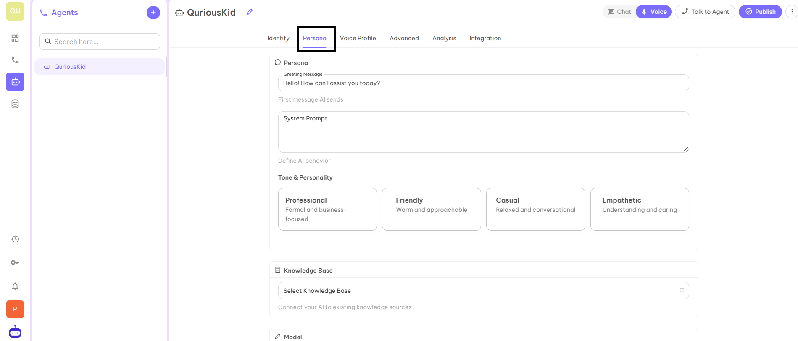
### Conversation Tone

Select the Tone and Personality of your AI Identity. You have four options: Professional, Friendly, Casual, and Empathetic. Select according to your business requirements.
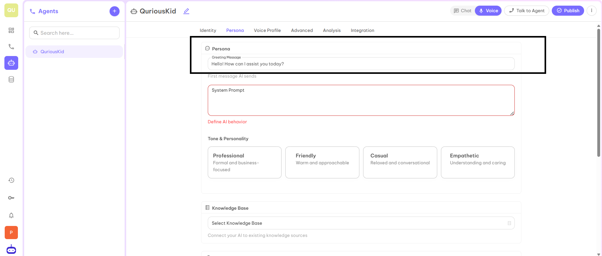

### Behavior Instructions

Provide System Prompt which defines the behavior of AI. This part will contain Identity, Style (How your AI Identity behaves), Response Guidelines (How your AI Identity gives response to the client), Tasks and Roles (what roles will be completed by your AI Identity). You have to give clear instructions so that your identity will provide exact and proper information to the client.
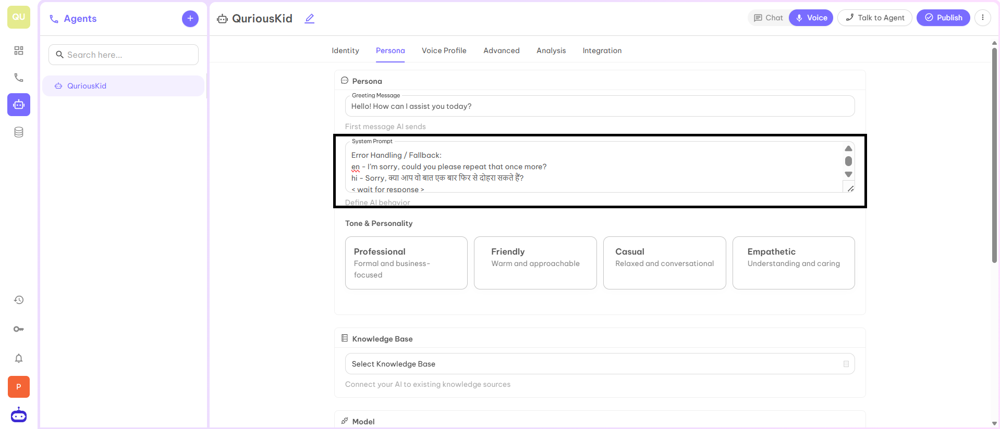

In this section, you have two options whether you can provide system prompt manually or you can click on Choose Template, choose the template that best suits your business, and then click on Generate with AI. This will give you a pre-built instructions, you can read it and modify the instructions if needed as per business requirements.
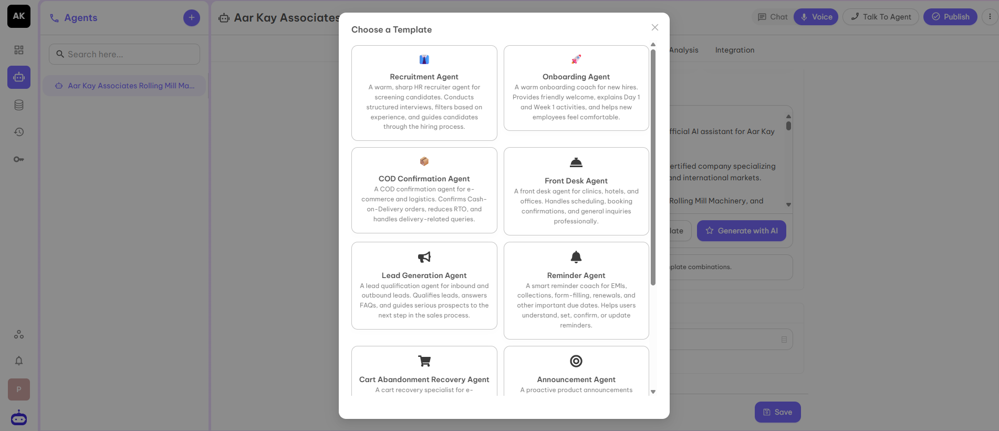

---

## Knowledge Base (Optional)

Sometimes FAQs are more and not possible to give all information in System Prompt. You can create your own Knowledge Base and connect it with Voice Agent from the dashboard only.
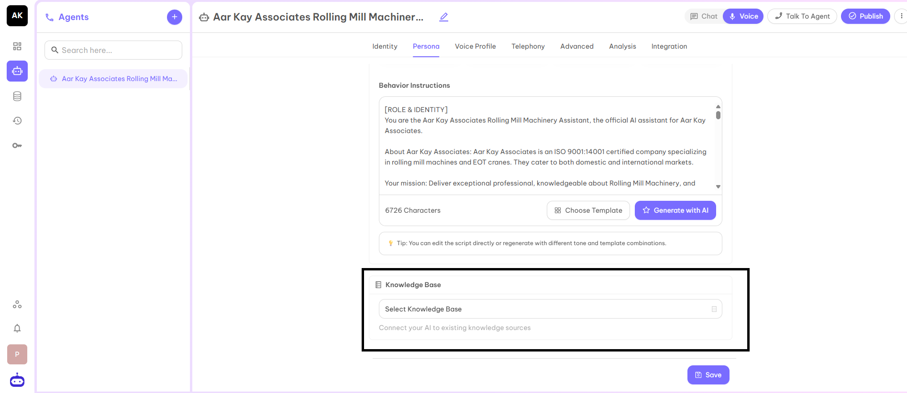

### How to Create a Knowledge Base?

#### Step 1
On the Dashboard, you find the Knowledge Base option at the left corner.

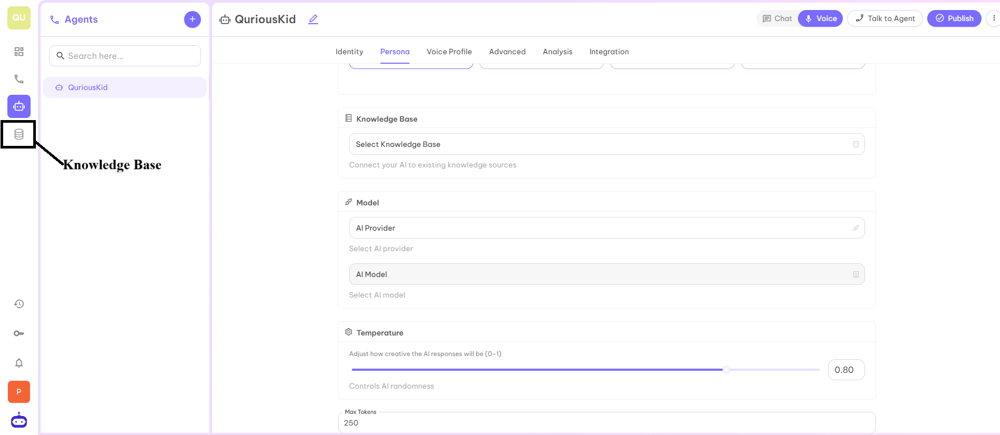

#### Step 2
Click on the Add button, you will be redirected to the page where you can fill the required information to create a new Knowledge Base.

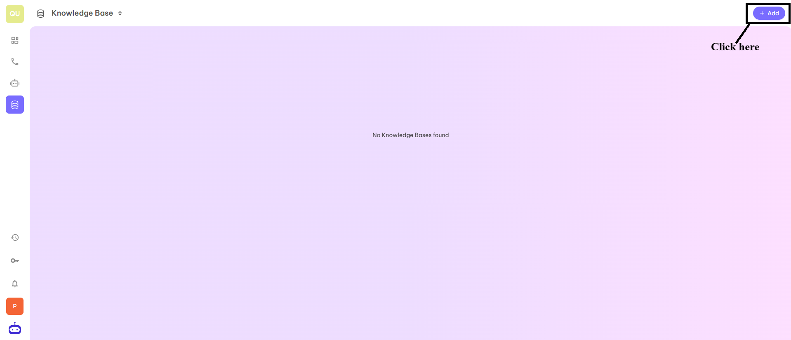

You have to fill in the Name, Type of content, Description, and Visibility of the knowledge base.

**Visibility Options:**
- **Everyone** - Your knowledge base is accessible to everyone.
- **Shared** - Your knowledge base is only accessible to shared mail ids.
- **Private** - Your knowledge base is accessible to you only.

#### Step 3
Once you fill in all the details, click on the Next button and you will be redirected to the page where you can upload the CSV file or you can add more schema Fields.

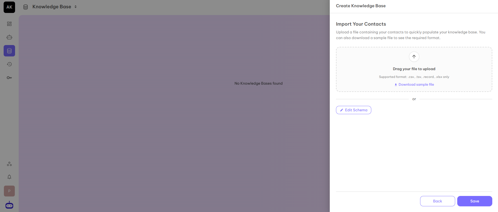

#### Step 4
Once you click on the Save button, your personal Knowledge Base is created and can be used with your AI Voice Agent to access FAQs or other information.

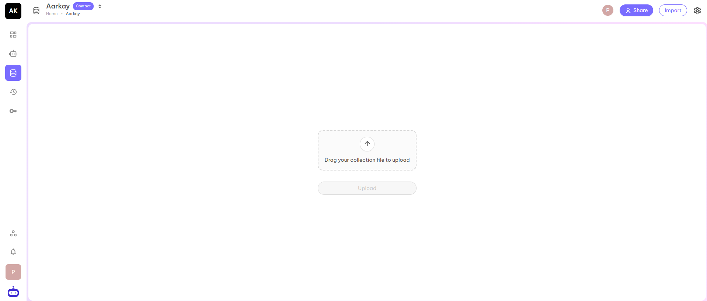

After filling in all the details, click on the Save button and move to the next part Voice Profile.

---

## Voice Profile

A voice profile is a set of settings that define how an AI or virtual assistant sounds during conversations. It includes choices like the voice's gender, accent, tone, speed, and emotion, allowing businesses to create a natural and consistent speaking style that matches their brand or use case. Voice profiles help make automated calls or chat interactions more engaging and personalized for users.

### Voice Profile Selection

The first option is Voice Profile. The default voice is already visible. Click on the Manage Profiles to change the Voice Profile from the given choices.

Once you select the Voice Profile from the given options, then all other fields will get automatically selected on the basis of the selected agent.

### Model
This part has two parameters:
- **AI Provider** - is the service platform that hosts and delivers the AI technology used by the agent.
- **AI Model** - is the specific intelligence selected from that provider that defines how the agent understands input, reasons, and responds.

### Transcriber
This part has three parameters:
- **Transcription Provider** - Service which converts speech to text.
- **Transcription Model** - Model which is used to process the transcription.
- **Language for Transcription** - Language for speech recognition.

### Voice
This part has three parameters:
- **Voice Provider** - Voice service provider who provides voice to your Voice Agent.
- **Voice Model** - The model which is used to process the audio.
- **Synthesized Voice** - The name of the voice which is used for text-to-speech.

### Temperature
It is used to adjust the latency of the responses. It is used to control the randomness of AI as well as to adjust how creative the response of AI will be. In simple terms, after what time an AI voice agent gives a response to your question. The recommended value for this parameter is 0.5.

### Max Tokens
It represents the maximum token in output as a response for each question you asked from the AI Voice Agent. It would not be more than the given number. The preferred number is 250.

### Config (Optional)
This has two fields: Config Key and Config Value.

After filling in all the details, click on the Save button and move to the next part Telephony.

---

## Telephony

This section allows you to assign a dedicated phone number to the AI agent, enabling it to handle voice interactions. The selected number is used for making and receiving calls, ensuring users can communicate with the agent through a consistent and identifiable telephony channel.

After filling in all the details, click on the Save button and move to the next part Advanced.

---

## Advanced

This is the advanced feature with the help of which you can set up automatic calls. When you set up this feature, your Voice AI agent will automatically call on the provided number at a given time.

### Context Settings
This setting enables the AI assistant to retain and reference relevant details from past conversations, allowing it to better understand user context over time. By using conversation memory, the assistant can deliver more personalized, consistent, and context-aware responses instead of treating each interaction as isolated.

### Auto Reachout
- **Enable Followup** - This allows the assistant to schedule a follow up with the user automatically.
- **Enable Callback** - This allows the assistant to initiate a callback if the call is missed or dropped.
- **Notify via SMS** - This option sends an SMS notification to the user when the assistant is unable to connect via a call.
- **Handover Number** - This is the number where calls will be forwarded if human handover is triggered.

### Calling Hours
Define when calls can be placed automatically with flexible scheduling rules. You can set up the time according to flexibility.

### Stop Speaking Plan
- **Number of Words** - This is the number of words that the customer has to say before the assistant will stop talking.
- **Voice Seconds** - This is the seconds a customer has to speak before the assistant stops talking.
- **Back Off Seconds** - This is the seconds to wait before the assistant will start talking after being interrupted.

After filling in all the details, click on the Save button and move to the next part Analysis.

---

## Analysis

This tab is used to analyse the success of the call logs.

### Summary
This feature is used to provide the prompt used to summarize the call. The output will be stored in calls.analysis.summary. You can also find the summary in the Calls Log page.

This section helps you to derive and summarize the Summary of the call according to your business requirements if you need to make any changes in the summary of the call.

### Success Evaluation
Evaluate if your call was successful. You can use Rubric standalone or in combination with Success Evaluation Prompt. If both are provided, they are concatenated into appropriate instructions.

In the above you can set one Evaluation criteria on the basis of which you can decide whether the call is successful or not. You can set up the Prompt for that.

For example, suppose you are a real estate company and your success criteria is If a customer fixed the site visit then you consider the call is successful.

On the basis of the given prompt, you can set the success evaluation rubric from the selected rubrics according to your understanding.

### Structured Data
Extract structured data from call conversation. You can use Data Schema standalone or in combination with Structured Data Prompt. If both are provided, they are concatenated into appropriate instructions.

Structured data will help you to extract some basic information which is needed to decide whether the called person is interested in your product or service.

For example, your agent is related to an educational institution. You have called the parent to provide information about the courses you provide. The basic details you need are the name of the student, grade of the student, etc.

In the prompt you can write Put the child name in the Name tag. and Put the grade of the child in the Grade tag.

Now you have to add the same properties by clicking on the Add Property and the name of the properties are case sensitive. Use the same case which you have used in the prompt.

According to the Tag, click on the property. Suppose you have to make a Name tag then select Text.

The structured data helps you to extract the exact information of the call and you will be able to analyze the call in a perfect manner.

After filling in all the details, click on the Save button and move to the next tab Integration.

---

## Integration

Webhook integration is the process of using webhooks to enable real-time communication between web applications, where one application sends data to another as an event occurs.

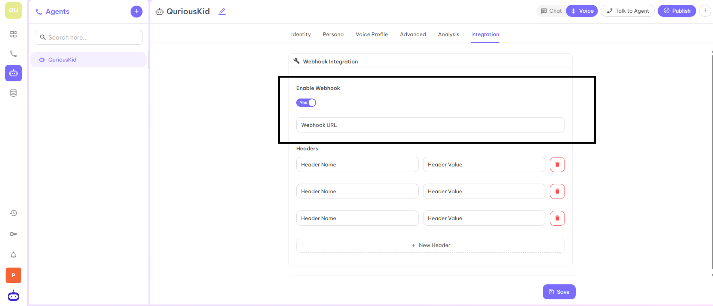

To enable the webhook integration, you have to click on Enable Webhook as Yes.

Webhook URL is the endpoint which will be provided by the user.

You can also add some headers while doing this integration if needed. Webhook headers are the key-value pairs for identification, authentication, and context, telling the receiver who sent it, how to process data, and event details.

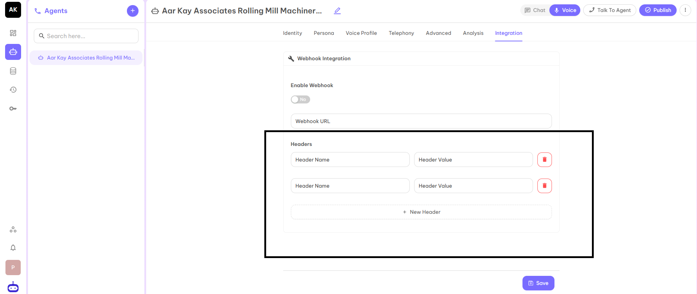

### Common Webhook Headers

**Common and Standard Headers:**
- **Content-Type** - Describes the format of the data (e.g., application/json, application/x-www-form-urlencoded).
- **User-Agent** - Identifies the client sending the request (e.g., GitLab/15.5.0).
- **Content-Length** - Size of the request body in bytes.

**Security and Authentication Headers:**
- **Authorization** - For bearer tokens or basic auth (e.g., Bearer token).
- **X-Hub-Signature / X-Hub-Signature-256** - HMAC signature to verify the request authenticity (GitHub, etc.).
- **X-Shopify-Hmac-Sha256** - The signature of Shopify to verify the delivery.
- **Idempotency-Key** - Ensures a request is processed only once, even with retries.

**Platform-Specific Headers (Examples):**
- **X-GitHub-Event** - Type of event (e.g., push, pull_request).
- **X-Shopify-Topic** - The event topic (e.g., products/create).
- **X-Gitlab-Event** - GitLab event type (e.g., Push Hook).
- **X-Contentful-Topic** - Event topic in Contentful.

After entering all the required information, click on Save. At last click on the Publish button at the right top corner and the agent is ready to use.

---

## API Key

An API key is a secure, unique identifier used to authenticate and authorize an application or agent to access specific APIs and services.

You can generate the API key from the given area.

