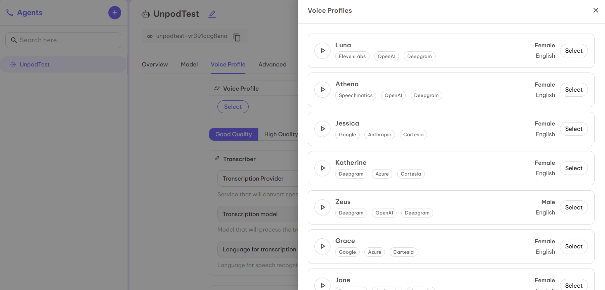

Unpod enables businesses to rent regional phone numbers and seamlessly integrate with Voice Infrastructure Providers and Voice AI agents. You can configure your SIP trunk, connect with providers like **LiveKit, Vapi,** etc., and meet regulatory compliance for smooth operations.

---

## Bridges: Making Sure Every Call Finds Its Way Home

Bridges act as central controllers that manage every call.  
They connect **phone numbers, service providers, and AI agents** to ensure conversations are directed correctly and smoothly.  

Think of them as the **traffic police** of communication—guiding calls, assigning service providers, connecting with AI, and keeping records organized.

### Steps to Create Bridges on Dashboard

1. Login to the Dashboard with the credentials provided by the Unpod technical team. 
![Step 1] (images/1:telephony.png) 

2. Once logged in, you will be redirected to the dashboard. 
! [Step 2](images/2:telephony.png) 

3. Click on the **Telephony** tab to access Bridges.  
4. Initially, the page will be empty as you don’t have any Bridges yet.  
5. Click on the ➕ symbol to create a **New Bridge**.  
6. You’ll be redirected to the Bridge creation page.  
7. Enter the **Bridge Title** and **Description**.  
8. Click **Publish**.  
9. Your first Bridge is ready to use! You can now integrate virtual numbers or your own SIP trunk configuration.  

---

## Numbers: Your Voice, Your Number, Any Region

Numbers in Unpod are **virtual phone lines** that allow your business to make and receive calls or messages globally, without traditional phone lines. Each number can connect to **providers, bridges, and agents** for flexible communication.

### Assign Numbers to Bridges

1. Select the Bridge where you want to link the number (e.g., *UnpodDemo*).  
2. Click on **Select Available Number**.  
3. You’ll be redirected to a page with available numbers.  
4. Click **Upgrade** to choose a plan for your number.  
5. Select a suitable plan by clicking **View Plans**.  
6. Return to the first page and again click **Select Available Number**.  
7. Choose a number for your business and click **Submit**.  
8. Your number is now added to the Bridge.  

---

## SIP Trunking: Powering Seamless Global Connections

**SIP trunking** replaces traditional phone lines with a **virtual connection over the internet**, enabling calls through broadband. It connects your internal phone system (PBX/VoIP) to a SIP provider, which routes calls to the regular network—making it **simpler and more cost-effective**.

---

## Supported SIP Providers

Unpod supports multiple providers for inbound and outbound calls:

- **LiveKit** – Real-time audio/video calls using virtual members.  
- **Vapi** – Cloud telephony API for programmatic calls.  
- **Daily** – Multi-party voice/video with web integrations.  
- **Twilio** – Global programmable voice for any device.  

---

## Setup Process

After selecting your number, configure it with a provider. Currently, Unpod supports **LiveKit** and **Vapi**.

---

### Configure Number with LiveKit

1. After adding a number to a Bridge, click **Configure** to activate SIP trunking.  
2. Select **LiveKit** from the provider list.  
3. Click **Configure** next to LiveKit.  
4. Fill in the required details from your LiveKit dashboard:  
   - **Name** – Any identifier (product/org name).  
   - **API Key** – Secure access key from LiveKit.  
   - **API Secret** – Password-like credential for API access.  
   - **Base URL** – Main API web address.  
   - **SIP URL** – VoIP identifier (e.g., `sip:username@domain.com`).  
5. Click **Verify and Configure**.  
6. Under Active Providers, select **Demo (LiveKit)** to link it to your number.  
7. Your SIP trunk is now active.  
8. Go to **Settings** to configure the trunk.  
9. Fill in:  
   - **Concurrency Channels** – Number of parallel interactions.  
   - **Enter Agent** – Name of your LiveKit agent.  
10. Your SIP trunk and number are ready for inbound/outbound calls.  

---

### Configure Number with Vapi

1. After adding a number to a Bridge, click **Configure**.  
2. Select **Vapi** from the provider list.  
3. Click **Configure** next to Vapi.  
4. Fill in the required details from your Vapi dashboard:  
   - **Name** – Any identifier (product/org name).  
   - **API Key** – Secure access key from Vapi.  
5. Click **Verify and Configure**.  
6. Under Active Providers, select **Demo (Vapi)**.  
7. Your SIP trunk is now active.  
8. Go to **Settings** to configure the trunk.  
9. Fill in:  
   - **Concurrency Channels** – Number of parallel interactions.  
   - **Enter Agent** – Name of your Vapi agent.  
10. Your SIP trunk and number are ready for inbound/outbound calls.  

---

## Final Step: Publish

After configuring all required numbers, click the **Publish** button at the top of the dashboard.  
Your setup is now live and ready to use! 🚀

